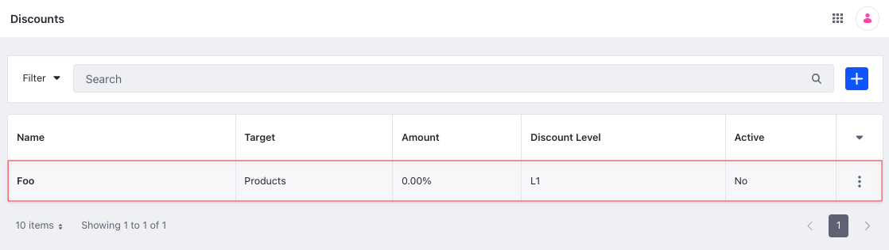

# Discount API Basics

You can manage discounts from the Applications menu or with REST APIs. Call the [headless-admin-commerce-pricing](http://localhost:8080/o/api?endpoint=http://localhost:8080/o/headless-commerce-admin-pricing/v2.0/openapi.json) services to create and manage discounts.

## Adding a Discount

```{include} /_snippets/run-liferay-dxp.md
```

Once Liferay is running,

1. Download and unzip [Discount API Basics](./liferay-r6f7.zip).

   ```bash
   curl https://resources.learn.liferay.com/commerce/latest/en/pricing/developer-guide/liferay-r6f7.zip -O
   ```

   ```bash
   unzip liferay-r6f7.zip
   ```

1. Discounts are scoped to an instance. Use the cURL script to add a new discount. On the command line, navigate to the `curl` folder. Execute the `Discount_POST_ToInstance.sh` script.

   ```bash
   ./Discount_POST_ToInstance.sh
   ```

   The JSON response shows a new discount was added:

   ```bash
   {
      "actions" : {
         "permissions" : {
            "method" : "PATCH",
            "href" : "http://localhost:8080/o/headless-commerce-admin-pricing/v2.0/discounts/46111"
         },
         "get" : {
            "method" : "GET",
            "href" : "http://localhost:8080/o/headless-commerce-admin-pricing/v2.0/discounts/46111"
         },
         "update" : {
            "method" : "PATCH",
            "href" : "http://localhost:8080/o/headless-commerce-admin-pricing/v2.0/discounts/46111"
         },
         "delete" : {
            "method" : "DELETE",
            "href" : "http://localhost:8080/o/headless-commerce-admin-pricing/v2.0/discounts/46111"
         }
      },
      "active" : false,
      "amountFormatted" : "0.00%",
      "couponCode" : "",
      "customFields" : { },
      "displayDate" : "2023-02-27T12:31:00Z",
      "externalReferenceCode" : "9df9ffc2-be00-680b-2a2c-69f572bbe65c",
      "id" : 46111,
      "level" : "L1",
      "limitationTimes" : 0,
      "limitationTimesPerAccount" : 0,
      "limitationType" : "unlimited",
      "numberOfUse" : 0,
      "rulesConjunction" : false,
      "target" : "Products",
      "title" : "Foo",
      "useCouponCode" : false,
      "usePercentage" : true
   }
   ```

1. To verify the discount addition, open the *Global Menu* () and navigate to *Commerce* &rarr; *Discounts*. The new discount appears.

   

1. Alternatively, call the REST service using the Java client. Navigate into the `java` folder and compile the source files:

   ```bash
   javac -classpath .:* *.java
   ```

1. Run the `Discount_POST_ToInstance` class.

   ```bash
   java -classpath .:* Discount_POST_ToInstance
   ```

### Adding a Coupon Code

To add a coupon code to the discount, set `useCouponCode` to `true` and set a value in the `couponCode` field. To restrict the coupon code's usage, use the settings described in the table below.

| Restriction Type              | Settings | Description |
| :---------------------------- | :------- | :---------- |
| Number of uses                | `"limitationType" : "limited for total"`<br />`"limitationTimes" : 5` (any integer) | The coupon code can be used a total of 5 times. |
| Number of uses per account    | `"limitationType": "limited for account"`<br />`"limitationTimesPerAccount" : 5` (any integer) | Each account can use the coupon code up to 5 times. |
| Number of uses and by account | `"limitationType" : "limited for account and total"`<br />`"limitationTimesPerAccount": 2` (any integer)<br />`"limitationTimes" : 5` (any integer) | Each account can use the coupon code up to 2 times, with total usage capped at 5. |

## Examine the cURL Command

The `Discount_POST_ToInstance.sh` script calls the REST service with a cURL command.

```{literalinclude} ./discount-api-basics/resources/liferay-r6f7.zip/curl/Discount_POST_ToInstance.sh
    :language: bash
```

Here are the command's arguments:

| Arguments                                                                | Description |
| :----------------------------------------------------------------------- | :--- |
| `-H "Content-Type: application/json"`                                      | Set the request body format to JSON.|
| `-X POST`                                                                  | Set the HTTP method to invoke at the specified endpoint. |
| `"http://localhost:8080/o/headless-commerce-admin-pricing/v2.0/discounts"` | Specify the REST service endpoint. |
| `-d "{\"level\": \"L1\", \"limitationType\": \"unlimited\", \"target\": \"products\", \"title\": \"Foo\", \"usePercentage\": true}"` | Enter the data to post. |
| `-u "test@liferay.com:learn"`                                              | Enter basic authentication credentials.  |

```{note}
Basic authentication is used here for demonstration purposes. For production, you should authorize users via [OAuth2](https://learn.liferay.com/w/dxp/headless-delivery/using-oauth2). See [Using OAuth2 to Authorize Users](https://learn.liferay.com/w/dxp/headless-delivery/using-oauth2/using-oauth2-to-authorize-users) for a sample React application using OAuth2.
```

The other cURL commands use similar JSON arguments.

## Examine the Java Class

The `Discount_POST_ToInstance.java` class adds a discount by calling the `DiscountResource` service.

```{literalinclude} ./discount-api-basics/resources/liferay-r6f7.zip/java/Discount_POST_ToInstance.java
   :dedent: 1
   :language: java
   :lines: 9-27
```

This class invokes the REST service using only three lines of code:

| Line (abbreviated)                                                         | Description                                                                  |
| :------------------------------------------------------------------------- | :--------------------------------------------------------------------------- |
| `DiscountResource.Builder builder = ...`                                   | Get a `Builder` for generating a `DiscountResource` service instance.        |
| `DiscountResource discountResource = builder.authentication(...).build();` | Use basic authentication and generate a `DiscountResource` service instance. |
| `discountResource.postDiscount(...);`                                      | Call the `discountResource.postDiscount` method and pass the data to post.   |

Note that the project includes the `com.liferay.headless.commerce.admin.pricing.client.jar` file as a dependency. You can find client JAR dependency information for all REST applications in the API Explorer in your installation at `/o/api` (e.g., <http://localhost:8080/o/api>).

```{note}
The `main` method's comment demonstrates running the class.
```

The remaining example Java classes call different `DiscountResource` methods.

```{important}
See [DiscountResource](https://github.com/liferay/liferay-portal/blob/[$LIFERAY_LEARN_PORTAL_GIT_TAG$]/modules/apps/commerce/headless/headless-commerce/headless-commerce-admin-pricing-client/src/main/java/com/liferay/headless/commerce/admin/pricing/client/resource/v2_0/DiscountResource.java) for service details.
```

Below are examples of calling other `Discount` REST services using cURL and Java.

## Get Discounts from Instance

List all the discounts in your Liferay instance with a cURL or Java command.

### Discounts_GET_FromInstance.sh

Command:

```bash
./Discounts_GET_FromInstance.sh
```

Code:

```{literalinclude} ./discount-api-basics/resources/liferay-r6f7.zip/curl/Discounts_GET_FromInstance.sh
   :language: bash
```

### Discounts_GET_FromInstance.java

Command:

```bash
java -classpath .:* Discounts_GET_FromInstance
```

Code:

```{literalinclude} ./discount-api-basics/resources/liferay-r6f7.zip/java/Discounts_GET_FromInstance.java
   :dedent: 1
   :language: java
   :lines: 11-22
```

The instance's `Discount` objects are formatted in JSON.

## Get a Discount

Get a specific discount with cURL or Java `get` commands. Replace `1234` with the discount's ID.

```{tip}
Use `Discounts_GET_FromInstance.[java|sh]` to get a list of all discounts, and note the `id` of the discount you want specifically.
```

### Discount_GET_ById.sh

Command:

```bash
./Discount_GET_ById.sh 1234
```

Code:

```{literalinclude} ./discount-api-basics/resources/liferay-r6f7.zip/curl/Discount_GET_ById.sh
   :language: bash
```

### Discount_GET_ById.java

Command:

```bash
java -classpath .:* -DdiscountId=1234 Discount_GET_ById
```

Code:

```{literalinclude} ./discount-api-basics/resources/liferay-r6f7.zip/java/Discount_GET_ById.java
   :dedent: 1
   :language: java
   :lines: 8-18
```

The `Discount` fields are listed in JSON.

## Patch a Discount

Update an existing discount with cURL and Java `patch` commands. Replace `1234` with your discount's ID.

### Discount_PATCH_ById.sh

Command:

```bash
./Discount_PATCH_ById.sh 1234
```

Code:

```{literalinclude} ./discount-api-basics/resources/liferay-r6f7.zip/curl/Discount_PATCH_ById.sh
   :language: bash
```

### Discount_PATCH_ById.java

Command:

```bash
java -classpath .:* -DdiscountId=1234 Discount_PATCH_ById
```

Code:

```{literalinclude} ./discount-api-basics/resources/liferay-r6f7.zip/java/Discount_PATCH_ById.java
   :dedent: 1
   :language: java
   :lines: 9-25
```

## Delete a Discount

Delete an existing discount with cURL and Java `delete` commands. Replace `1234` with your discount's ID.

### Discount_DELETE_ById.sh

Command:

```bash
./Discount_DELETE_ById.sh 1234
```

Code:

```{literalinclude} ./discount-api-basics/resources/liferay-r6f7.zip/curl/Discount_DELETE_ById.sh
   :language: bash
```

### Discount_DELETE_ById.java

Command

```bash
java -classpath .:* -DdiscountId=1234 Discount_DELETE_ById
```

Code:

```{literalinclude} ./discount-api-basics/resources/liferay-r6f7.zip/java/Discount_DELETE_ById.java
   :dedent: 1
   :language: java
   :lines: 8-17
```

The [API Explorer](https://learn.liferay.com/w/dxp/headless-delivery/consuming-apis/consuming-rest-services) shows the `Discount` services and schemas and has an interface to test each service.
