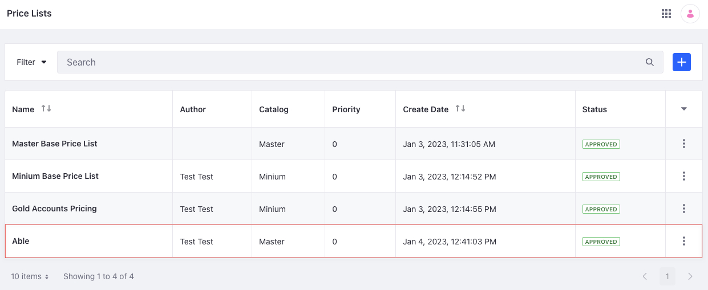

# Price List API Basics

You can manage price lists from the Applications menu or with REST APIs. Call the [headless-admin-commerce-pricing](http://localhost:8080/o/api?endpoint=http://localhost:8080/o/headless-commerce-admin-pricing/v2.0/openapi.json) services to create and manage price lists.

## Adding a Price List

```{include} /_snippets/run-liferay-dxp.md
```

Once Liferay is running,

1. Download and unzip [Price List API Basics](./liferay-c2v4.zip).

   ```bash
   curl https://resources.learn.liferay.com/commerce/latest/en/pricing/developer-guide/liferay-c2v4.zip -O
   ```

   ```bash
   unzip liferay-c2v4.zip
   ```

1. Price lists are scoped to catalogs, so you need the catalog ID to create one.

   To get a catalog's ID, open the *Global Menu* (), and go to *Commerce* &rarr; *Catalogs*. Select a catalog and copy its ID.

   

1. Use the cURL script to add a new price list to the catalog. On the command line, navigate to the `curl` folder. Execute the `PriceList_POST_ToCatalog.sh` script with the appropriate catalog ID value as a parameter.

   ```bash
   ./PriceList_POST_ToCatalog.sh 1234
   ```

   The JSON response shows a new price list was added:

   ```bash
   {
      "actions" : {
         "permissions" : {
         "method" : "PATCH",
         "href" : "http://localhost:8080/o/headless-commerce-admin-pricing/v2.0/price-lists/46002"
         },
         "get" : {
         "method" : "GET",
         "href" : "http://localhost:8080/o/headless-commerce-admin-pricing/v2.0/price-lists/46002"
         },
         "update" : {
         "method" : "PATCH",
         "href" : "http://localhost:8080/o/headless-commerce-admin-pricing/v2.0/price-lists/46002"
         },
         "delete" : {
         "method" : "DELETE",
         "href" : "http://localhost:8080/o/headless-commerce-admin-pricing/v2.0/price-lists/46002"
         }
      },
      "active" : true,
      "author" : "Test Test",
      "catalogBasePriceList" : false,
      "catalogId" : 1234,
      "catalogName" : "Master",
      "createDate" : "2023-01-04T12:41:03Z",
      "currencyCode" : "USD",
      "customFields" : { },
      "displayDate" : "2023-01-04T12:41:00Z",
      "externalReferenceCode" : "b314f22b-72ff-c47c-4fb6-c34539257821",
      "id" : 46002,
      "name" : "Able",
      "netPrice" : true,
      "parentPriceListId" : 0,
      "priority" : 0.0,
      "type" : "price-list",
      "workflowStatusInfo" : {
         "code" : 0,
         "label" : "approved",
         "label_i18n" : "Approved"
      }
   }
   ```

1. To verify the price list addition, open the *Global Menu* () and navigate to *Commerce* &rarr; *Price Lists*. The new price list appears.

   

1. Alternatively, call the REST service using the Java client. Navigate into the `java` folder and compile the source files:

   ```bash
   javac -classpath .:* *.java
   ```

1. Run the `PriceList_POST_ToCatalog` class, replacing the `catalogId` with the appropriate value.

   ```bash
   java -classpath .:* -DcatalogId=1234 PriceList_POST_ToCatalog
   ```

## Examine the cURL Command

The `PriceList_POST_ToCatalog.sh` script calls the REST service with a cURL command.

```{literalinclude} ./price-list-api-basics/resources/liferay-c2v4.zip/curl/PriceList_POST_ToCatalog.sh
    :language: bash
```

Here are the command's arguments:

| Arguments                                           | Description                                         |
| :-------------------------------------------------- | :-------------------------------------------------- |
| `-H "Content-Type: application/json"`                 | Set the request body format to JSON.     |
| `-X POST`                                             | Set the HTTP method to invoke at the specified endpoint. |
| `"http://localhost:8080/o/headless-commerce-admin-pricing/v2.0/price-lists"` | Specify the REST service endpoint. |
| `-d "{\"catalogId\": ${1}, \"currencyCode\": \"USD\", \"name\": \"Able\", \"type\": \"price-list\"}"` | Enter the data to post. |
| `-u "test@liferay.com:learn"`                         | Enter basic authentication credentials. |

```{note}
Basic authentication is used here for demonstration purposes. For production, you should authorize users via [OAuth2](https://learn.liferay.com/w/dxp/headless-delivery/using-oauth2). See [Using OAuth2 to Authorize Users](https://learn.liferay.com/w/dxp/headless-delivery/using-oauth2/using-oauth2-to-authorize-users) for a sample React application using OAuth2.
```

The other cURL commands use similar JSON arguments.

## Examine the Java Class

The `PriceList_POST_ToCatalog.java` class adds a price list by calling the `PriceListResource` service.

```{literalinclude} ./price-list-api-basics/resources/liferay-c2v4.zip/java/PriceList_POST_ToCatalog.java
   :dedent: 1
   :language: java
   :lines: 9-27
```

This class invokes the REST service using only three lines of code:

| Line (abbreviated)                                                         | Description |
| :------------------------------------------------------------------------- | :---------- |
| `PriceListResource.Builder builder = ...`                                    | Get a `Builder` for generating a `PriceListResource` service instance. |
| `PriceListResource priceListResource = builder.authentication(...).build();` | Use basic authentication and generate a `PriceListResource` service instance. |
| `priceListResource.postPriceList(...);`                                      | Call the `priceListResource.postPriceList` method and pass the data to post. |

Note that the project includes the `com.liferay.headless.commerce.admin.pricing.client.jar` file as a dependency. You can find client JAR dependency information for all REST applications in the API explorer in your installation at `/o/api` (e.g., <http://localhost:8080/o/api>).

```{note}
The `main` method's comment demonstrates running the class.
```

The remaining example Java classes call different `PriceListResource` methods.

```{important}
See [PriceListResource](https://github.com/liferay/liferay-portal/blob/[$LIFERAY_LEARN_PORTAL_GIT_TAG$]/modules/apps/commerce/headless/headless-commerce/headless-commerce-admin-pricing-client/src/main/java/com/liferay/headless/commerce/admin/pricing/client/resource/v2_0/PriceListResource.java) for service details.
```

Below are examples of calling other `PriceList` REST services using cURL and Java.

## Get Price Lists from Instance

List all the price lists in your Liferay instance with a cURL or Java command.

### PriceLists_GET_FromInstance.sh

Command:

```bash
./PriceLists_GET_FromInstance.sh
```

Code:

```{literalinclude} ./price-list-api-basics/resources/liferay-c2v4.zip/curl/PriceLists_GET_FromInstance.sh
   :language: bash
```

### PriceLists_GET_FromInstance.java

Command:

```bash
java -classpath .:* PriceLists_GET_FromInstance
```

Code:

```{literalinclude} ./price-list-api-basics/resources/liferay-c2v4.zip/java/PriceLists_GET_FromInstance.java
   :dedent: 1
   :language: java
   :lines: 11-22
```

The instance's `PriceList` objects are formatted in JSON.

### Filtering, Paginating, Searching, and Sorting Price Lists

This API also accepts parameters to filter, paginate, search, and sort the price lists. See the [`getPriceListsPage`](https://github.com/liferay/liferay-portal/blob/[$LIFERAY_LEARN_PORTAL_GIT_TAG$]/modules/apps/commerce/headless/headless-commerce/headless-commerce-admin-pricing-client/src/main/java/com/liferay/headless/commerce/admin/pricing/client/resource/v2_0/PriceListResource.java#L43-#L46) method for more information. Use the following `PriceList` fields to filter, search, and sort the results.

* accountId
* accountGroupId
* catalogId
* channelId
* orderTypeId
* name
* catalogBasePriceList
* type
* createDate

| Filter Query                                     | Description |
| :----------------------------------------------- | :---------- |
| `name eq 'Able'`                                   | The price list name must equal Able. |
| `createDate gt 2022-12-31T12:00:00Z`               | The price list create date must be greater than 31st December 2022 12:00:00. |
| `catalogId/any(x:(x eq 43956) and (x eq 43199))`   | Match price lists associated to catalogs 43956 and 43199. The term `any` means that at least one of the subsequent expressions must return `true`. |

The `accountId`, `accountGroupId`, `catalogId`, `channelId`, and `orderTypeId` filter fields are collection fields. Filtering by a collection field must be done as shown in the third row of the table above.

| Sort Query                  | Description                                                                    |
| :-------------------------- | :------------------------------------------------------------------------------|
| `createDate:desc`           | Sort by createDate in descending order.                                          |
| `createDate:desc,type:desc` | Sort by createDate in descending order first, then by type in descending order.  |

Read [API Query Parameters](https://learn.liferay.com/w/dxp/headless-delivery/consuming-apis/api-query-parameters) for more information.

## Get a Price List

Get a specific price list with cURL or Java `get` commands. Replace `1234` with the price list's ID.

```{tip}
Use `PriceLists_GET_FromInstance.[java|sh]` to get a list of all price lists, and note the `id` of the price list you want specifically.
```

### PriceList_GET_ById.sh

Command:

```bash
./PriceList_GET_ById.sh 1234
```

Code:

```{literalinclude} ./price-list-api-basics/resources/liferay-c2v4.zip/curl/PriceList_GET_ById.sh
   :language: bash
```

### PriceList_GET_ById.java

Command:

```bash
java -classpath .:* -DpriceListId=1234 PriceList_GET_ById
```

Code:

```{literalinclude} ./price-list-api-basics/resources/liferay-c2v4.zip/java/PriceList_GET_ById.java
   :dedent: 1
   :language: java
   :lines: 8-18
```

The `PriceList` fields are listed in JSON.

## Patch a Price List

Update an existing price list with cURL and Java `patch` commands. Replace `1234` with your price list's ID.

### PriceList_PATCH_ById.sh

Command:

```bash
./PriceList_PATCH_ById.sh 1234
```

Code:

```{literalinclude} ./price-list-api-basics/resources/liferay-c2v4.zip/curl/PriceList_PATCH_ById.sh
   :language: bash
```

### PriceList_PATCH_ById.java

Command:

```bash
java -classpath .:* -DpriceListId=1234 PriceList_PATCH_ById
```

Code:

```{literalinclude} ./price-list-api-basics/resources/liferay-c2v4.zip/java/PriceList_PATCH_ById.java
   :dedent: 1
   :language: java
   :lines: 9-23
```

## Delete a Price List

Delete an existing price list with cURL and Java `delete` commands. Replace `1234` with your price list's ID.

### PriceList_DELETE_ById.sh

Command:

```bash
./PriceList_DELETE_ById.sh 1234
```

Code:

```{literalinclude} ./price-list-api-basics/resources/liferay-c2v4.zip/curl/PriceList_DELETE_ById.sh
   :language: bash
```

### PriceList_DELETE_ById.java

Command

```bash
java -classpath .:* -DpriceListId=1234 PriceList_DELETE_ById
```

Code:

```{literalinclude} ./price-list-api-basics/resources/liferay-c2v4.zip/java/PriceList_DELETE_ById.java
   :dedent: 1
   :language: java
   :lines: 8-17
```

The [API Explorer](https://learn.liferay.com/w/dxp/headless-delivery/consuming-apis/consuming-rest-services) shows the `PriceList` services and schemas and has an interface to test each service.
