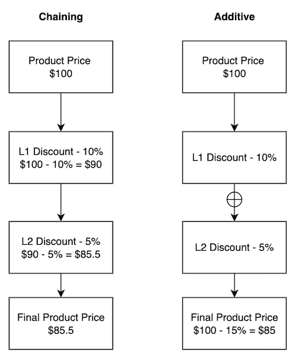

# Pricing Configuration Reference

You can change the default discovery logic and other parameters of the pricing engine through system settings. To access these settings, open the *Global Menu* () and navigate to *Control Panel* &rarr; *System Settings* &rarr; *Pricing*. The following settings are available:

* Pricing Calculation Key
* Price List Discovery Method
* Promotion Discovery Method
* Discount Application Strategy

## Pricing Calculation Key

The default pricing calculation key is `v2.0`. This uses version two of the [Commerce pricing engine](./introduction-to-pricing.md). If you want to use the older pricing engine, replace this with `v1.0` and click *Save*. Read [Pricing Engine v1.0 Reference](./introduction-to-pricing.md#pricing-engine-v10-reference) for more information. 

## Price List Discovery Method

By default, price lists use priority to apply to eligible accounts. The highest priority eligible price list takes precedence over the others. You can change this by replacing `hierarchy` with `lowest`. This chooses the eligible price list with the lowest price among other eligible price lists. 

## Promotion Discovery Method

By default, promotion lists use _priority_ to apply to eligible accounts. The highest priority-eligible promotion list takes precedence over the others. You can change this by replacing `hierarchy` with `lowest`. This discovery method chooses the eligible promotion list with the lowest price among other eligible promotion lists. 

```{note}
You can use these discovery methods interchangeably. It is not mandatory to have the same value for both. For instance, you can set the price list discovery method as `lowest` and keep the promotion discovery method as `hierarchy` or vice-versa. 
```

## Discount Application Strategy

There are two ways to apply discounts at [multiple levels](./promoting-products/using-discount-levels.md): `additive` and `chaining`. By default, discounts at multiple levels are chained. This means that the subsequent discount gets calculated on the value after applying the previous discount. When it's additive, multiple discounts are grouped together and applied all at once. See below to understand the difference. 

### Chaining Discounts Example

Product Price - $100

L1 Discount - 10% 

Discounted Price - $100 - 10% Discount = $90

L2 Discount - 5%

Discounted Price - $90 - 5% = $85.5

### Additive Discounts Example

Product Price - $100

L1 Discount - 10% 

L2 Discount - 5%

Discounted Price - $90 - (10% + 5%) = $85



## Related Topics

* [Pricing Engine v1.0 Reference](./introduction-to-pricing.md#pricing-engine-v10-reference)
* [Using Discount Levels](./promoting-products/using-discount-levels.md)
