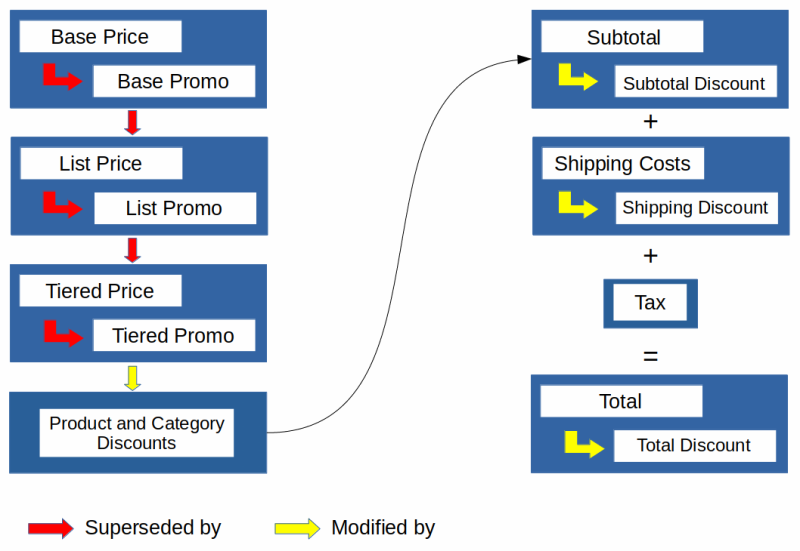
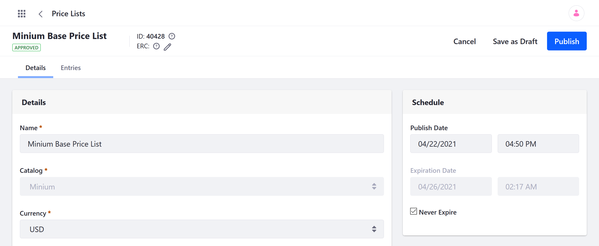
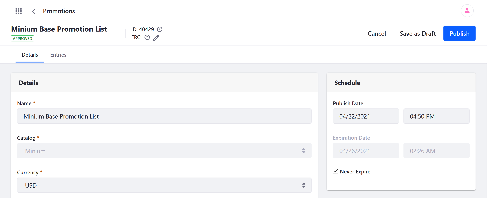
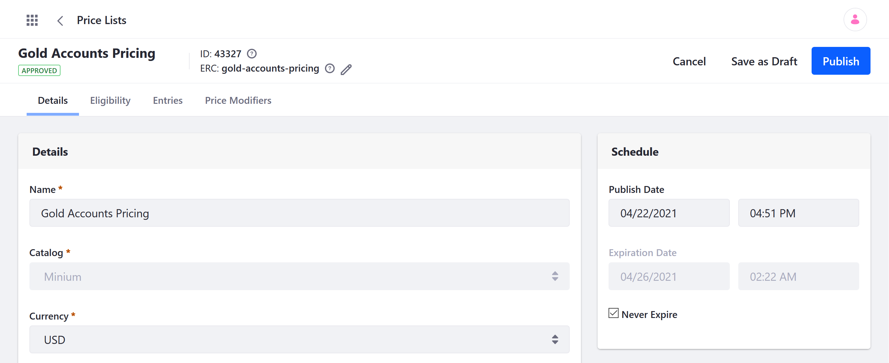
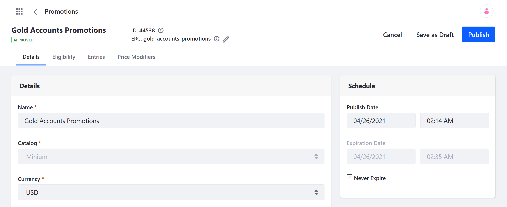
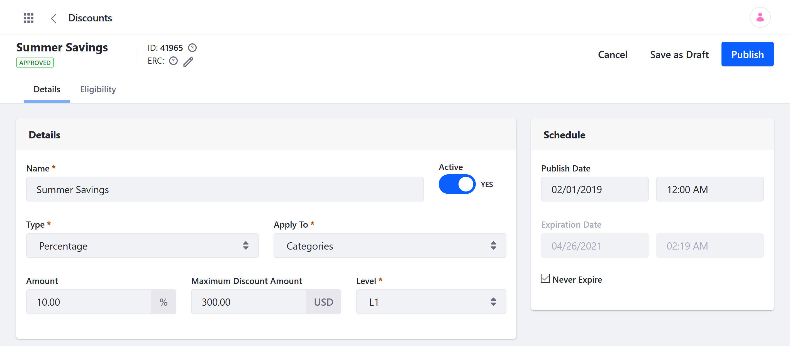
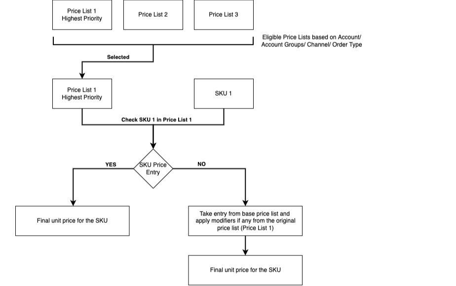
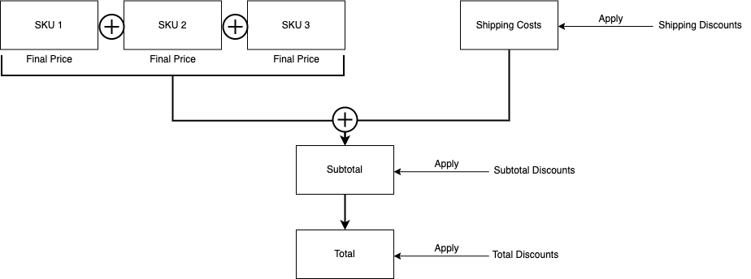
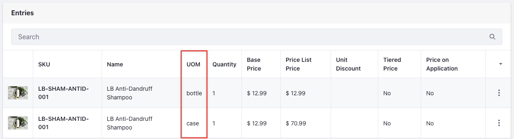

# Pricing Engine Overview

Catalogs contain products, and each catalog has its own default [base price list](#base-price-list) and [base promotion list](#base-promotion-list). These lists store base price entries for all product SKUs in the catalog and are available to all customers. You can also create custom [price lists](#price-lists) and [promotion lists](#promotion-lists) to define more targeted and configurable price entities. As part of each entry, you can also define [price tiers](#price-tiers) that set special prices for products based on quantity. Finally, [discounts](#discounts) are applied on top of price entries without overriding them.

!!! note
    The following overview describes Commerce Pricing Engine v2.0. This is the default pricing algorithm used for Commerce 3.0+ and Portal/DXP 7.3+. Earlier versions (i.e., Commerce 2.1.x) use [Pricing Engine v1.0](#pricing-engine-v1-0-reference) by default. If desired, you can [change the pricing engine version](#enabling-pricing-engine-v20-in-commerce-21x) used for the instance.

{bdg-secondary}`Liferay DXP 2023.Q4+/Portal GA98+` If you have a [unit of measure](../product-management/creating-and-managing-products/products/units-of-measure.md) configured for the SKU, you have entries for each unit in the base price list, base promotion list, custom price lists, and custom promotion lists. 

## Base Price List

The base price list stores the starting price for every product SKU in a catalog. These entries set the standard currency and price used for each SKU when no overrides are applied to it. This list is created automatically for every catalog and is available to all accounts and channels. See [Setting a Product's Base Price](./setting-a-products-base-price.md) to learn more.

## Base Promotion List

The base promotion list stores base promotional price entries for all product SKUs in a catalog. When applied to an SKU, the base promotional price entry overrides its base price for all customers. This list is created automatically for every catalog and is available to all accounts and channels. See [Promotion Base List Reference](./promoting-products/promotions-reference.md) for more information.

## Price Lists

Custom price lists store price entries for specific products and are available only to eligible customers. These lists can use a different currency from the base price list and can include all or only some of a catalog's products. A custom price list entry override an SKU's base price for eligible customers. You can also define [Price Modifiers](./using-price-modifiers.md) to modify specific price entries. See [Creating a Price List](./creating-a-price-list.md) for more information.

## Promotion Lists

Custom promotion lists store promotion price entries for specific products and are available only to eligible customers. These lists can use a different currency from the base price list and include all or only some of a catalog's products. When applied, they override other price entries of an SKU (e.g., base prices, tiered prices) for eligible users. In these lists, you can also define [Price Modifiers](./using-price-modifiers.md) to modify specific price entries. While active, both the original price and promotional price appear together on the Product page so that buyers see the markdown. See [Creating a Promotion](./promoting-products/creating-a-promotion.md) for more information.

!!! note
    Before Liferay DXP 7.4 U42/GA42, Promotion Price was called Sale Price.

## Price Tiers

Price tiers are set directly within a price entry and define specific prices for orders that meet minimum quantity requirements. These prices appear to customers as discounted order options. See [Using Price Tiers](./using-price-tiers.md) for more information.

## Discounts

Discounts are applied on top of the price and modify it without superseding it. They can be defined within an existing price entry, or created as separate entities and used to target products, product groups, categories, shipping costs, subtotals, or totals. See [Introduction to Discounts](./promoting-products/introduction-to-discounts.md) to learn more.

## How the Pricing Engine Calculates Product Prices

The pricing engine determines how each pricing component contributes to an SKU's price in a channel. When the engine receives a price request, it first calculates the product's *unit price* and *promotion price*. These prices are then used to determine the *final price* made available to the customer.

{bdg-secondary}`Liferay DXP 2023.Q4+/Portal GA98+` The pricing engine calculates the unit price, promotion price, final price, and order price the same way for an SKU containing [units of measure](../product-management/creating-and-managing-products/products/units-of-measure.md) as an SKU without units of measure.

<!--TASK: Consider adding details about net/gross price types and how taxes are calculated-->

### Calculating an SKU's Unit Price

When calculating an SKU's unit price, the pricing engine searches for eligible custom price lists. If multiple lists exist, the engine selects the list with the highest priority. Then, it searches the selected list's price entries for the product SKU.

* If an entry for the SKU exists, the algorithm applies any existing price modifiers to it and uses the total for the SKU's unit price.

* If no entry for the SKU exists, the engine uses the SKU's base price and applies modifiers from the highest priority price list. The total is the SKU's unit price.

   !!! note
       The engine only searches the highest priority list and does not search for the SKU in lower priority lists. This is to avoid applying prices from different price lists to SKUs in the same catalog.

If no eligible custom price list exists, the engine uses the SKU's base price list entry for the unit price.

!!! note
    During this process, the engine also checks for applicable tier prices. If one exists, its price is used in place of the default list price for specific quantities.

### Calculating an SKU's Promotion Price

After calculating the SKU's unit price, the pricing engine calculates the SKU's promotion price. This calculation is essentially the same as the process for calculating the unit price with two exceptions:

* If an applicable promotion list does not have a price entry for the SKU, any existing price modifiers are applied to the unit price, and the total is used for the promotion price.

* If there is no applicable promotion list and the base promotion list is set to 0, the promotion price is set to 0.

### Calculating an SKU's Final Price

After calculating the unit and promotion prices, the pricing engine compares them and selects the lower price. The pricing algorithm then searches for all applicable discounts and applies them to that price. The total is the SKU's final price: the price the customer pays to purchase the product.

## How the Pricing Engine Calculates Order Prices

When calculating order prices, the pricing engine first retrieves the shipping costs and applies any discounts that target shipping.

Then, the engine determines the subtotal by adding the final prices of all SKUs in the order. Any discounts targeting the subtotal are then applied.

Finally, the pricing engine adds together the discounted shipping cost and discounted subtotal to get the order's total. Any discounts targeting the total are then applied.

## Pricing Engine v1.0 Reference

| Pricing Method                                 | Summary                                                                                    | Overrides the Base Price? | Where is it set? | Applies to who?                                                                      |                Applies to what?                 |
| :--------------------------------------------- | :----------------------------------------------------------------------------------------- | :-----------------------: | :--------------- | :----------------------------------------------------------------------------------- | :---------------------------------------------: |
| Base Price                                     | The base price                                                                             |            n/a            | Product SKU      | All buyers                                                                           |                   Product SKU                   |
| Base Promo                                     | Marked down price                                                                          |            Yes            | Product SKU      | All buyers                                                                           |                   Product SKU                   |
| Price List (List Price, List Promo)            | Special pricing (or currencies) per product and buyer                                      |            Yes            | Price Lists      | Selected buyers (Accounts & Account Groups)                                          |             Individual Product SKUs             |
| Tiered Price List (Tiered Price, Tiered Promo) | Special pricing (or currencies) per product and buyer *at bulk quantities*                 |            Yes            | Price Lists      | Selected buyers (Accounts & Account Groups)                                          |             Individual Product SKUs             |
| Discount                                       | Modifies price for a group of products or buyers (Can limit quantity and use coupon codes) |            No             | Discounts        | Selected Buyers (Accounts & Account Groups or those who meet certain qualifications) | Groups of Products (or Individual Product SKUs) |

!!! note
    In v1.0, price entries include three components: an SKU, a standard price, and a promotion price. In v2.0, each is a separate entity.

## Enabling Pricing Engine v2.0 in Commerce 2.1.x

By default, Commerce 2.1.x and earlier versions use Commerce Pricing Engine v1.0. Follow these steps to enable Commerce Pricing Engine v2.0:

1. Open the Control Panel, and go to *System Settings* &rarr; *Commerce* &rarr; *Pricing*.

1. Click *Commerce Pricing Configuration* in the left panel.

1. Replace `v1.0` with `v2.0` in the *Pricing Calculation Key* field.

1. Click *Save*.

Your instance now uses Pricing Engine v2.0 for all price calculations.

## Related Topics

* [Setting a Product's Base Price](./setting-a-products-base-price.md)
* [Creating a Price List](./creating-a-price-list.md)
* [Adding Products to a Price List](./adding-products-to-a-price-list.md)
* [Using Price Tiers](./adding-products-to-a-price-list.md)
* [Creating a Discount](./promoting-products/creating-a-discount.md)
