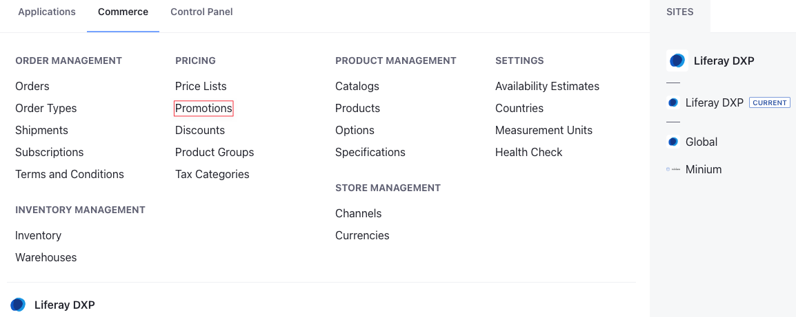
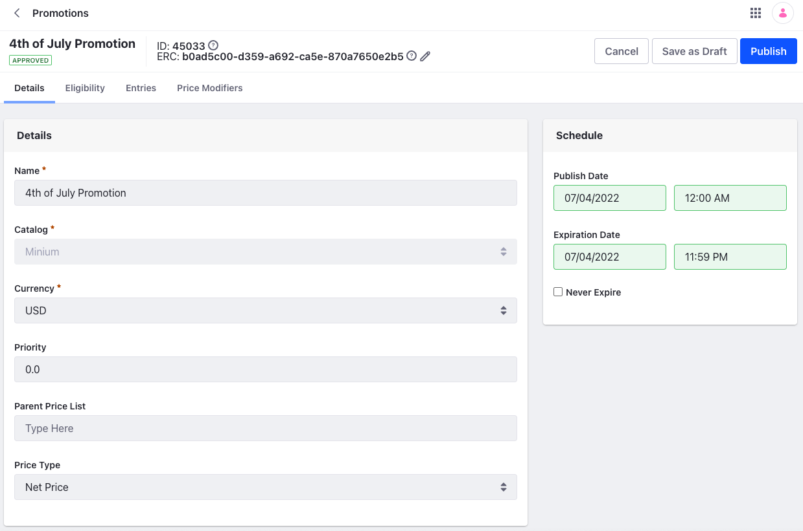
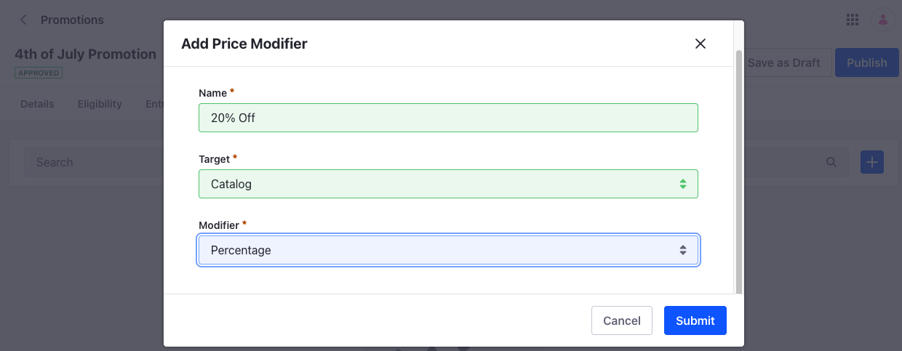
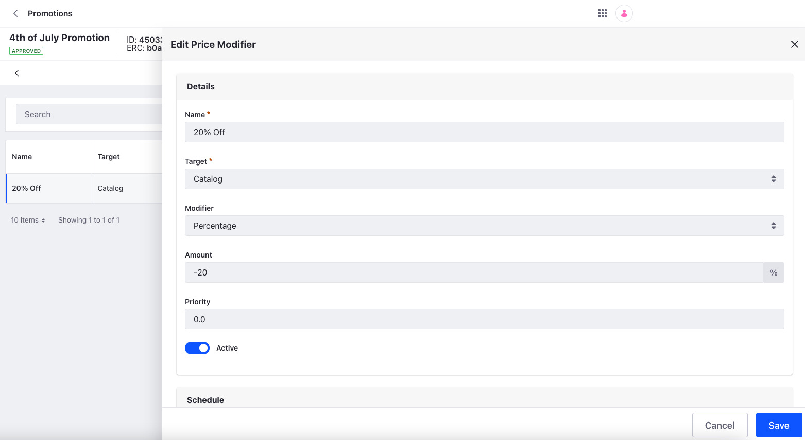
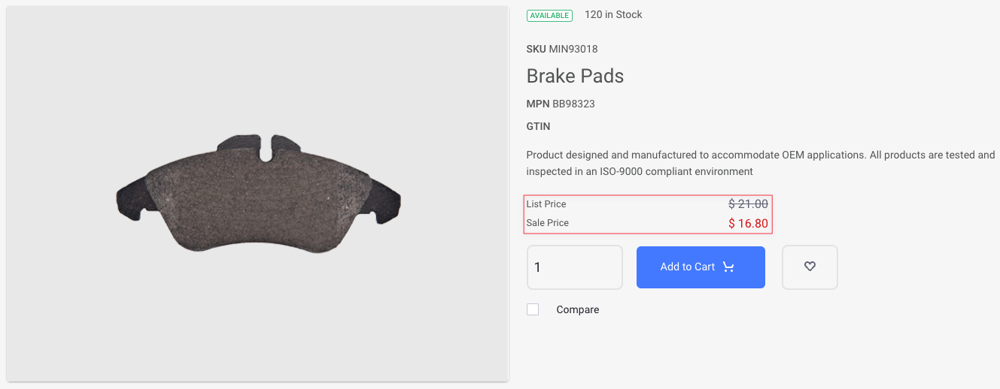

# Creating a Promotion

The example below creates a promotion that reduces the price of all products in the catalog by 20% on the 4th of July. All accounts, account groups, channels, and order types are eligible for this promotion.

1. Open the *Global Menu* () and navigate to *Commerce* &rarr; *Promotions*.

   

1. Click *Add* () and enter the following information.

   **Name:** 4th of July Promotion

   **Catalog:** Minium

   **Currency:** USD

   

1. Click *Submit*.

This creates a new promotion on the selected catalog. Notice how there is a *Base Promotion List* for the catalog already available. Read [Using the Promotion Base List](./using-the-promotion-base-list.md) for more information.



In the Details section, you can change the name of the promotion, assign a priority, and select the Parent Price List and the Price Type. Since the promotion is for the 4th of July, you can set a schedule by selecting a *Publish Date* and *Expiration Date* from the Schedule section. Click *Publish* to activate the promotion. If there are multiple promotions applicable for an account, the promotion with higher priority has precedence over the others. See [Promotions Reference](./promotions-reference.md) for more information on specific fields.

## Adding a Price Modifier

In this example, the promotion reduces the price of all products in the catalog by 20%. To do this, you must add a price modifier.

1. Click the *Price Modifiers* tab.

1. Click *Add* () and enter the following information.

   **Name:** 20% Off

   **Target:** Catalog

   **Modifier:** Percentage

   

1. Click *Submit*.

```{note}
You need not set an expiration date for the price modifier if you have already set an expiration date for the promotion itself.
```

You must now configure the new price modifier. Click the entry from the list and enter the percentage amount as -20. Then activate it using the *Active* toggle. After that, click *Save* and click *Publish*. See [Price Modifiers Reference](./promotions-reference.md#price-modifiers-reference) for more information.



This activates the promotion, and the prices of all products in the catalog are reduced by 20% on the scheduled date. If there are any active discounts available, they are calculated on the reduced price. If you are targeting a promotion at a specific product, use the Entries tab to add an entry and configure its price. You can also configure [Tiered Pricing or Bulk Pricing](../using-price-tiers.md#bulk-pricing-vs-tier-pricing) for it here. See [Adding Entries](./using-the-promotion-base-list.md#adding-entries) for more information.



## Related Topics

* [Introduction to Promotions](./introduction-to-promotions.md)
* [Using the Promotion Base List](./using-the-promotion-base-list.md)
* [Promotions Reference](./promotions-reference.md)
