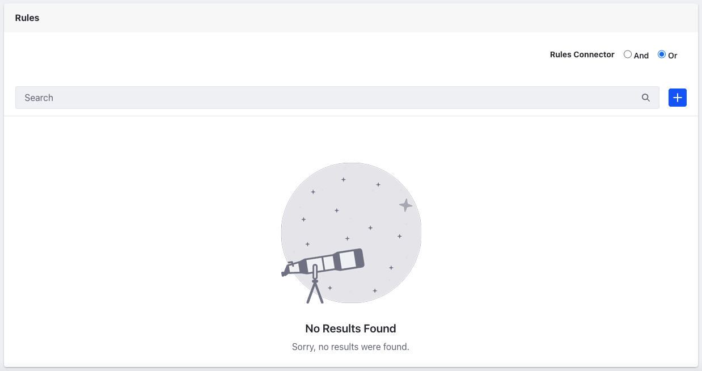

# Introduction to Discounts

You can use discounts to reduce the price of products or offer other incentives to customers. You can use discounts to offer,

* Reduced price on specific products/product groups/SKUs
* Free shipping
* Tailored discounts for specific [Account Groups](../../users-and-accounts/account-management/creating-a-new-account-group.md), or to a more narrowly defined group of customers
* Promotions that last for a specific period of time

To create a discount, open the *Global Menu* and navigate to *Commerce* &rarr; *Discounts*.

```{tip}
Discounts and *Price Lists* are not the same. For more information on Pricing see [Introduction to Pricing](../introduction-to-pricing.md), [Creating a Price List](../creating-a-price-list.md), and [Using Price Tiers](../using-price-tiers.md).
```

```{note}
For Commerce 2.1 and below, navigate to *Control Panel* &rarr; *Commerce*. Many Commerce settings in prior versions are present there or under *Site Administration*.
```

## Discount Types

The following types of discounts are available:

| Discount Type  | Description                                                                                                                                                                                     |
| :------------- | :---------------------------------------------------------------------------------------------------------------------------------------------------------------------------------------------- |
| Categories     | The discount applies to all products tagged with a specific [Category](../../product-management/creating-and-managing-products/products/organizing-your-catalog-with-product-categories.md). |
| Products       | The discount applies to a specific product or list of products.                                                                                                                              |
| Shipments      | The discount applies to the shipment costs, either by a percentage or flat sum.                                                                                                              |
| Subtotal       | The discount reduces the order's subtotal, usually before applying taxes and other fees.                                                                                                               |
| Total          | The discount applies to the entire total.                                                                                                                                                    |
| Product Groups | The discount applies to all products in the same Product Group.                                                                                                                              |


## Coupon Codes

Regardless of the discount type you choose, you can ask users to enter a coupon code to qualify for the discount. After enabling a coupon code, you can share it through emails, newsletters, or ads.


To accept coupon codes, you must add the *Coupon Code Entry* widget on a store's [Checkout](../../creating-store-content/commerce-storefront-pages/checkout.md) page. The checkout page is available out-of-the-box on the [Minium site](../../starting-a-store/using-the-minium-accelerator-to-jump-start-your-b2b-store.md).


After applying the coupon code, you can view the updated prices in the order summary section.


## Discount Levels

You can create discounts at multiple levels for all discounts based on percentages. For instance, you can create a level 1 discount offering 20% off and then offer an additional 5% off if the cart value exceeds 50$. To create this on a Minium site,

1. Open the *Global Menu* () and navigate to *Commerce* &rarr; *Discounts*.

1. Click the *Add* () button and enter the following information.

   **Name:** U-Joint Clearance

   **Type:** Percentage

   **Apply To:** Products

1. Click *Submit*. This opens a new page with options to configure the discount.

1. Enter the *Amount* as 20 and keep the *Level* at its default value (L1).

1. In the *Products* section, search for *U-Joint* and click *Select*.

1. Enable the discount using the *Active* toggle.

1. Click *Publish*.

   This creates the base discount of 20% for the product (U-Joint). To add a new level, you must create a new discount following the first three steps above. Once you reach the configuration page for the new discount,

1. Enter the *Amount* as 5, and set the *Level* to L2.

1. In the *Products* section, search for *U-Joint* and click *Select*.

1. In the *Rules* section, click the *Add* () button.

1. Enter a name and set the type to *Cart Total*.

1. Click *Submit*.

1. Once created, click on the rule again, and set the *Cart Total Minimum Amount* to 50$ and click *Save*.

1. Click *Publish*.

Go to your site and open the product page for u-joint. It should have a base discount of 20% applied to it. Now, add more units to your cart so that the total exceeds 50$. Check the price again to verify the additional discount applied to your cart.

## Expiration Date

You can configure discounts to have expiration dates that coincide with promotional efforts.


## Discount Rules

You can define rules that specify requirements to qualify for a discount. There are three rules available out-of-the-box:

| Rule                      | Description                                                                                         |
| :------------------------ | :-------------------------------------------------------------------------------------------------- |
| Cart Total                | Cart subtotal must meet a minimum threshold to receive the discount.                                |
| Has all of these products | Orders must include all specified products in order to receive the discount.                        |
| Has one of these products | Orders must contain at least one product from a list of specified products to receive the discount. |

You can add discount rules in the *Rules* section. Developers can also [implement new discount rules](../../developer-guide/promotions/adding-a-new-discount-rule-type.md).



When using either *Has all of these products* or *Has one of these products* rules, select which products in the catalog are eligible for the discount.


## What's Next

* [Creating a Discount](./creating-a-discount.md)