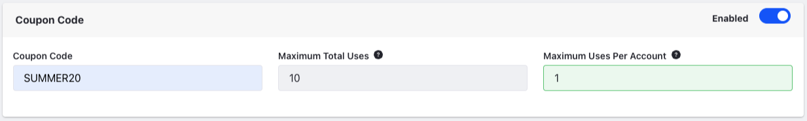
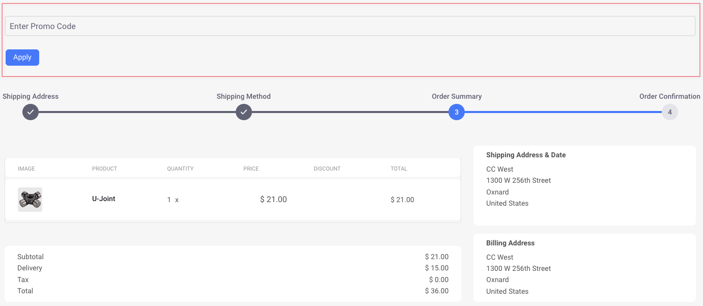
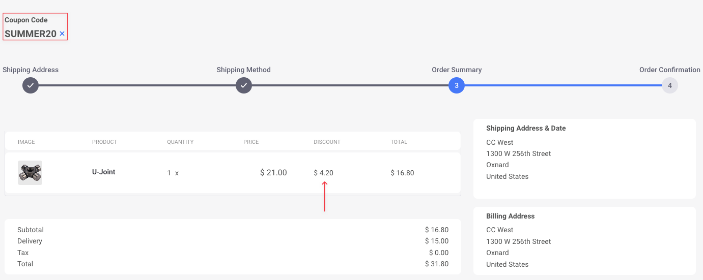
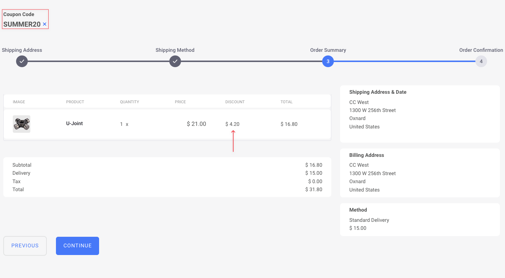
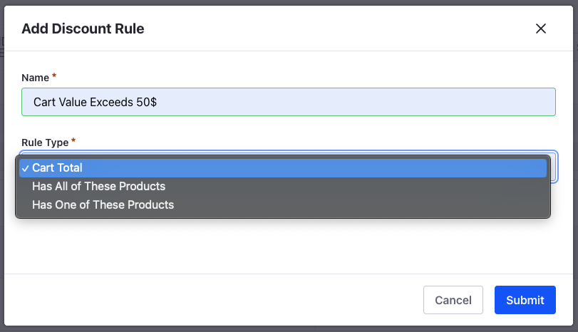

# Introduction to Discounts

Discounts are price reductions you can apply to products and orders to offer incentives to customers. When creating a discount, you determine whether to reduce the set price by a percentage or flat rate and set the discount's scope:

| Discount Scope  | Description                                                                                                                                                   |
| :-------------- | :------------------------------------------------------------------------------------------------------------------------------------------------------------ |
| Categories      | Applies to all products in a [category](../../product-management/creating-and-managing-products/products/organizing-your-catalog-with-product-categories.md). |
| Products        | Applies to selected products.                                                                                                                                 |
| Product Groups  | Applies to all products in the same group.                                                                                                                    |
| Shipments       | Applies to shipping costs.                                                                                                                                    |
| SKUs            | Applies to specified SKUs.                                                                                                                                    |
| Subtotal        | Applies to order subtotals, usually before applying taxes and other fees.                                                                                     |
| Total           | Applies to order totals.                                                                                                                                      |

{bdg-secondary}`Liferay DXP 2023.Q4+/Portal 7.4 GA98+` If you have [units of measure](../../product-management/creating-and-managing-products/products/units-of-measure.md) configured for SKUs, you can target discounts at each unit of measure specifically. 

Once created, you can both determine which channels, accounts, and order types are eligible for receiving the discount and define rules to specify requirements for qualifying. By default, Liferay applies discounts automatically, but you can make them available to customers as coupon codes. Also, when configuring discounts, you can schedule when they take effect and expire.

See [Creating Discounts](./creating-a-discount.md) to get started or [Introduction to Pricing](../introduction-to-pricing.md) to learn how discounts contribute to Liferay's pricing engine.

## Coupon Codes

Regardless of the discount type you choose, you can ask users to enter a coupon code to qualify for the discount. After enabling a coupon code, you can share it through emails, newsletters, or ads.

To accept coupon codes, you must add the *Coupon Code Entry* widget on a store's [Checkout](../../creating-store-content/commerce-storefront-pages/checkout.md) page. The checkout page is available out-of-the-box on the [Minium site](../../starting-a-store/using-the-minium-accelerator-to-jump-start-your-b2b-store.md).

After applying the coupon code, you can view the updated prices in the order summary section.

## Expiration Date

You can configure discounts to have expiration dates that coincide with promotional efforts.

## Discount Rules

You can define rules that specify requirements to qualify for a discount. There are three rules available out-of-the-box:

| Rule                      | Description                                                                                         |
| :------------------------ | :-------------------------------------------------------------------------------------------------- |
| Cart Total                | Cart subtotal must meet a minimum threshold to receive the discount.                                |
| Has all of these products | Orders must include all specified products in order to receive the discount.                        |
| Has one of these products | Orders must contain at least one product from a list of specified products to receive the discount. |

You can add discount rules in the *Rules* section. Developers can also [implement new discount rules](../../developer-guide/promotions/adding-a-new-discount-rule-type.md).

When using *Has all of these products* or *Has one of these products* rules, select which products in the catalog are eligible for the discount.

## Discount Levels

You can create discount levels for applying multiple discounts to products and orders. Commerce applies these discounts consecutively. See [Using Discount Levels](./using-discount-levels.md) for more information.

## Overriding Discounts

When editing price entries, you can set alternative discounts that override those set in the Discounts application. These discounts use the percentage type. However, they do not support rules or eligibility restrictions. If you want to maintain restrictions, do not use discount overrides.

## Related Topics

* [Introduction to Pricing](../introduction-to-pricing.md)
* [Creating a Discount](./creating-a-discount.md)
* [Using Discount Levels](./using-discount-levels.md)
