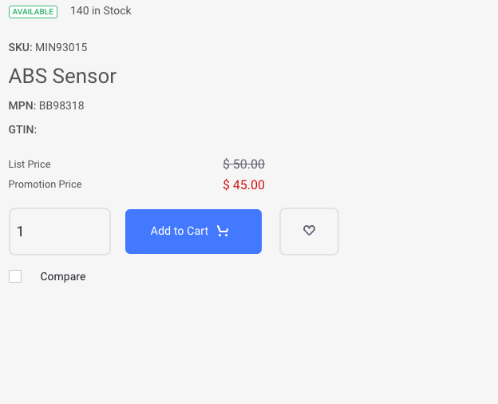
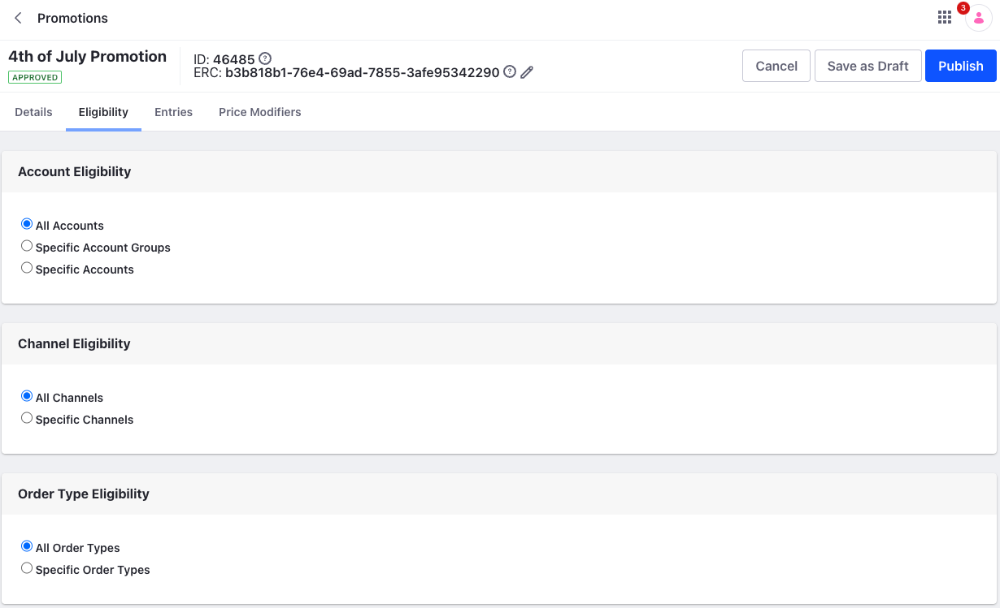
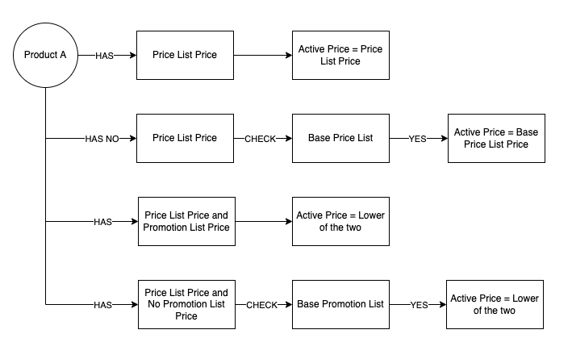
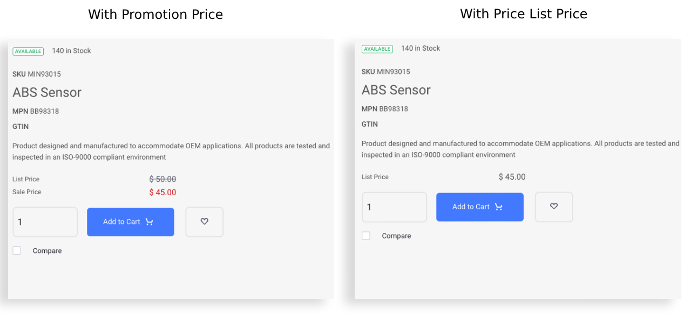

# Introduction to Promotions

You can create *Promotions* in Liferay to offer promotional pricing to all customers or a set of customers. A promotion shows the difference between a product's list price and its promotion price visually. This is useful to highlight the discount a customer is receiving and to support multiple prices for individuals or groups of customers.

!!! note
    Prior to Liferay DXP 7.4 U42/GA42, Promotion Price was called Sale Price.

## Eligibility

Click the *Eligibility* tab and select the appropriate option to define a promotional price for all or a specific set of customers. You can narrow down the promotion based on the account, account group, channel, or order type.

## Entries

You can use the Entries tab to define promotions for specific SKUs. Click the *Entries* tab, search for an SKU, and click *Select*. Once selected, click on the SKU from the Entries section and add a promotion price. See [Adding Entries](./using-the-promotion-base-list.md#adding-entries) for more information.

{bdg-secondary}`Liferay DXP 2023.Q4+/Portal 7.4 GA98+` If you have [units of measure](../../product-management/creating-and-managing-products/products/units-of-measure.md) configured for SKUs, you can enter a promotion price for each unit of measure separately if applicable. 

## Price Modifiers

*Price Modifiers* can adjust the price of a range of products by a fixed amount or percentage. Price modifiers make it easy to maintain a promotion by calculating the promotional price using the product’s base price. If you have an entry as well as a price modifier that targets the same SKU, the price in the entry has precedence over the price modifier.

You can use price modifiers to target a catalog, category, product group, or product. The price modifier is applied to all products in the target group. This is unlike in the entries section where you must target each SKU specifically. See [Adding a Price Modifier](./creating-a-promotion.md#adding-a-price-modifier) for more information.

## Promotions and Price Lists

Promotions are similar to price lists in functionality but they are used together to determine the discount price. See the diagram below to understand the calculation.

Once the active price of a product is determined, discounts are then applied on the active price. See [Introduction to Discounts](./introduction-to-discounts.md) for more information.

If you want to offer special pricing to a customer that is lower than the usual price for other customers, you can use both price lists and promotions but a price list does not show the reduction in price. See the image below.

!!! important
    Setting a SKU's price to `0` in a promotion list specifies the absence of a promotion price.

## Related Topics

* [Creating a Promotion](./creating-a-promotion.md)
* [Using the Promotion Base List](./using-the-promotion-base-list.md)
* [Promotions Reference](./promotions-reference.md)
