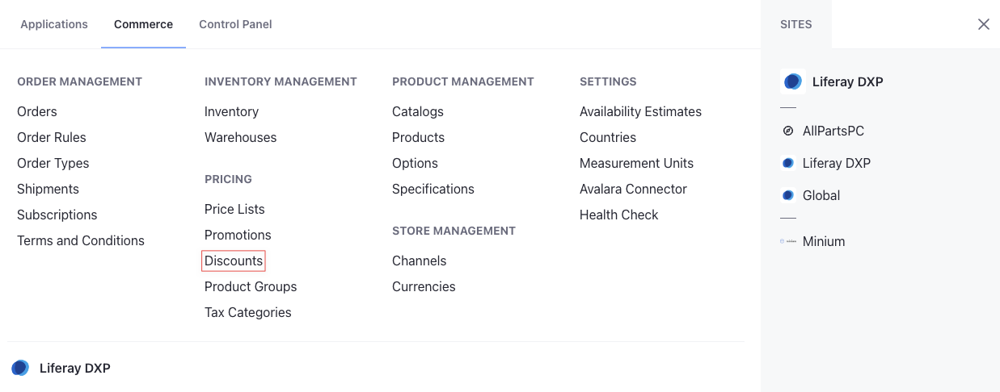
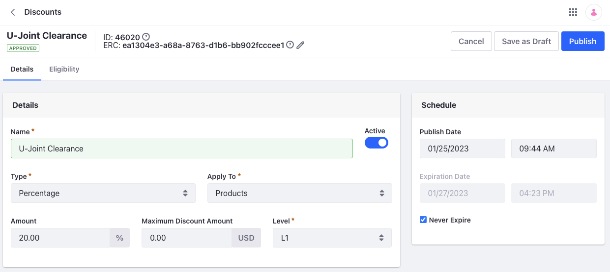
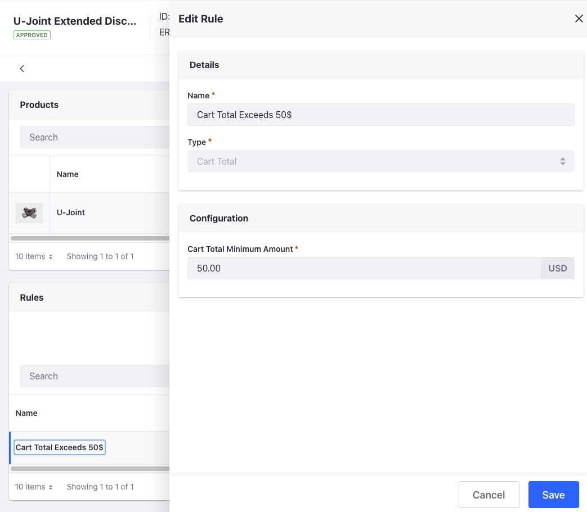

# Using Discount Levels

You can create discount levels to apply multiple discounts to products and orders. Commerce applies these discounts consecutively according to their rank. For example, if you create a level 1 discount offering 20% off and a level 2 discount offering an additional 5% off if the cart value exceeds 50$, the level 1 discount is applied first, and if applicable, the level two discount is applied second.

To add discount levels on a Minium site,

1. Open the *Global Menu* () and navigate to *Commerce* &rarr; *Discounts*.

   

1. Click *Add* () and enter this information:

   **Name:** U-Joint Clearance

   **Type:** Percentage

   **Apply To:** Products

1. Click *Submit*. This opens a new page with options to configure the discount.

1. Enter 20 for the Amount and keep the default Level value (L1).

   

1. In the Products section, search for U-Joint and click *Select*.

1. Toggle the *Active* switch to enable the discount.

1. Click *Publish*. This creates the base discount of 20% for the product (U-Joint).

1. Return to the Discounts application page and repeat steps 2-3 to create another discount with a different name.

1. Enter 5 for the Amount and set the Level to L2.

1. In the Products section, search for U-Joint and click *Select*.

1. In the Rules section, click *Add* () and enter this information:

   **Name**: Cart Total Exceeds $50

   **Type**: Cart Total

1. Click *Submit*.

1. Edit the rule, enter 50 for the Cart Total Minimum Amount, and click *Save*.

   

1. Click *Publish*.

Go to your site and open the product page for u-joint. It should have a base discount of 20% off. Then add more units to your cart so the total exceeds $50. Check the price again to verify the additional discount is applied to your cart.


```{note}
Overriding discounts for a price entry overrides all discount levels targeting the SKU. See [Overriding Discounts](./introduction-to-discounts.md#overriding-discounts) for more information.
```

## Additional Information

* [Introduction to Pricing](../introduction-to-pricing.md)
* [Introduction to Discounts](./introduction-to-discounts.md)
* [Creating a Discount](./creating-a-discount.md)
