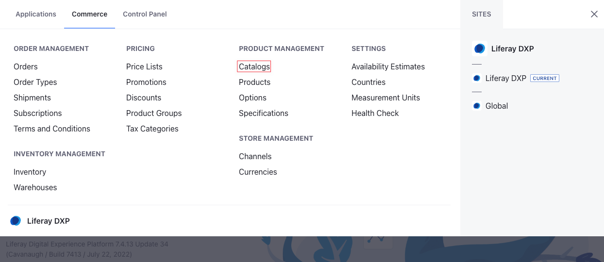
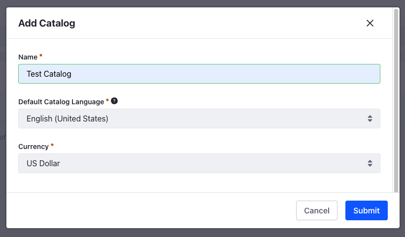
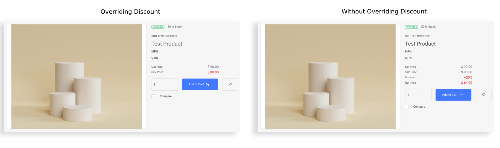

# Using the Base Promotion List

When you create a new catalog, a new *Base Promotion List* is created automatically. You cannot control the eligibility or add any price modifiers for a base promotion list. You can only use it to add specific entries that you want to target with a promotional price.

To use the base promotion list,

1. Open the *Global Menu* () and go to *Commerce* &rarr; *Catalogs*.

   

1. Click *Add* () and enter the following information.

   **Name:** Test Catalog

   **Default Catalog Language:** English (United States)

   **Currency:** US Dollar

   

1. Click *Submit*.

This creates a new catalog and a new base promotion list. To view this, open the *Global Menu* () and click on *Commerce* &rarr; *Promotions*. You should see a new entry as *Test Catalog Base Promotion*.

## Adding Entries

The base promotion list automatically adds all products in the corresponding catalog as entries. To target a specific SKU in the Catalog,

1. Search for an SKU in the Entries section and click on it.

1. You can enter a promotion price, expiration date, and configure [bulk or tiered pricing](../using-price-tiers.md#bulk-pricing-vs-tier-pricing) for the SKU.

   

1. Click *Save*.

You can also use the Override Discount toggle to give the promotion price precedence over any active discounts. See the comparison between a promotion overriding a 20% discount and without it.

!!! important
    Setting a SKU's price to `0` in a promotion list specifies the absence of a promotion price.

!!! note
    Another way to target an SKU with a promotion price is by opening the *Global Menu* () and going to *Commerce* &rarr; *Products*. Find and select the product and click the *SKUs* tab. Select the SKU you want to target and set a promotion price for it. Click *Publish*. This sets the price of the SKU in the Base Promotion List. Before Liferay DXP 7.4 U42/GA42, promotion price was called sale price.

## Related Topics

* [Introduction to Promotions](./introduction-to-promotions.md)
* [Creating a Promotion](./creating-a-promotion.md)
* [Promotions Reference](./promotions-reference.md)
