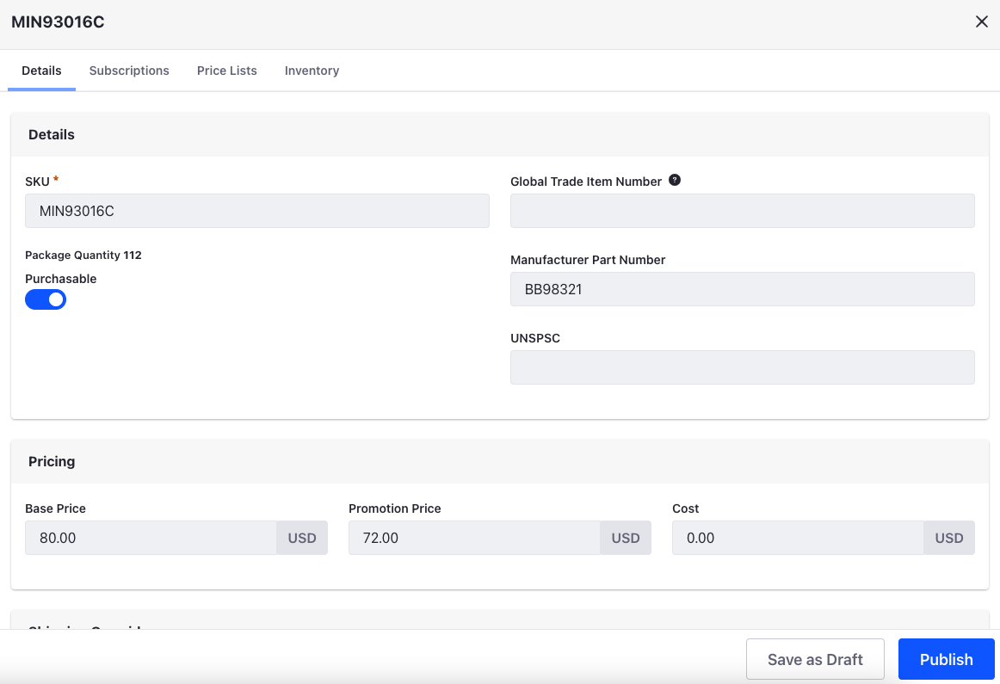

# Setting a Product's Base Price

When you create a SKU, it doesn't have a base price. A price entry for the SKU is automatically created in the catalog's base price list, but you must change it to the SKU's actual price. Once added, this price serves as the default price for the SKU when no overrides (e.g., other price lists or promotions) are applicable.

## Setting the Base Price

{bdg-secondary}`Liferay DXP 2023.Q4+/Portal GA98+` To assign the base price or promotion price for an SKU or a unit of measure:

1. Open the *Global Menu* () and navigate to *Commerce* &rarr; *Products*.

1. Click on the desired product.

1. Go to the *SKUs* tab, and click on the desired *SKU*.

1. Go to the *Price* tab.

1. Select the base price list or base promotion list.

1. Enter the desired value in the *Price List Price* field.

1. Click *Save*.

If you have a [unit of measure](../product-management/creating-and-managing-products/products/units-of-measure.md) configured for the SKU, the base price list and base promotion list appears as a separate entry for each unit. You can configure different prices for each of the available units of measure.

{bdg-secondary}`Liferay DXP 2023.Q3/Portal GA97 and Below` To assign a SKU's base price:

1. Open the *Global Menu* () and navigate to *Commerce* &rarr; *Products*.

1. Click on the desired product.

1. Go to the *SKUs* tab, and click on the desired *SKU*.

1. In the *Details* tab, enter the desired value in the *Base Price* field under *Pricing*.

   Optionally, you can also set a *Promotion Price* and *Cost* for the SKU.

   

   ```{note}
   Prior to Liferay DXP 7.4 U42/GA42, Promotion Price was called Sale Price.
   ```

1. Click on *Publish*.

The SKU’s base price and any other entered values are now set. You can directly edit this amount at any time or modify it using price lists, promotion prices, and discounts.

## Commerce 2.1 and Below

Products are located in the _Control Panel_ in the legacy versions.

1. Navigate to the _Control Panel_ &rarr; _Commerce_ &rarr; _Products_.
1. Click on a product (_Torque Converters_ in this example).
1. Click the _SKUs_ tab.
1. Click on a SKU (_MIN55859_ in this example).
1. On the _Details_ tab, enter the following in the Pricing section:
    * **Price**: 34
    * **Promo Price**: (leave it blank) (If you enter this field, then both the price above and promo price will appear on the product page so that buyers can see the markdown.)
    * **Cost**: 20

    

1. Click _Publish_.

This product SKU’s base price, promo price (optional), and cost (optional) have been set. The _Cost_ field corresponds to your cost for this SKU which can help you track margins.

## Related Topics

* [Creating a Price List](./creating-a-price-list.md)
* [Creating a Discount](./promoting-products/creating-a-discount.md)
