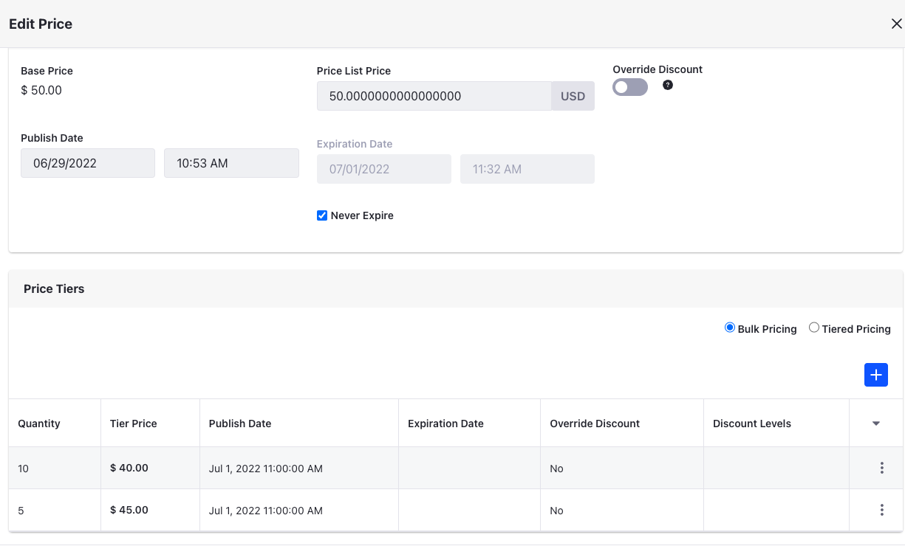
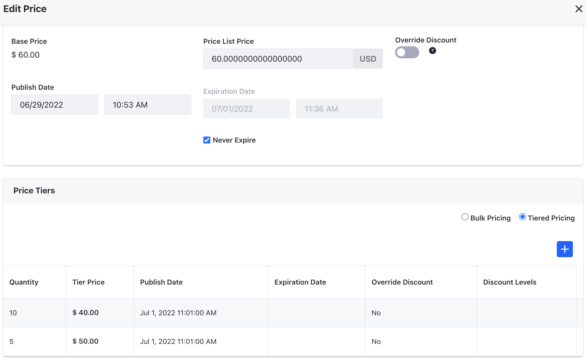

# Using Price Tiers

With Liferay Commerce, you can use *Price Tiers* to offer price reductions based on the quantity of a product ordered. Prices set this way take precedence for associated users when the specified minimum quantity is met.

Follow these steps to add tiered pricing to an existing Price List:

1. Open the *Global Menu* (), click on the *Commerce* tab, and go to *Pricing* &rarr; *Price Lists*.

1. Click on the desired *Price List*, and go to the *Entries* tab.

1. Click on the desired price entry.

1. Use the radio button in the *Price Tiers* section to select either *Bulk Pricing* or *Tiered Pricing*.

1. Click the *Add* button ().

1. Enter a *Quantity* to determine the minimum quantity for receiving the bulk price.

1. Enter a *Tier Price* to determine the individual price of each product in the bulk order.

1. Determine whether the tier price overrides active discounts on the product. If enabled, you can define custom discount levels for buyers who have been offered the list price and purchased the minimum quantity.

   ```{note}
   You can use discount levels to apply multiple discounts and modify the price. If there are two discounts on the same level (e.g., L1), the algorithm applies the better of the two. However, if there are two discounts on different levels (e.g., L1 and L2) the algorithm applies both.
   ```

   

1. Determine when the new price tier takes effect, as well as if and when it expires.

1. Click on *Submit*, and then click on *Save* in the *Edit Price* window.

   

When finished, click on *Publish* for the selected Price List to make your changes live, or click on *Save as Draft* to publish them at a later time.

## Bulk Pricing vs Tier Pricing

You can configure both price tier options in the same way, but they apply prices differently. *Bulk Pricing* applies the same tier price to all items in qualifying bulk orders, while *Tiered Pricing* applies different prices to order items according to defined price tiers.

### Bulk Pricing



Product A has a base price of $50, with two price tiers for Bulk Pricing. If the quantity is 5 or more, the price is $45 and if the quantity is 10 or more, the price if $40.

| You Buy  | Total Price | Unit Price Calculation |
| :------- | :---------- | :--------------------- |
| 4 units  | $200        | $50                    |
| 5 units  | $225        | $45                    |
| 9 units  | $405        | $45                    |
| 10 units | $400        | $40                    |
| 11 units | $440        | $40                    |

### Tiered Pricing



Product B has a base price of $60, with two price tiers for Tiered Pricing. If the quantity is 5 or more, the price is $50 starting from the fifth item. There is another tier with a unit price of $40 starting from the tenth item.

| You Buy  | Total Price | Unit Price Calculation                                        |
| :------- | :---------- | :------------------------------------------------------------ |
| 4 units  | $240        | ($60 * 4 units)/4 = $60                                       |
| 5 units  | $290        | (($60 * 4 units)+($50 * 1 unit))/5 = $58                      |
| 9 units  | $490        | (($60 * 4 units)+($50 * 5 units))/9 = $54.44                  |
| 10 units | $530        | (($60 * 4 units)+($50 * 5 units)+($40 * 1 unit))/10 = $53     |
| 11 units | $570        | (($60 * 4 units)+($50 * 5 units)+($40 * 2 units))/11 = $51.82 |

## Commerce 2.1 and Below

1. Navigate to the *Control Panel* &rarr; *Commerce* &rarr; *Price Lists*.
1. Click on a price list (*VIP Customers* in this example).
1. Click the *Entries* sub-tab.
1. Click on a product (*Premium Brake Fluid* in this example).
1. Click the *Tier Price Entries* sub-tab.
1. Click the () button.
1. Enter the following fields (example values shown below):
    * **Price**: 90
    * **Promo Price**: (leave it blank)
    * *Minimum Quantity*: 20 (This is the minimum quantity needed to receive the price for bulk quantity.)

        

1. Click Save.

This creates a price tier ($90) for orders that reach the minimum quantity (20) for the product (*Premium Brake Fluid*) on the price list (*VIP Customers*). Repeat the steps to add successive price tiers to the same product and price list (for other minimum quantities), or to add a price tier to another product and price list.

## Related Topics

**Note**: You can view Price Tier entries directly from the Product SKU.

* [Creating a Price List](./creating-a-price-list.md)
* [Adding Products to a Price List](./adding-products-to-a-price-list.md)
