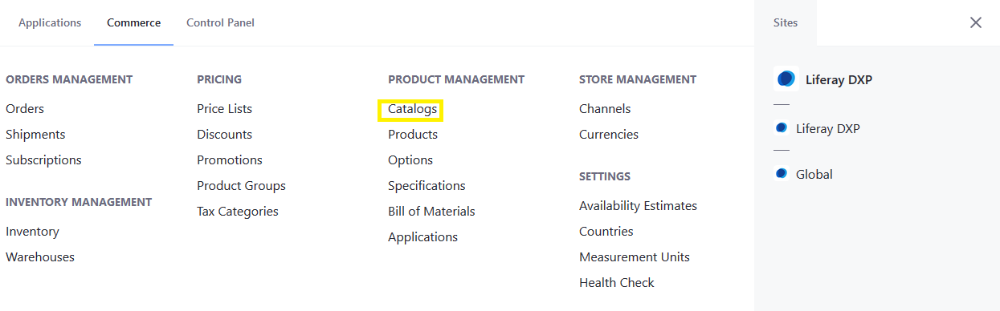
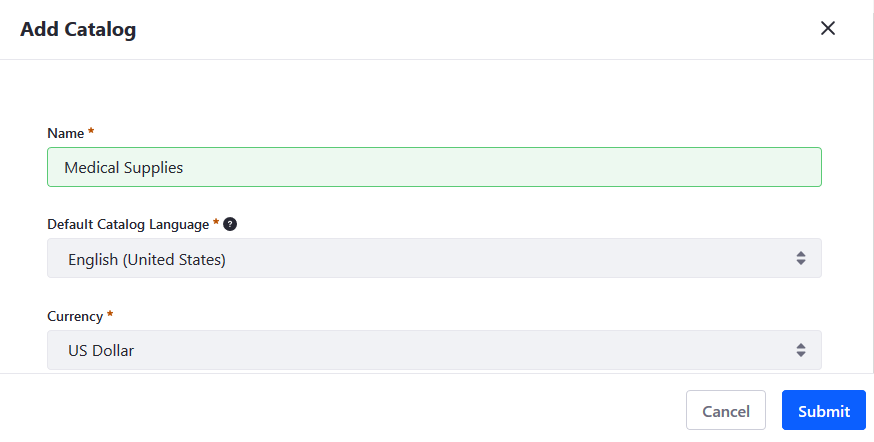
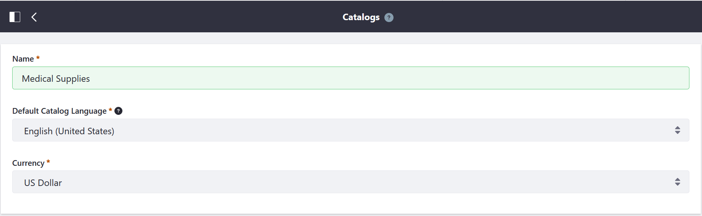

# Creating a New Catalog

1. Open the _Global Menu_ () and navigate to _Commerce_ &rarr; _Catalogs_.

   

1. Click _Add_ () and enter this data:

   - **Name**: Medical Supplies
   - **Default Catalog Language**: English (United States)
   - **Currency**: US Dollar

    

1. Click _Submit_.

## Liferay Commerce 2.1 and Below

1. Navigate to _Control Panel_ &rarr; _Commerce_ &rarr; _Catalogs_.

1. Click _Add_ () and enter the following:

    * **Name**: Medical Supplies
    * **Default Catalog Language**: English (United States)
    * **Currency**: US Dollar

    

1. Click _Save_.

## Related Topics

* [Locale Options](../../store-management/locale-options.md)
* [Currencies](../../store-management/currencies.md)