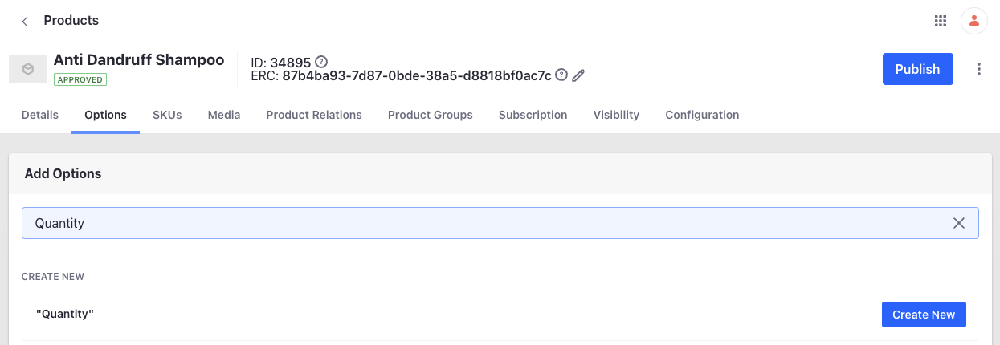

# Defining SKUs as Option Values using a Collection Provider

{bdg-secondary}`Liferay DXP 2023.Q4+/Portal 7.4 GA98+`

You can specify one or more categories as a collection provider when configuring an option on a product. You can use this to define your own custom logic, linking a group of SKUs as option values for a product. 

For instance, consider two products that aren't related to each other. To add them as product options, you can create a category, link it to these two products, and use that category as a collection provider on a new product. 

```{note}
You must create categories in the global scope so that they're available to products.
```

## Choosing a Category as a Collection Provider

See [Creating a New Product Category](https://learn.liferay.com/w/commerce/product-management/creating-and-managing-products/products/creating-a-new-product-category) and [Organizing Your Catalog with Product Categories](https://learn.liferay.com/w/commerce/product-management/creating-and-managing-products/products/organizing-your-catalog-with-product-categories) to learn more about creating categories and assigning them to products. 

Once you have your categories created and assigned to products, 

1. Open the *Global Menu* () and navigate to *Commerce* &rarr; *Products*. 

1. Find and select the product where you want to add a category as a collection provider.

1. Click on the *Options* tab.

1. Enter a name for the option and click on *Create New*. 

   

   This creates a new option and assigns it to the product. Now, select the new option. Alternatively, if you already have an option template created, select that.

1. Activate the *Define Externally* toggle. 

1. Set the *Price Type* drop-down to *Dynamic*.

1. Click *Save*. 

   This adds two new drop-downs below the *Price Type* drop-down to define a collection provider and categories. 

1. Choose *SKUs by Categories* as the collection provider.

1. Click *Save*.

1. From the categories drop-down, choose one or more categories. 

   

1. Click *Save*. 

   This populates the SKUs with the selected categories as option values. 

```{important}
You must have one active SKU for the product before defining options externally. Multi-SKU products cannot be added as external options currently.
```
