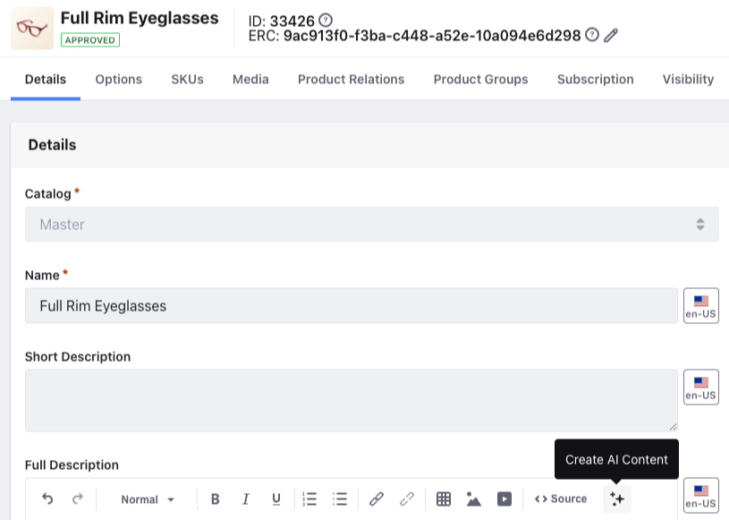
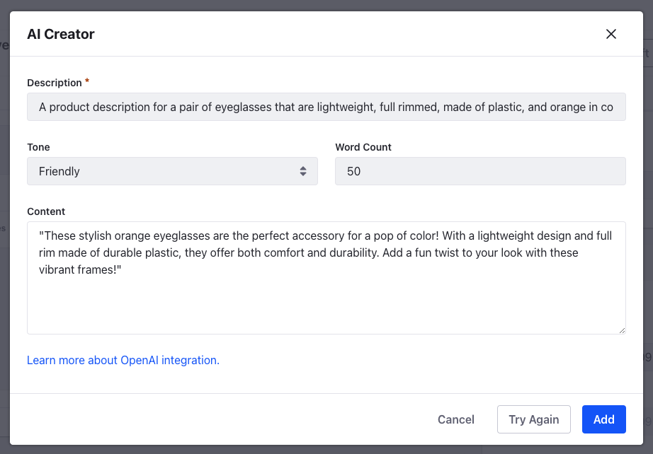
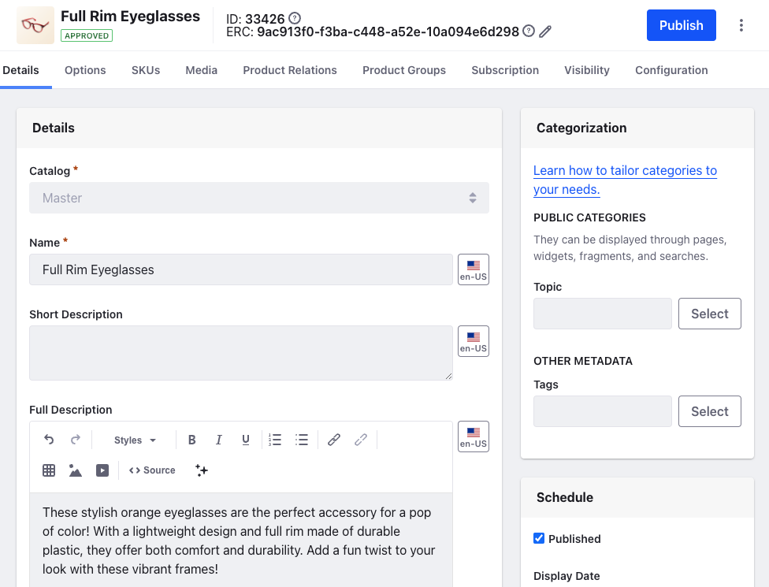

---
taxonomy-category-names:
- Commerce
- Products
- Product Information
- Liferay Self-Hosted
- Liferay PaaS
- Liferay SaaS
uuid: 9b08b64f-12a7-4aa6-b3be-060e43bfabd5
---
# Generating Product Descriptions using AI

{bdg-secondary}`Liferay DXP 2024.Q2+/Portal 7.4 GA120+`

You can now use generative AI to add product descriptions. To start using the AI Creator tool, you must add an API key to authenticate your access to ChatGPT. See [Generating Text Content Using AI](https://learn.liferay.com/web/guest/w/dxp/content-authoring-and-management/web-content/web-content-articles/generating-text-content-using-ai) for more information.

!!! important
    This feature was released behind a [release feature flag](https://learn.liferay.com/web/guest/w/dxp/system-administration/configuring-liferay/feature-flags#release-feature-flags) in Liferay DXP 2024.Q2/Portal 7.4 GA120. It was made Generally Available (GA) in 2024.Q3/GA132.

After adding the API key,

1. Open the *Global Menu* () and navigate to *Commerce* &rarr; *Products*.

1. Select a product for which you want to generate a product description.

1. Under the Full Description CKEditor, click *Generate AI Content*.

   

1. In the AI Creator modal window, fill in the three fields described below. 

1. Click *Create*.

   

1. (Optional) If you don’t like the AI-generated content, you can click *Try Again* to regenerate the content.

1. Click *Add* to add the product description to your product.

1. Click *Publish* to save your changes to the product.

**Description**: The desired content (e.g. “A blog post about the sleeping habits of cats”).

**Tone**: The tone for your text. There are five options available: Neutral, Casual, Friendly, Formal, and Academic.

**Word Count**: An approximate word count for your text.

!!! important
    Each request to generate content consumes [OpenAI API tokens](https://help.openai.com/en/articles/4936856-what-are-tokens-and-how-to-count-them). When your limit is reached, a generic error message will appear.
