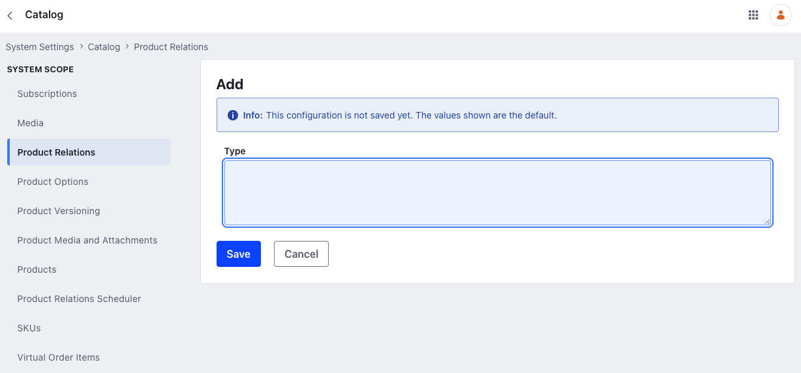
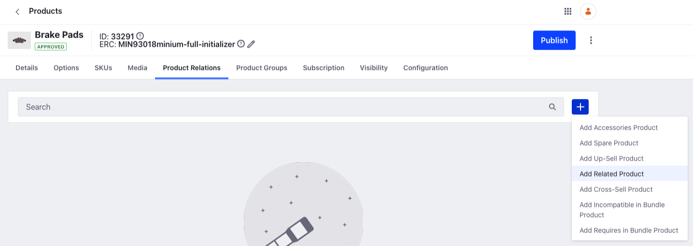
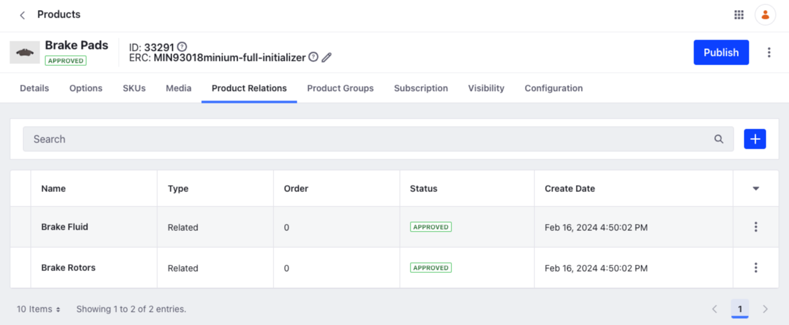
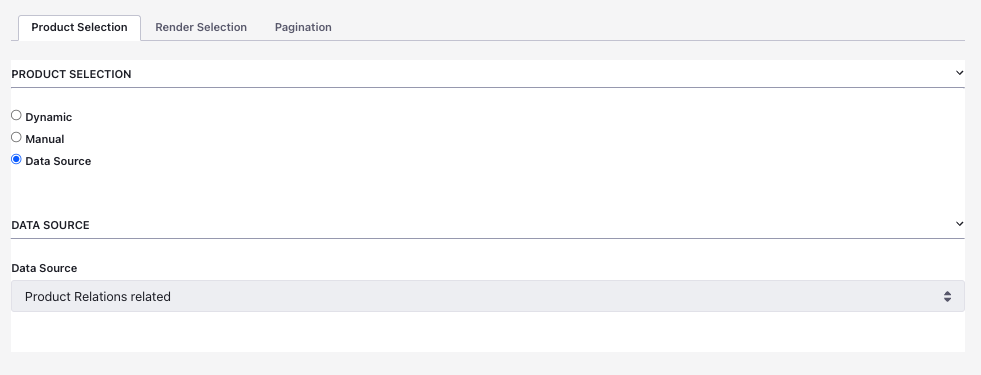
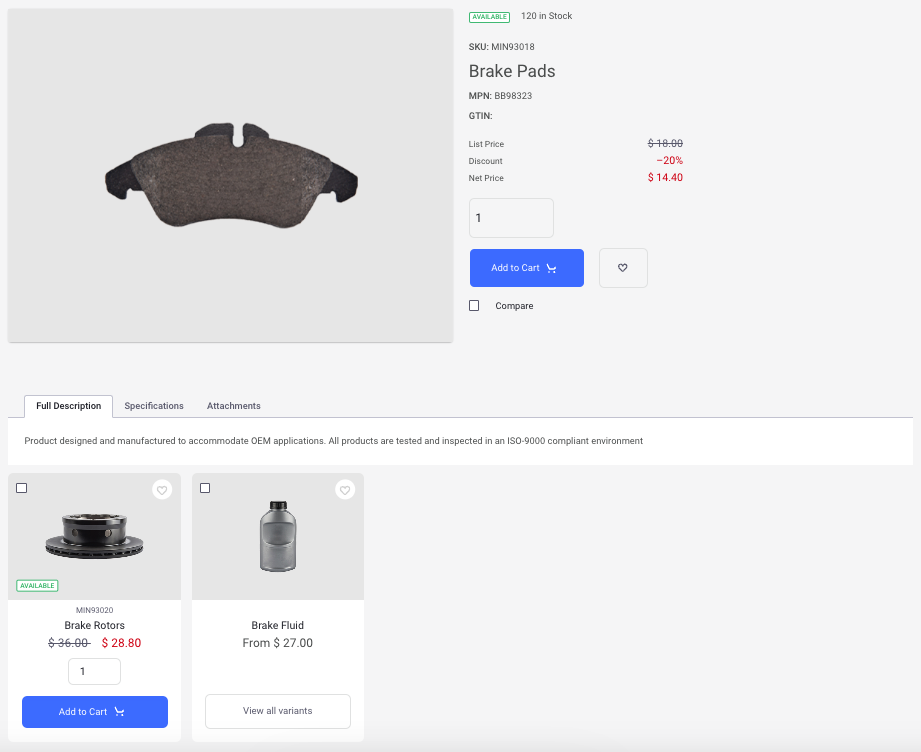

# Related Products, Up-Sells, and Cross-Sells

You can use product relations to create links between products. After doing so, one product displays other linked products. To add a product relation, you must choose from one of the available relation types. Then you can use a product publisher and choose the appropriate relation type to display linked products relative to the product featured on the page.

When placing multiple product publisher widgets on a product detail page, multiple sets of related products may appear. For instance, one widget can display alternatives while another can display accessories to the product featured on the page.

Here is a list of product relations that come with the Minium and Speedwell site initializers:

**Up-Sell**: products with a higher sale value comparable to the featured product.

**Spare**: spare parts or components of the featured product.

**Related**: a catch-all set.

**Accessories**: add-on products for use in conjunction with the featured product.

**Cross-Sell**: products complementary to the featured product.

{bdg-secondary}`Liferay DXP 2024.Q1+/Portal 7.4 GA112+` There are two more product relations used in product bundles. See [Creating Bundles Containing Product Relations](./creating-product-bundles.md#creating-bundles-containing-product-relations) for more information.

## Adding a New Product Relation Type

If you're not using a site initializer or want more product relations, you can add them as needed.

1. Open the *Global Menu* () and navigate to *Control Panel* &rarr; *System Settings*.

1. Go to *Commerce* &rarr; *Catalog* and choose *Product Relations* from the left menu.

1. Click *Add*.

1. Enter the name of the relation in the *Type* field.

   

1. Click *Save*.

## Creating Relationships Between Products

1. Open the *Global Menu* () and navigate to *Commerce* &rarr; *Products*.

1. Select a product.

1. Go to *Product Relations*.

1. Click *Add* () and select *Add Related Product*.

    

1. Search for products and use the checkbox to select them.

1. Click *Add*.

   

The two products (Brake Fluid and Brake Rotors) are now associated with the selected product (Brake Pads). This relationship is unidirectional. You can see brake fluid and brake rotors as related products when viewing brake pads. But the opposite is not true. To display product relations, you must configure a product publisher widget.

## Displaying Product Relations

You can display product relations on a product display page by configuring a product publisher widget. You must have a [product display page](../../../creating-store-content/creating-product-display-pages.md) in place first.

1. After adding the product relations to a product and creating a product display page, go to the specific product's product display page.

1. Click *Edit* () and add a product publisher widget below the product details widget.

1. Click *Actions* () and select *Configuration*.

1. Select *Product Relations related* from the *Data Source* dropdown menu.

    

1. Click *Save* and close the dialog box.

    

The two related products appear in the product publisher widget. This is contextual and changes when you select a different product. If the chosen product doesn't have related products, the widget appears empty.

## Commerce 2.1 and Below

### Adding a New Product Relation Type

If you're not using a site initializer or want more product relations, you can add them as needed.

1. Go to the *Control Panel* &rarr; *Configuration* &rarr; *System Settings*.

1. Click *Catalog* in the *Commerce* section.

1. Click *Product Relations* on the left menu.

1. Click the *Add* button.

1. Enter the new Product Relation in the *Type* field: Warranties.

1. Click *Save*.

    

This adds a new product relation.

### Creating Relationships Between Products

1. Go to the *Control Panel* menu &rarr; *Commerce* &rarr; *Products*.

1. Select any product; for example, *Brake Pads*.

1. Click on the *Product Relations* sub-tab.

1. Click on *Related* in the left menu.

    

1. Click *Add* () to add one or more relationships.

1. Click *Add*.

    

The two products (Brake Fluid and Brake Rotors) are now associated with the selected product (Brake Pads). This relationship is unidirectional. You can see brake fluid and brake rotors as related products when viewing brake pads. But the opposite is not true. To display product relations, you must configure a product publisher widget.

### Displaying Product Relations

You can display product relations on a product display page by configuring a product publisher widget. You must have a [product display page](../../../creating-store-content/creating-product-display-pages.md) in place first.

1. Search for a product (for example *Brake Pads*).

1. Click *Brake Pads* to view the Product Details.

1. Scroll to the bottom of the page to view the related products listed in the *Product Publisher* widget.

   

1. Click *Actions* () and select *Configuration*.

1. Select *Product Relations related* from the *Data Source* dropdown menu.

    

1. Click *Save* and close the dialog box.

    

The example above shows how different products could be related, ensuring that customers can see the full range of products that may also be potentially useful.
