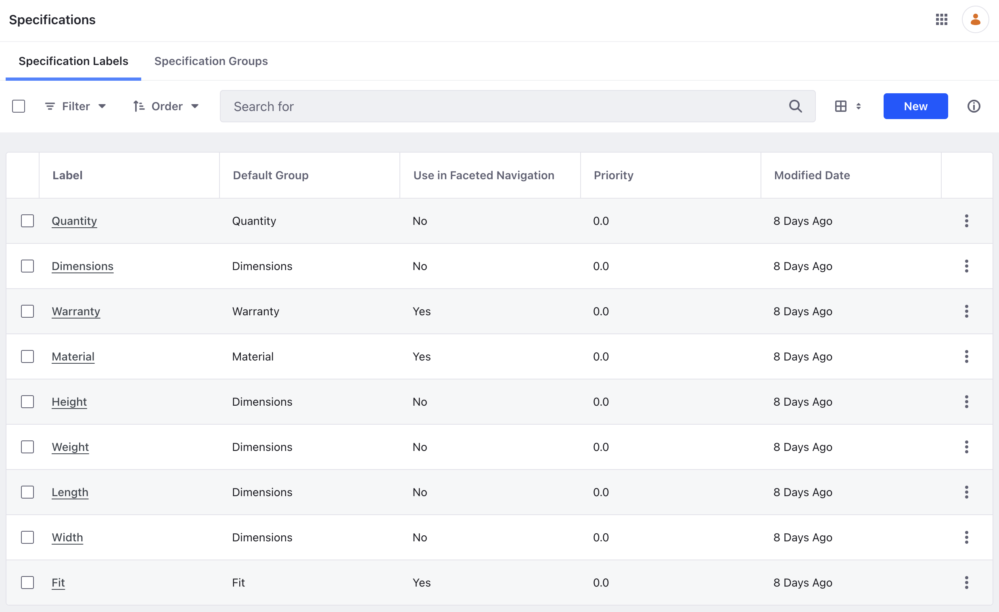
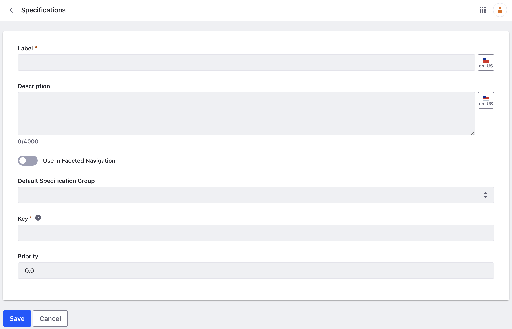
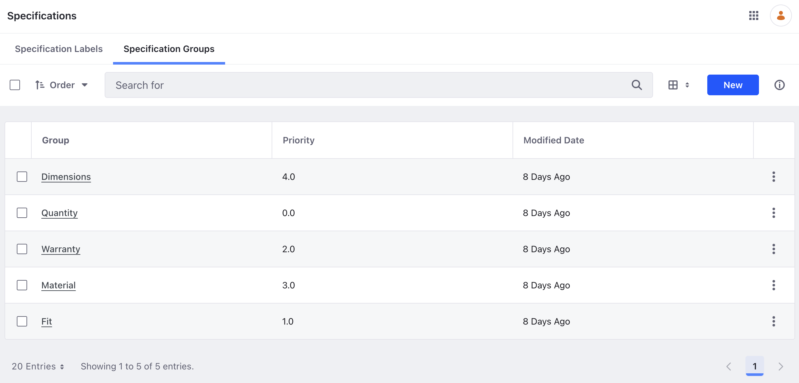
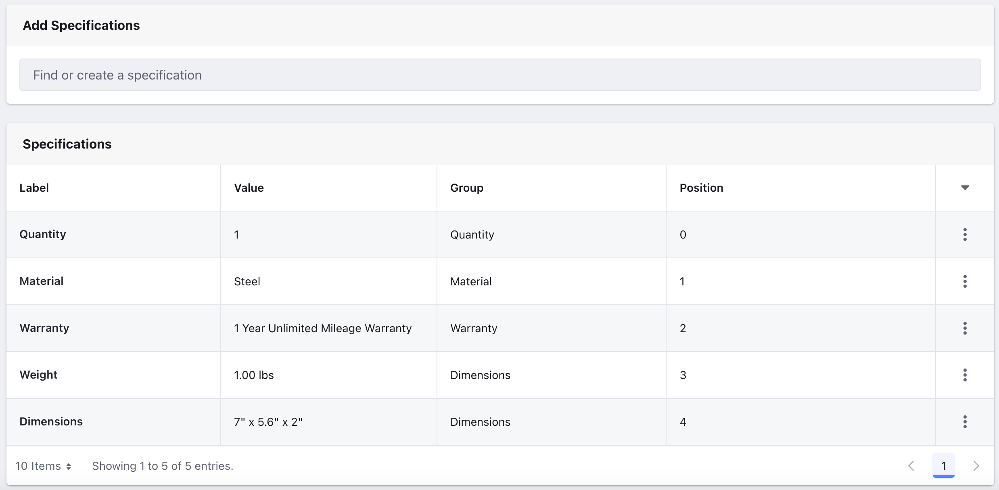
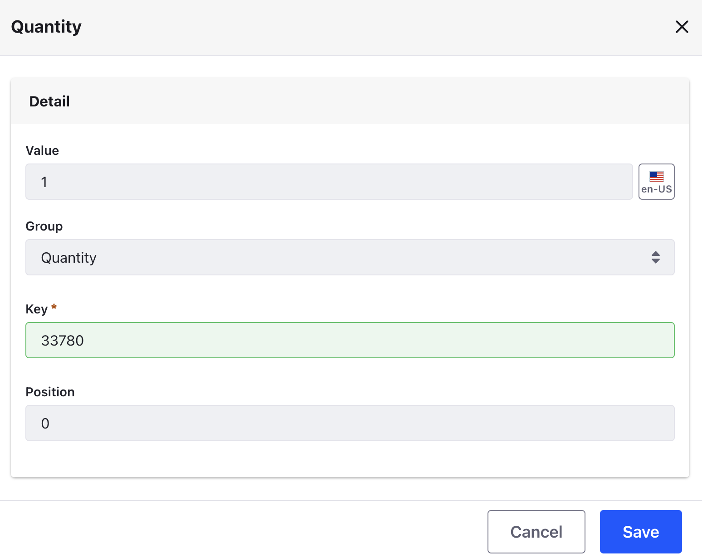

# Specifications

A specification stores a single piece of product information. This can be the product's dimensions, color, weight, capacity, or any other attribute. These details help customers when comparing similar products.

Specification data consists of groups, labels, and values. This makes it easier to display and maintain them.

| Name                                         | Description                                                                   |
| :------------------------------------------- | :---------------------------------------------------------------------------- |
| [Specification Group](#specification-groups) | For grouping and organizing similar specification labels (e.g., `dimensions`) |
| [Specification Label](#specification-labels) | For storing a specification value (e.g., `height`)                            |
| [Specification Value](#specification-values) | Product-specific data added to a specification label (e.g., `100 cm`)         |

!!! note
    Specifications defined at the SKU level override specifications defined at the product level. See [Overriding Product Level Information](./overriding-product-level-information.md) for more details.

## Specification Labels

1. Open the _Global Menu_ () and navigate to _Commerce_ &rarr; _Specifications_.

   This displays all the specification labels in the _Specifications Labels_ screen.

1. There are nine specification labels included by default:

   

1. To add a new specification label, click _New_.

   | Field                       | Description                                    |
   | :-------------------------- | :--------------------------------------------- |
   | Label                       | Display name of the label.                     |
   | Description                 | Description of the label.                      |
   | Use in Faceted Navigation   | Enable to use the label in faceted navigation. |
   | Default Specification Group | Choose a group to associate this label with.   |
   | Key                         | Unique identifier for the label.               |

This only creates the label. You must assign it to a product to set values to a specification.

!!! note
    You can also link picklists to specifications. See [Using Specifications with Picklists](./using-specifications-with-picklists.md) for more information.

## Specification Groups

1. Open the _Global Menu_ () and navigate to _Commerce_ &rarr; _Specifications_.

1. Go to _Specification Groups_. By default, there are five specification groups included:

   

1. To add a new specification group, click _New_.

   | Field       | Description                                                                     |
   | :---------- | :------------------------------------------------------------------------------ |
   | Title       | Display name of the specification group.                                        |
   | Description | Description of the specification group.                                         |
   | Priority    | Order to display the specification groups with smaller numbers displayed first. |
   | Key         | Unique identifier for the group.                                                |

## Specification Values

Specification groups and labels are scoped to a catalog. After creating them, you can assign it to a product and set values.

1. Open the _Global Menu_ () and navigate to _Commerce_ &rarr; _Products_.

1. Select a product.

1. Scroll down to the _Specifications_ section.

   

1. Search for an existing specification and click _Select_ to assign it to the product. You can also create a new specification label by typing its name in the search bar and clicking on _Create New_.

   This assigns the new label to the product.

1. To set its value, click on the label or click _Actions_ () and select _Edit_. Enter values in the form to set a specification value.

   | Field                                                       | Description                                                                                                                                                           |
   | :---------------------------------------------------------- | :-------------------------------------------------------------------------------------------------------------------------------------------------------------------- |
   | Value                                                       | Value assigned to the specification.                                                                                                                                  |
   | Group                                                       | Assign the label to a group.                                                                                                                                |
   | {bdg-secondary}`Liferay DXP 2024.Q2+/Portal 7.4 GA120+` Key | Default key to identify the specification value uniquely. Use this to display the specification in a display page template using the  Product Specification fragment. |
   | Priority                                                    | Establishes the order to display the specification groups with smaller numbers going first.                                                                           |

You can also override the specification group that was selected when the label was created. When editing the label to assign a value, you can choose any group from the _Group_ drop-down box. This change applies only to the current product and has no effect on other products that use the same label.
