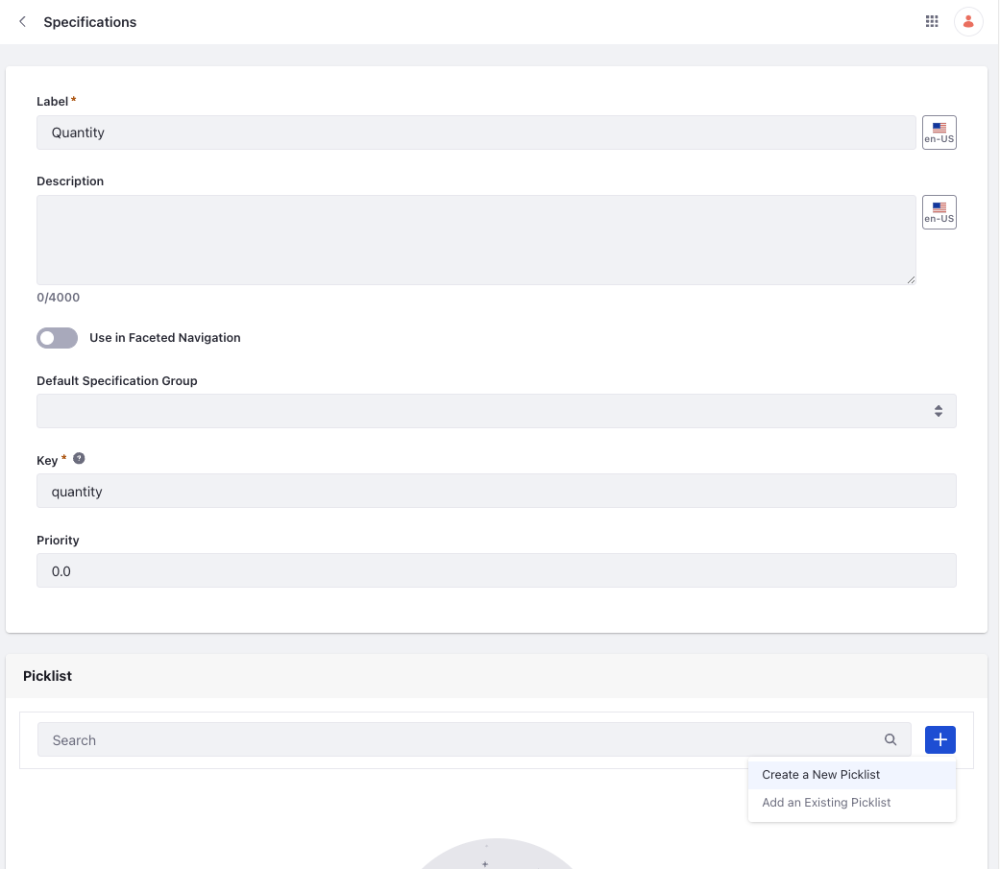
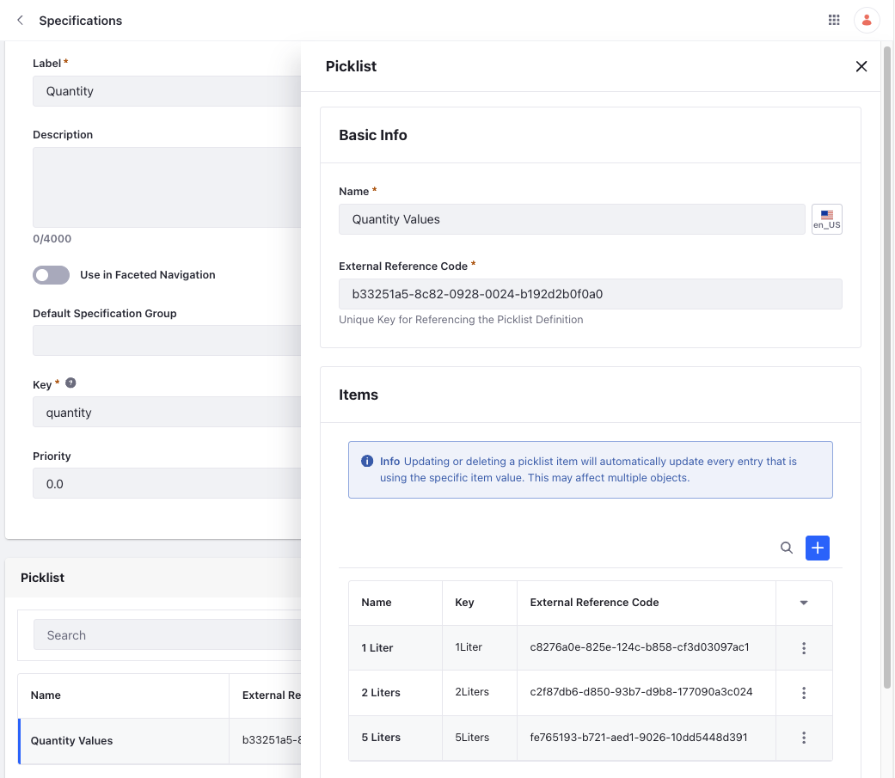
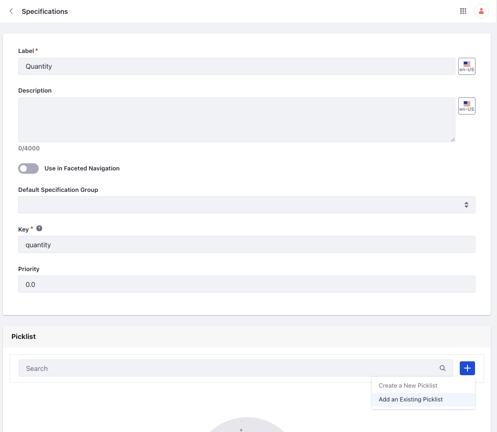
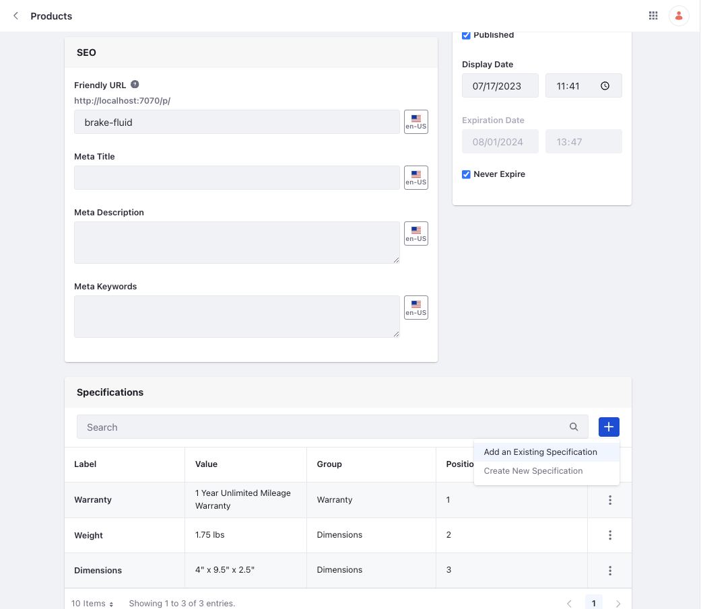
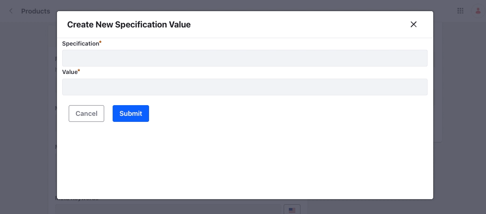

# Using Specifications with Picklists

{bdg-secondary}`Liferay DXP 2024.Q3+/Portal 7.4 GA132+`

You can now use [picklists](https://learn.liferay.com/w/dxp/liferay-development/objects/picklists) to define specification values and link them to a specification template to use with products. There are two ways to create a picklist.

* In the Picklists application. See [Creating Picklists](https://learn.liferay.com/web/guest/w/dxp/liferay-development/objects/picklists/creating-picklists) for more information.
* In the Specifications application

!!! important
    This feature is currently behind a release feature flag. Read [Release Feature Flags](https://learn.liferay.com/web/guest/w/dxp/system-administration/configuring-liferay/feature-flags#release-feature-flags) for more information.

## Creating a Picklist in the Specifications Application

If you already have a picklist created, see [Linking a Picklist to a Specification](#linking-a-picklist-to-a-specification). After [creating a specification](./specifications.md#specification-labels), scroll down to the Picklist section.

1. Click *Add* ().

1. Choose *Create a New Picklist*.

   

1. Enter a name and click *Save*.

1. To add values, click the created picklist and click *Add* () in the Items section.

1. Enter a name and click *Save*. The key is auto-populated.

1. Click *Save*.

   

1. Click *Save* to save the specification.

The new picklist also appears in the Picklists application.

## Linking a Picklist to a Specification

If you've already created a picklist and want to link it to a specification,

1. Open the *Global Menu* () and navigate to *Commerce* &rarr; *Specifications*.

1. Select a specification and scroll down to the Picklist section.

1. Click *Add* ().

1. Choose *Add an Existing Picklist*.

   

1. In the modal that appears, search for the existing picklist. It auto-completes the name as you type. Select the picklist.

1. Click *Save*.

The picklist values share a bi-directional relationship between the Picklists application and the Specifications application. If you delete a picklist value from a specification, it also deletes the value in the Picklists application and vice-versa. However, removing a picklist from a specification doesn't delete the picklist, it only removes the link between the specification and the picklist.

## Linking a Specification to a Product

Now that you've created a specification linked to a picklist, you can associate it with a product. 

1. Open the *Global Menu* () and navigate to *Commerce* &rarr; *Products*.

1. Choose a product and scroll down to the Specifications section.

1. Click *Add* ().

1. Choose *Add an Existing Specification*.

   

1. In the modal that appears, search for the existing specification. It auto-completes the name as you type. Select the specification.

1. The value dropdown auto-populates the values of the picklist. You can choose a value and click *Submit*.

!!! note
    For specifications not linked to a picklist, you must enter a value as usual.