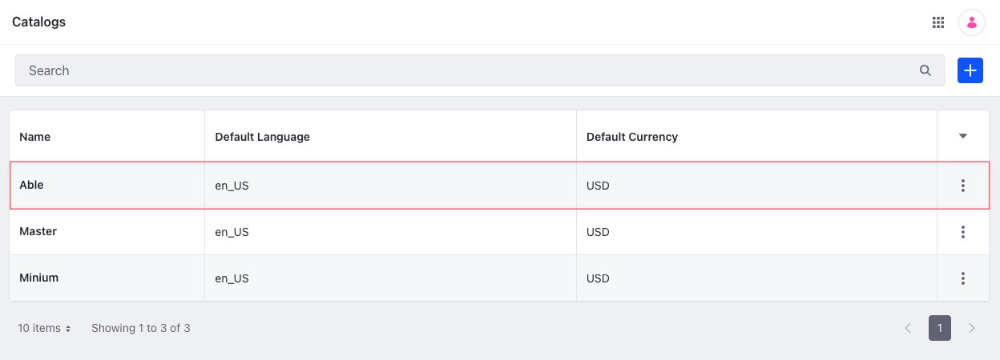

# Catalog API Basics

You can manage catalogs from the Applications menu or REST APIs. Call the [headless-commerce-admin-catalog](http://localhost:8080/o/api?endpoint=http://localhost:8080/o/headless-commerce-admin-catalog/v1.0/openapi.json) services to create and manage catalogs.

## Adding a Catalog

```{include} /_snippets/run-liferay-dxp.md
```

Once Liferay is running,

1. Download and unzip [Catalog API Basics](./liferay-q2v8.zip).

   ```bash
   curl https://resources.learn.liferay.com/commerce/latest/en/product-management/developer-guide/liferay-q2v8.zip -O
   ```

   ```bash
   unzip liferay-q2v8.zip
   ```

1. Catalogs are scoped to an instance. Use the cURL script to add a new catalog. On the command line, navigate to the `curl` folder. Execute the `Catalog_POST_ToInstance.sh` script.

   ```bash
   ./Catalog_POST_ToInstance.sh
   ```

   The JSON response shows a new catalog was added:

   ```bash
   {
      "actions" : {
         "get" : {
            "method" : "GET",
            "href" : "http://localhost:8080/o/headless-commerce-admin-catalog/v1.0/catalog/46110"
         },
         "update" : {
            "method" : "PATCH",
            "href" : "http://localhost:8080/o/headless-commerce-admin-catalog/v1.0/catalog/46110"
         },
         "delete" : {
            "method" : "DELETE",
            "href" : "http://localhost:8080/o/headless-commerce-admin-catalog/v1.0/catalog/46110"
         }
      },
      "currencyCode" : "USD",
      "defaultLanguageId" : "en_US",
      "externalReferenceCode" : "246ad89e-8da1-546c-0d62-06ac7061e1da",
      "id" : 46110,
      "name" : "Able",
      "system" : false
   }
   ```

1. To verify the catalog addition, open the *Global Menu* () and navigate to *Commerce* &rarr; *Catalogs*. The new catalog appears.

   

1. Alternatively, call the REST service using the Java client. Navigate into the `java` folder and compile the source files:

   ```bash
   javac -classpath .:* *.java
   ```

1. Run the `Catalog_POST_ToInstance` class.

   ```bash
   java -classpath .:* Catalog_POST_ToInstance
   ```

## Examine the cURL Command

The `Catalog_POST_ToInstance.sh` script calls the REST service with a cURL command.

```{literalinclude} ./catalog-api-basics/resources/liferay-q2v8.zip/curl/Catalog_POST_ToInstance.sh
    :language: bash
```

Here are the command's arguments:

| Arguments                                                                                | Description                                              |
| :--------------------------------------------------------------------------------------- | :------------------------------------------------------- |
| `-H "Content-Type: application/json"`                                                    | Set the request body format to JSON.                     |
| `-X POST`                                                                                | Set the HTTP method to invoke at the specified endpoint. |
| `"http://localhost:8080/o/headless-commerce-admin-catalog/v1.0/catalogs"`                | Specify the REST service endpoint.                       |
| `-d "{\"currencyCode\": \"USD\", \"defaultLanguageId\": \"en_US\", \"name\": \"Able\"}"` | Enter the data to post.                                  |
| `-u "test@liferay.com:learn"`                                                            | Enter basic authentication credentials.                  |

```{note}
Basic authentication is used here for demonstration purposes. For production, you should authorize users via [OAuth2](https://learn.liferay.com/dxp/latest/en/headless-delivery/using-oauth2.html). See [Using OAuth2 to Authorize Users](https://learn.liferay.com/dxp/latest/en/headless-delivery/using-oauth2/using-oauth2-to-authorize-users.html) for a sample React application using OAuth2.
```

The other cURL commands use similar JSON arguments.

## Examine the Java Class

The `Catalog_POST_ToInstance.java` class adds a catalog by calling the `CatalogResource` service.

```{literalinclude} ./catalog-api-basics/resources/liferay-q2v8.zip/java/Catalog_POST_ToInstance.java
   :dedent: 1
   :language: java
   :lines: 9-25
```

This class invokes the REST service using only three lines of code:

| Line (abbreviated)                                                       | Description                                                                 |
| :----------------------------------------------------------------------- | :-------------------------------------------------------------------------- |
| `CatalogResource.Builder builder = ...`                                  | Get a `Builder` for generating a `CatalogResource` service instance.        |
| `CatalogResource catalogResource = builder.authentication(...).build();` | Use basic authentication and generate a `CatalogResource` service instance. |
| `catalogResource.postCatalog(...);`                                      | Call the `catalogResource.postCatalog` method and pass the data to post.    |

The project includes the `com.liferay.headless.commerce.admin.catalog.client.jar` file as a dependency. You can find client JAR dependency information for all REST applications in the API explorer in your installation at `/o/api` (e.g., <http://localhost:8080/o/api>).

```{note}
The `main` method's comment demonstrates running the class.
```

The remaining example Java classes call different `CatalogResource` methods.

```{important}
See [CatalogResource](https://github.com/liferay/liferay-portal/blob/[$LIFERAY_LEARN_PORTAL_GIT_TAG$]/modules/apps/commerce/headless/headless-commerce/headless-commerce-admin-catalog-client/src/main/java/com/liferay/headless/commerce/admin/catalog/client/resource/v1_0/CatalogResource.java) for service details.
```

Below are examples of calling other `Catalog` REST services using cURL and Java.

## Get Catalogs from Instance

List all the catalogs in your Liferay instance with a cURL or Java command.

### Catalogs_GET_FromInstance.sh

Command:

```bash
./Catalogs_GET_FromInstance.sh
```

Code:

```{literalinclude} ./catalog-api-basics/resources/liferay-q2v8.zip/curl/Catalogs_GET_FromInstance.sh
   :language: bash
```

### Catalogs_GET_FromInstance.java

Command:

```bash
java -classpath .:* Catalogs_GET_FromInstance
```

Code:

```{literalinclude} ./catalog-api-basics/resources/liferay-q2v8.zip/java/Catalogs_GET_FromInstance.java
   :dedent: 1
   :language: java
   :lines: 11-22
```

The instance's `Catalog` objects are formatted in JSON.

### Filtering, Paginating, Searching, and Sorting Catalogs

This API also accepts parameters to filter, paginate, search, and sort the catalogs. See the [`getCatalogsPage`](https://github.com/liferay/liferay-portal/blob/[$LIFERAY_LEARN_PORTAL_GIT_TAG$]/modules/apps/commerce/headless/headless-commerce/headless-commerce-admin-catalog-client/src/main/java/com/liferay/headless/commerce/admin/catalog/client/resource/v1_0/CatalogResource.java#L93-#L96) method for more information. You can use the `name` field to filter, search, and sort the results.

| Filter Query     | Description                       |
| :--------------- | :-------------------------------- |
| `name eq 'Able'` | The catalog name must equal Able. |
|                  |                                   |

| Sort Query  | Description                       |
| :---------- | :-------------------------------- |
| `name:desc` | Sort by name in descending order. |

Read [API Query Parameters](https://learn.liferay.com/dxp/latest/en/headless-delivery/consuming-apis/api-query-parameters.html) for more information.

## Get a Catalog

Get a specific catalog with cURL or Java `get` commands. Replace `1234` with the catalog's ID.

```{tip}
Use `Catalogs_GET_FromInstance.[java|sh]` to get a list of all catalogs, and note the `id` of the catalog you want specifically.
```

### Catalog_GET_ById.sh

Command:

```bash
./Catalog_GET_ById.sh 1234
```

Code:

```{literalinclude} ./catalog-api-basics/resources/liferay-q2v8.zip/curl/Catalog_GET_ById.sh
   :language: bash
```

### Catalog_GET_ById.java

Command:

```bash
java -classpath .:* -DcatalogId=1234 Catalog_GET_ById
```

Code:

```{literalinclude} ./catalog-api-basics/resources/liferay-q2v8.zip/java/Catalog_GET_ById.java
   :dedent: 1
   :language: java
   :lines: 8-18
```

The `Catalog` fields are listed in JSON.

## Patch a Catalog

Update an existing catalog with cURL and Java `patch` commands. Replace `1234` with your catalog's ID.

### Catalog_PATCH_ById.sh

Command:

```bash
./Catalog_PATCH_ById.sh 1234
```

Code:

```{literalinclude} ./catalog-api-basics/resources/liferay-q2v8.zip/curl/Catalog_PATCH_ById.sh
   :language: bash
```

### Catalog_PATCH_ById.java

Command:

```bash
java -classpath .:* -DcatalogId=1234 Catalog_PATCH_ById
```

Code:

```{literalinclude} ./catalog-api-basics/resources/liferay-q2v8.zip/java/Catalog_PATCH_ById.java
   :dedent: 1
   :language: java
   :lines: 9-23
```

## Delete a Catalog

Delete an existing catalog with cURL and Java `delete` commands. Replace `1234` with your catalog's ID.

### Catalog_DELETE_ById.sh

Command:

```bash
./Catalog_DELETE_ById.sh 1234
```

Code:

```{literalinclude} ./catalog-api-basics/resources/liferay-q2v8.zip/curl/Catalog_DELETE_ById.sh
   :language: bash
```

### Catalog_DELETE_ById.java

Command

```bash
java -classpath .:* -DcatalogId=1234 Catalog_DELETE_ById
```

Code:

```{literalinclude} ./catalog-api-basics/resources/liferay-q2v8.zip/java/Catalog_DELETE_ById.java
   :dedent: 1
   :language: java
   :lines: 8-17
```

The [API Explorer](https://learn.liferay.com/dxp/latest/en/headless-delivery/consuming-apis/consuming-rest-services.html) shows the `Catalog` services and schemas and has an interface to test each service.
