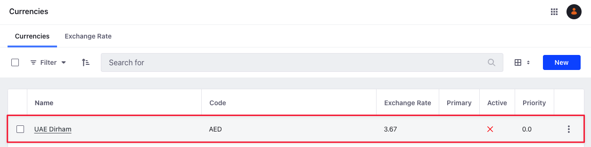

# Currency API Basics

{bdg-secondary}`Liferay DXP 2024.Q1+/Portal 7.4 GA112+`

You can manage [currencies](../../store-management/currencies.md) from the Applications menu or with REST APIs. Call the [headless-commerce-admin-catalog](http://localhost:8080/o/api?endpoint=http://localhost:8080/o/headless-commerce-admin-catalog/v1.0/openapi.json) services to create and manage currencies.

## Adding a Currency

```{include} /_snippets/run-liferay-portal.md
```

Once Liferay is running,

1. Download and unzip [Currency API Basics](./liferay-e6w7.zip).

   ```bash
   curl https://resources.learn.liferay.com/commerce/latest/en/product-management/developer-guide/liferay-e6w7.zip -O
   ```

   ```bash
   unzip liferay-e6w7.zip
   ```

Currencies are scoped to an instance, and each currency must specify a unique `code`. You must also provide a `name` and `rate` to create a currency.

Use the cURL script to add a new currency. On the command line, navigate to the `curl` folder. Execute the `Currency_POST_ToInstance.sh` script.

```bash
./Currency_POST_ToInstance.sh
```
 The JSON response shows a new currency was added:
 ```json
{
   "active" : false,
   "code" : "AED",
   "formatPattern" : {
      "en_US" : "###,##0.00"
   },
   "id" : 35562,
   "maxFractionDigits" : 2,
   "minFractionDigits" : 2,
   "name" : {
      "en_US" : "UAE Dirham"
   },
   "primary" : false,
   "priority" : 0.0,
   "rate" : 3.67,
      "roundingMode" : "HALF_EVEN",
      "symbol" : ""
   }
```

The rate field specifies the conversion rate relative to the primary currency. For instance, if your primary currency is United States Dollar (USD) and you're creating UAE Dirham (AED), the rate determines how many dirhams make up a dollar. If you're setting a currency as primary, the rate must be `1.00`.

The values for `maxFractionDigits` and `minFractionDigits` default to 2. This specifies the decimal precision for the currency.

The value for `roundingMode` defaults to `HALF_EVEN`. This uses the `java.math.RoundingMode` enum to provide rounding strategies for currencies. You can use the following values for the rounding mode: `UP`, `DOWN`, `CEILING`, `FLOOR`, `HALF_UP`, `HALF_DOWN`, `HALF_EVEN`, and `UNNECESSARY`.

| Rounding Mode | Positive Value | Rounded Value | Negative Value | Rounded Value | Description                                                                                                                          |
| :------------ | :------------- | :------------ | :------------- | :------------ | :----------------------------------------------------------------------------------------------------------------------------------- |
| `UP`          | `3.14`         | `4`           | `-3.14`        | `-4`          | Rounds towards positive infinity for positive numbers. For negative numbers, `UP` rounds away from 0.                                |
| `DOWN`        | `3.14`         | `3`           | `-3.14`        | `-3`          | Rounds towards zero for positive and negative numbers.                                                                               |
| `CEILING`     | `3.14`         | `4`           | `-3.14`        | `-3`          | Rounds towards positive infinity for positive numbers. For negative numbers, `CEILING` rounds towards from 0.                        |
| `FLOOR`       | `3.14`         | `3`           | `-3.14`        | `-4`          | Rounds towards zero for positive numbers. For negative numbers, `FLOOR` rounds towards from 0.                                       |
| `HALF_UP`     | `3.5`          | `4`           | `-3.5`         | `-3`          | Rounds towards the nearest neighbor. If the number is exactly halfway between two neighbors, it rounds up.                           |
| `HALF_DOWN`   | `3.5`          | `3`           | `-3.5`         | `-4`          | Rounds towards the nearest neighbor. If the number is exactly halfway between two neighbors, it rounds down.                         |
| `HALF_EVEN`   | `2.5`          | `2`           | `-2.5`         | `-2`          | Rounds towards the nearest neighbor. If the number is exactly halfway between two neighbors, it rounds to the nearest even neighbor. |
| `UNNECESSARY` | `3.14`         | NA            | `-3.14`        | NA            | Throws an `ArithmeticException` to ensure no rounding occurs.                                                                        |

To verify the currency addition, open the *Global Menu* () and navigate to *Commerce* &rarr; *Currencies*. The new currency appears.

   

Alternatively, call the REST service using the Java client: 

1. Navigate into the `java` folder and compile the source files:

   ```bash
   javac -classpath .:* *.java
   ```

1. Run the `Currency_POST_ToInstance` class.

   ```bash
   java -classpath .:* Currency_POST_ToInstance
   ```

## Examine the cURL Command

The `Currency_POST_ToInstance.sh` script calls the REST service with a cURL command.

```{literalinclude} ./currency-api-basics/resources/liferay-e6w7.zip/curl/Currency_POST_ToInstance.sh
    :language: bash
```

Here are the command's arguments:

| Arguments                                                                         | Description                                              |
| :-------------------------------------------------------------------------------- | :------------------------------------------------------- |
| `"http://localhost:8080/o/headless-commerce-admin-catalog/v1.0/currencies"`       | Specify the REST service endpoint.                       |
| `--data-raw "{ "code": "AED", "name": { "en_US": "UAE Dirham" }, "rate": 3.67 }"` | Enter the data to post.                                  |
| `--header "Content-Type: application/json"`                                       | Set the request body format to JSON.                     |
| `--request POST`                                                                  | Set the HTTP method to invoke at the specified endpoint. |
| `--user "test@liferay.com:learn"`                                                 | Enter basic authentication credentials.                  |

!!! note
    Basic authentication is used here for demonstration purposes. For production, you should authorize users via [OAuth2](https://learn.liferay.com/dxp/latest/en/headless-delivery/using-oauth2.html). See [Using OAuth2 to Authorize Users](https://learn.liferay.com/dxp/latest/en/headless-delivery/using-oauth2/using-oauth2-to-authorize-users.html) for a sample React application using OAuth2.

The other cURL commands use similar JSON arguments.

## Examine the Java Class

The `Currency_POST_ToInstance.java` class adds a currency by calling the `CurrencyResource` service.

```{literalinclude} ./currency-api-basics/resources/liferay-e6w7.zip/java/Currency_POST_ToInstance.java
   :dedent: 1
   :language: java
   :lines: 13-33
```

This class invokes the REST service using only three lines of code:

| Line (abbreviated)                                                         | Description                                                                  |
| :------------------------------------------------------------------------- | :--------------------------------------------------------------------------- |
| `CurrencyResource.Builder builder = ...`                                   | Get a `Builder` for generating a `CurrencyResource` service instance.        |
| `CurrencyResource currencyResource = builder.authentication(...).build();` | Use basic authentication and generate a `CurrencyResource` service instance. |
| `currencyResource.postCurrency(...);`                                      | Call the `currencyResource.postCurrency` method and pass the data to post.   |

The project includes the `com.liferay.headless.commerce.admin.catalog.client.jar` file as a dependency. You can find client JAR dependency information for all REST applications in the API Explorer in your installation at `/o/api` (e.g., <http://localhost:8080/o/api>).

!!! note
    The `main` method's comment demonstrates running the class.

The remaining example Java classes call different `CurrencyResource` methods.

!!! important
    See [CurrencyResource](https://github.com/liferay/liferay-portal/blob/[$LIFERAY_LEARN_PORTAL_GIT_TAG$]/modules/apps/commerce/headless/headless-commerce/headless-commerce-admin-catalog-client/src/main/java/com/liferay/headless/commerce/admin/catalog/client/resource/v1_0/CurrencyResource.java) for service details.

Below are examples of calling other `Currency` REST services using cURL and Java.

## Get Currencies from Instance

List all the currencies in your Liferay instance with a cURL or Java command.

### Currencies_GET_FromInstance.sh

Command:

```bash
./Currencies_GET_FromInstance.sh
```

Code:

```{literalinclude} ./currency-api-basics/resources/liferay-e6w7.zip/curl/Currencies_GET_FromInstance.sh
   :language: bash
```

### Currencies_GET_FromInstance.java

Command:

```bash
java -classpath .:* Currencies_GET_FromInstance
```

Code:

```{literalinclude} ./currency-api-basics/resources/liferay-e6w7.zip/java/Currencies_GET_FromInstance.java
   :dedent: 1
   :language: java
   :lines: 9-19
```

The instance's `Currency` objects are formatted in JSON.

### Filtering, Paginating, Searching, and Sorting Currencies

This API also accepts parameters to filter, paginate, search, and sort the currencies. See the [`getCurrenciesPage`](https://github.com/liferay/liferay-portal/blob/[$LIFERAY_LEARN_PORTAL_GIT_TAG$]/modules/apps/commerce/headless/headless-commerce/headless-commerce-admin-catalog-client/src/main/java/com/liferay/headless/commerce/admin/catalog/client/resource/v1_0/CurrencyResource.java#L37-#L40) method for more information. You can use the following `Currency` fields in your queries to filter and search the results:

- active
- primary
- code
- name

| Filter Query           | Description                              |
| :--------------------- | :--------------------------------------- |
| `name eq 'UAE Dirham'` | The currency name must equal UAE Dirham. |
| `code eq 'AED'`        | The currency code must be AED.           |
| `active eq false`      | The currency is not active               |

You can use the `name` field in your queries to sort the results:

| Sort Query  | Description                                |
| :---------- | :----------------------------------------- |
| `name:desc` | Sort by currency name in descending order. |

Read [API Query Parameters](https://learn.liferay.com/dxp/latest/en/headless-delivery/consuming-apis/api-query-parameters.html) for more information.

## Get a Currency

Get a specific currency with cURL or Java `get` commands. Replace `1234` with the currency's ID.

```{tip}
Use `Currency_GET_ById.[java|sh]` to get a list of all currencies, and note the `id` of the currency you want specifically.
```

### Currency_GET_ById.sh

Command:

```bash
./Currency_GET_ById.sh 1234
```

Code:

```{literalinclude} ./currency-api-basics/resources/liferay-e6w7.zip/curl/Currency_GET_ById.sh
   :language: bash
```

### Currency_GET_ById.java

Command:

```bash
java -classpath .:* -DcurrencyId=1234 Currency_GET_ById
```

Code:

```{literalinclude} ./currency-api-basics/resources/liferay-e6w7.zip/java/Currency_GET_ById.java
   :dedent: 1
   :language: java
   :lines: 8-18
```

The `Currency` fields are listed in JSON.

## Patch a Currency

Update an existing currency with cURL and Java `patch` commands. Replace `1234` with your currency's ID.

### Currency_PATCH_ById.sh

Command:

```bash
./Currency_PATCH_ById.sh 1234
```

Code:

```{literalinclude} ./currency-api-basics/resources/liferay-e6w7.zip/curl/Currency_PATCH_ById.sh
   :language: bash
```

### Currency_PATCH_ById.java

Command:

```bash
java -classpath .:* -DcurrencyId=1234 Currency_PATCH_ById
```

Code:

```{literalinclude} ./currency-api-basics/resources/liferay-e6w7.zip/java/Currency_PATCH_ById.java
   :dedent: 1
   :language: java
   :lines: 11-29
```

## Delete a Currency

Delete an existing currency with cURL and Java `delete` commands. Replace `1234` with your currency's ID.

### Currency_DELETE_ById.sh

Command:

```bash
./Currency_DELETE_ById.sh 1234
```

Code:

```{literalinclude} ./currency-api-basics/resources/liferay-e6w7.zip/curl/Currency_DELETE_ById.sh
   :language: bash
```

### Currency_DELETE_ById.java

Command

```bash
java -classpath .:* -DcurrencyId=1234 Currency_DELETE_ById
```

Code:

```{literalinclude} ./currency-api-basics/resources/liferay-e6w7.zip/java/Currency_DELETE_ById.java
   :dedent: 1
   :language: java
   :lines: 8-17
```

The [API Explorer](https://learn.liferay.com/dxp/latest/en/headless-delivery/consuming-apis/consuming-rest-services.html) shows the `Currency` services and schemas and has an interface to test each service.

## Related Topics

- [Currencies](../../store-management/currencies.md)
- [Consuming REST Services](https://learn.liferay.com/web/guest/w/dxp/headless-delivery/consuming-apis/consuming-rest-services)
