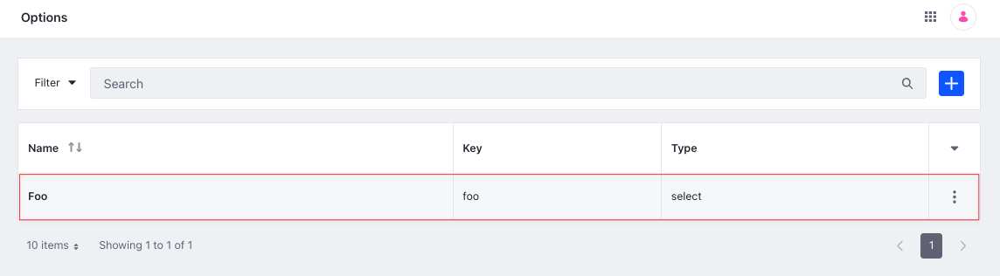
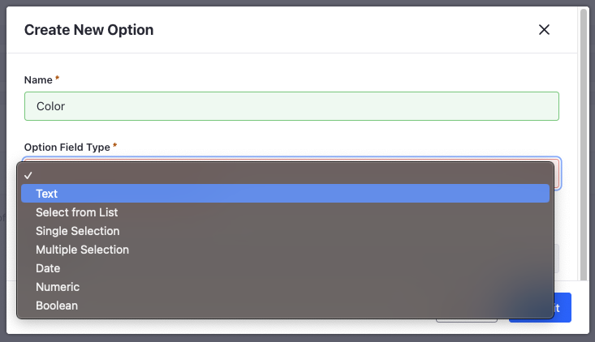

# Option API Basics

You can manage [option templates](../../product-management/creating-and-managing-products/products/using-product-options.md) from the Applications menu or with REST APIs. Call the [headless-commerce-admin-catalog](http://localhost:8080/o/api?endpoint=http://localhost:8080/o/headless-commerce-admin-catalog/v1.0/openapi.json) services to create and manage options.

## Adding an Option

```{include} /_snippets/run-liferay-dxp.md
```

Once Liferay is running,

1. Download and unzip [Option API Basics](./liferay-d3g5.zip).

   ```bash
   curl https://resources.learn.liferay.com/commerce/latest/en/product-management/developer-guide/liferay-d3g5.zip -O
   ```

   ```bash
   unzip liferay-d3g5.zip
   ```

1. Options are scoped to an instance, and each option must specify a unique `key`.

   Use the cURL script to add a new option. On the command line, navigate to the `curl` folder. Execute the `Option_POST_ToInstance.sh` script.

   ```bash
   ./Option_POST_ToInstance.sh
   ```

   The JSON response shows a new option was added:

   ```bash
   {
      "actions" : {
         "get" : {
            "method" : "GET",
            "href" : "http://localhost:8080/o/headless-commerce-admin-catalog/v1.0/options/46438"
         },
         "update" : {
            "method" : "PATCH",
            "href" : "http://localhost:8080/o/headless-commerce-admin-catalog/v1.0/options/46438"
         },
         "delete" : {
            "method" : "DELETE",
            "href" : "http://localhost:8080/o/headless-commerce-admin-catalog/v1.0/options/46438"
         }
      },
      "description" : { },
      "externalReferenceCode" : "f73e12cd-feae-9e78-5921-6b65f6b993f6",
      "facetable" : false,
      "fieldType" : "select",
      "id" : 46438,
      "key" : "foo",
      "name" : {
         "en_US" : "Foo"
      },
      "required" : false,
      "skuContributor" : false
   }
   ```

1. To verify the option addition, open the *Global Menu* () and navigate to *Commerce* &rarr; *Options*. The new option appears.

   

1. Alternatively, call the REST service using the Java client. Navigate into the `java` folder and compile the source files:

   ```bash
   javac -classpath .:* *.java
   ```

1. Run the `Option_POST_ToInstance` class.

   ```bash
   java -classpath .:* Option_POST_ToInstance
   ```



| Field Type         | API Value                          |
| :----------------- | :--------------------------------- |
| Text               | `"fieldType": "text"`              |
| Select From List   | `"fieldType": "select"`            |
| Single Selection   | `"fieldType": "radio"`             |
| Multiple Selection | `"fieldType": "checkbox_multiple"` |
| Date               | `"fieldType": "date"`              |
| Numeric            | `"fieldType": "numeric"`           |
| Boolean            | `"fieldType": "checkbox"`          |

## Examine the cURL Command

The `Option_POST_ToInstance.sh` script calls the REST service with a cURL command.

```{literalinclude} ./option-api-basics/resources/liferay-d3g5.zip/curl/Option_POST_ToInstance.sh
    :language: bash
```

Here are the command's arguments:

| Arguments                                                                            | Description                                              |
| :----------------------------------------------------------------------------------- | :------------------------------------------------------- |
| `-H "Content-Type: application/json"`                                                | Set the request body format to JSON.                     |
| `-X POST`                                                                            | Set the HTTP method to invoke at the specified endpoint. |
| `"http://localhost:8080/o/headless-commerce-admin-catalog/v1.0/options"`             | Specify the REST service endpoint.                       |
| `-d "{\"fieldType\": \"select\", \"key\": \"foo\", \"name\": {\"en_US\": \"Foo\"}}"` | Enter the data to post.                                  |
| `-u "test@liferay.com:learn"`                                                        | Enter basic authentication credentials.                  |

!!! note
   Basic authentication is used here for demonstration purposes. For production, you should authorize users via [OAuth2](https://learn.liferay.com/w/dxp/headless-delivery/using-oauth2). See [Using OAuth2 to Authorize Users](https://learn.liferay.com/w/dxp/headless-delivery/using-oauth2/using-oauth2-to-authorize-users) for a sample React application using OAuth2.

The other cURL commands use similar JSON arguments.

## Examine the Java Class

The `Option_POST_ToInstance.java` class adds an option by calling the `OptionResource` service.

```{literalinclude} ./option-api-basics/resources/liferay-d3g5.zip/java/Option_POST_ToInstance.java
   :dedent: 1
   :language: java
   :lines: 11-31
```

This class invokes the REST service using only three lines of code:

| Line (abbreviated)                                                     | Description                                                                |
| :--------------------------------------------------------------------- | :------------------------------------------------------------------------- |
| `OptionResource.Builder builder = ...`                                 | Get a `Builder` for generating a `OptionResource` service instance.        |
| `OptionResource optionResource = builder.authentication(...).build();` | Use basic authentication and generate a `OptionResource` service instance. |
| `optionResource.postOption(...);`                                      | Call the `optionResource.postOption` method and pass the data to post.     |

The project includes the `com.liferay.headless.commerce.admin.catalog.client.jar` file as a dependency. You can find client JAR dependency information for all REST applications in the API Explorer in your installation at `/o/api` (e.g., <http://localhost:8080/o/api>).

!!! note
   The `main` method's comment demonstrates running the class.

The remaining example Java classes call different `OptionResource` methods.

!!! important
   See [OptionResource](https://github.com/liferay/liferay-portal/blob/[$LIFERAY_LEARN_PORTAL_GIT_TAG$]/modules/apps/commerce/headless/headless-commerce/headless-commerce-admin-catalog-client/src/main/java/com/liferay/headless/commerce/admin/catalog/client/resource/v1_0/OptionResource.java) for service details.

Below are examples of calling other `Option` REST services using cURL and Java.

## Get Options from Instance

List all the options in your Liferay instance with a cURL or Java command.

### Options_GET_FromInstance.sh

Command:

```bash
./Options_GET_FromInstance.sh
```

Code:

```{literalinclude} ./option-api-basics/resources/liferay-d3g5.zip/curl/Options_GET_FromInstance.sh
   :language: bash
```

### Options_GET_FromInstance.java

Command:

```bash
java -classpath .:* Options_GET_FromInstance
```

Code:

```{literalinclude} ./option-api-basics/resources/liferay-d3g5.zip/java/Options_GET_FromInstance.java
   :dedent: 1
   :language: java
   :lines: 8-18
```

The instance's `Option` objects are formatted in JSON.

### Filtering, Paginating, Searching, and Sorting Options

This API also accepts parameters to filter, paginate, search, and sort the options. See the [`getOptionsPage`](https://github.com/liferay/liferay-portal/blob/[$LIFERAY_LEARN_PORTAL_GIT_TAG$]/modules/apps/commerce/headless/headless-commerce/headless-commerce-admin-catalog-client/src/main/java/com/liferay/headless/commerce/admin/catalog/client/resource/v1_0/OptionResource.java#L43-#L46) method for more information. You can use the following `Option` fields in your queries to filter, search, and sort the results:

- fieldType
- key
- name

| Filter Query            | Description                      |
| :---------------------- | :------------------------------- |
| `name eq 'Able'`        | The option name must equal Able. |
| `fieldType eq 'select'` | The option type must be select.   |

| Sort Query  | Description                       |
| :---------- | :-------------------------------- |
| `key:desc`  | Sort by key in descending order. |
| `name:desc` | Sort by name in descending order. |

Read [API Query Parameters](https://learn.liferay.com/w/dxp/headless-delivery/consuming-apis/api-query-parameters) for more information.

## Get an Option

Get a specific option with cURL or Java `get` commands. Replace `1234` with the option's ID.

```{tip}
Use `Options_GET_FromInstance.[java|sh]` to get a list of all options, and note the `id` of the option you want specifically.
```

### Option_GET_ById.sh

Command:

```bash
./Option_GET_ById.sh 1234
```

Code:

```{literalinclude} ./option-api-basics/resources/liferay-d3g5.zip/curl/Option_GET_ById.sh
   :language: bash
```

### Option_GET_ById.java

Command:

```bash
java -classpath .:* -DoptionId=1234 Option_GET_ById
```

Code:

```{literalinclude} ./option-api-basics/resources/liferay-d3g5.zip/java/Option_GET_ById.java
   :dedent: 1
   :language: java
   :lines: 8-18
```

The `Option` fields are listed in JSON.

## Patch an Option

Update an existing option with cURL and Java `patch` commands. Replace `1234` with your option's ID.

### Option_PATCH_ById.sh

Command:

```bash
./Option_PATCH_ById.sh 1234
```

Code:

```{literalinclude} ./option-api-basics/resources/liferay-d3g5.zip/curl/Option_PATCH_ById.sh
   :language: bash
```

### Option_PATCH_ById.java

Command:

```bash
java -classpath .:* -DoptionId=1234 Option_PATCH_ById
```

Code:

```{literalinclude} ./option-api-basics/resources/liferay-d3g5.zip/java/Option_PATCH_ById.java
   :dedent: 1
   :language: java
   :lines: 11-31
```

## Delete an Option

Delete an existing option with cURL and Java `delete` commands. Replace `1234` with your option's ID.

### Option_DELETE_ById.sh

Command:

```bash
./Option_DELETE_ById.sh 1234
```

Code:

```{literalinclude} ./option-api-basics/resources/liferay-d3g5.zip/curl/Option_DELETE_ById.sh
   :language: bash
```

### Option_DELETE_ById.java

Command

```bash
java -classpath .:* -DoptionId=1234 Option_DELETE_ById
```

Code:

```{literalinclude} ./option-api-basics/resources/liferay-d3g5.zip/java/Option_DELETE_ById.java
   :dedent: 1
   :language: java
   :lines: 8-17
```

The [API Explorer](https://learn.liferay.com/w/dxp/headless-delivery/consuming-apis/consuming-rest-services) shows the `Option` services and schemas and has an interface to test each service.

## Related Topics

- [Using Product Options](../../product-management/creating-and-managing-products/products/using-product-options.md)
- [Consuming REST Services](https://learn.liferay.com/web/guest/w/dxp/headless-delivery/consuming-apis/consuming-rest-services)