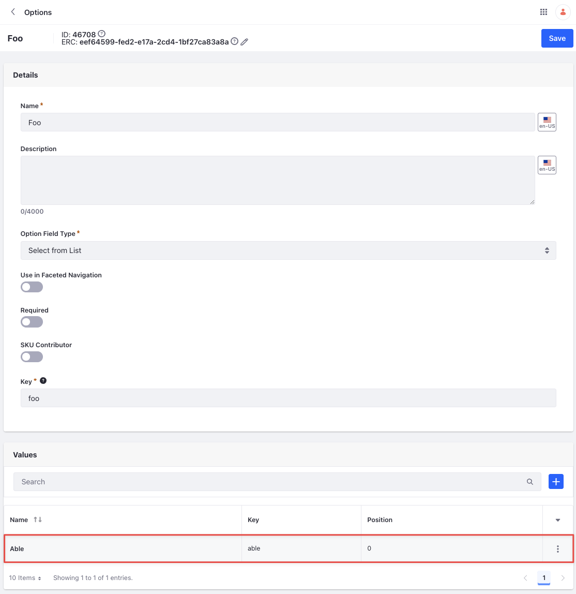

# Option Value API Basics

You can manage option values from the Options application or with REST APIs. Call the [headless-commerce-admin-catalog](http://localhost:8080/o/api?endpoint=http://localhost:8080/o/headless-commerce-admin-catalog/v1.0/openapi.json) services to create and manage option values.

## Adding an Option Value

```{include} /_snippets/run-liferay-dxp.md
```

Once Liferay is running,

1. Download and unzip [Option Value API Basics](./liferay-c7w9.zip).

   ```bash
   curl https://resources.learn.liferay.com/commerce/latest/en/product-management/developer-guide/liferay-c7w9.zip -O
   ```

   ```bash
   unzip liferay-c7w9.zip
   ```

1. Option values are scoped to an option. If you haven't created an option, see [Option API Basics](./option-api-basics.md). When creating a new option value, you must provide the `id` of the option, a unique key, and a name for the option value.

   Use the cURL script to add a new option value. On the command line, navigate to the `curl` folder. Execute the `OptionValue_POST_ToOption.sh` script with the appropriate option ID as a parameter.

   ```bash
   ./OptionValue_POST_ToOption.sh 1234
   ```

   The JSON response shows a new option value was added:

   ```json
   {
      "actions" : {
         "get" : {
            "method" : "GET",
            "href" : "http://localhost:8080/o/headless-commerce-admin-catalog/v1.0/optionValues/{id}"
         },
         "update" : {
            "method" : "PATCH",
            "href" : "http://localhost:8080/o/headless-commerce-admin-catalog/v1.0/optionValues/{id}"
         },
         "delete" : {
            "method" : "DELETE",
            "href" : "http://localhost:8080/o/headless-commerce-admin-catalog/v1.0/optionValues/{id}"
         }
      },
      "externalReferenceCode" : "c63216c7-9043-90ab-35b9-6efbe36b47ff",
      "id" : 46709,
      "key" : "able",
      "name" : {
         "en_US" : "Able"
      },
      "priority" : 0.0
   }
   ```

1. To verify the option value addition, open the *Global Menu* () and navigate to *Commerce* &rarr; *Options*. Select the appropriate option. The new option value appears in the Values section.

   

1. Alternatively, call the REST service using the Java client. Navigate into the `java` folder and compile the source files:

   ```bash
   javac -classpath .:* *.java
   ```

1. Run the `OptionValue_POST_ToOption` class, replacing the `optionId` with the appropriate value.

   ```bash
   java -classpath .:* -DoptionId=1234 OptionValue_POST_ToOption
   ```

## Examine the cURL Command

The `OptionValue_POST_ToOption.sh` script calls the REST service with a cURL command.

```{literalinclude} ./option-value-api-basics/resources/liferay-c7w9.zip/curl/OptionValue_POST_ToOption.sh
    :language: bash
```

Here are the command's arguments:

| Arguments                                                                                  | Description                                              |
| :----------------------------------------------------------------------------------------- | :------------------------------------------------------- |
| `-H "Content-Type: application/json"`                                                      | Set the request body format to JSON.                     |
| `-X POST`                                                                                  | Set the HTTP method to invoke at the specified endpoint. |
| `"http://localhost:8080/o/headless-commerce-admin-catalog/v1.0/options/${1}/optionValues"` | Specify the REST service endpoint.                       |
| `-d "{\"key\": \"able\", \"name\": {\"en_US\": \"Able\"}}"`                                | Enter the data to post.                                  |
| `-u "test@liferay.com:learn"`                                                              | Enter basic authentication credentials.                  |

```{note}
Basic authentication is used here for demonstration purposes. For production, you should authorize users via [OAuth2](https://learn.liferay.com/dxp/latest/en/headless-delivery/using-oauth2.html). See [Using OAuth2 to Authorize Users](https://learn.liferay.com/dxp/latest/en/headless-delivery/using-oauth2/using-oauth2-to-authorize-users.html) for a sample React application using OAuth2.
```

The other cURL commands use similar JSON arguments.

## Examine the Java Class

The `OptionValue_POST_ToOption.java` class adds an option value by calling the `OptionValueResource` service.

```{literalinclude} ./option-value-api-basics/resources/liferay-c7w9.zip/java/OptionValue_POST_ToOption.java
   :dedent: 1
   :language: java
   :lines: 11-31
```

This class invokes the REST service using only three lines of code:

| Line (abbreviated)                                                               | Description                                                                              |
| :------------------------------------------------------------------------------- | :--------------------------------------------------------------------------------------- |
| `OptionValueResource.Builder builder = ...`                                      | Get a `Builder` for generating a `OptionValueResource` service instance.                 |
| `OptionValueResource optionValueResource = builder.authentication(...).build();` | Use basic authentication and generate a `OptionValueResource` service instance.          |
| `optionValueResource.postOption(...);`                                           | Call the `optionValueResource.postOptionIdOptionValue` method and pass the data to post. |

The project includes the `com.liferay.headless.commerce.admin.catalog.client.jar` file as a dependency. You can find client JAR dependency information for all REST applications in the API Explorer in your installation at `/o/api` (e.g., <http://localhost:8080/o/api>).

```{note}
The `main` method's comment demonstrates running the class.
```

The remaining example Java classes call different `OptionValueResource` methods.

```{important}
See [OptionValueResource](https://github.com/liferay/liferay-portal/blob/[$LIFERAY_LEARN_PORTAL_GIT_TAG$]/modules/apps/commerce/headless/headless-commerce/headless-commerce-admin-catalog-client/src/main/java/com/liferay/headless/commerce/admin/catalog/client/resource/v1_0/OptionValueResource.java) for service details.
```

Below are examples of calling other `OptionValue` REST services using cURL and Java.

## Get Option Values from an Option

List all the option values from an option with a cURL or Java command. Replace `1234` with the option's ID.

### OptionValues_GET_FromOption.sh

Command:

```bash
./OptionValues_GET_FromOption.sh 1234
```

Code:

```{literalinclude} ./option-value-api-basics/resources/liferay-c7w9.zip/curl/OptionValues_GET_FromOption.sh
   :language: bash
```

### OptionValues_GET_FromOption.java

Command:

```bash
java -classpath .:* -DoptionId=1234 OptionValues_GET_FromOption
```

Code:

```{literalinclude} ./option-value-api-basics/resources/liferay-c7w9.zip/java/OptionValues_GET_FromOption.java
   :dedent: 1
   :language: java
   :lines: 9-20
```

The option's `OptionValue` objects are formatted in JSON.

## Get an Option Value

Get a specific option value with cURL or Java `get` commands. Replace `1234` with the option value's ID.

```{tip}
Use `OptionValues_GET_FromOption.[java|sh]` to get a list of all option values associated to an option, and note the `id` of the option value you want specifically.
```

### OptionValue_GET_ById.sh

Command:

```bash
./OptionValue_GET_ById.sh 1234
```

Code:

```{literalinclude} ./option-value-api-basics/resources/liferay-c7w9.zip/curl/OptionValue_GET_ById.sh
   :language: bash
```

### OptionValue_GET_ById.java

Command:

```bash
java -classpath .:* -DoptionValueId=1234 OptionValue_GET_ById
```

Code:

```{literalinclude} ./option-value-api-basics/resources/liferay-c7w9.zip/java/OptionValue_GET_ById.java
   :dedent: 1
   :language: java
   :lines: 8-18
```

The `OptionValue` fields are listed in JSON.

## Patch an Option Value

Update an existing option value with cURL and Java `patch` commands. Replace `1234` with your option value's ID.

### OptionValue_PATCH_ById.sh

Command:

```bash
./OptionValue_PATCH_ById.sh 1234
```

Code:

```{literalinclude} ./option-value-api-basics/resources/liferay-c7w9.zip/curl/OptionValue_PATCH_ById.sh
   :language: bash
```

### OptionValue_PATCH_ById.java

Command:

```bash
java -classpath .:* -DoptionValueId=1234 OptionValue_PATCH_ById
```

Code:

```{literalinclude} ./option-value-api-basics/resources/liferay-c7w9.zip/java/OptionValue_PATCH_ById.java
   :dedent: 1
   :language: java
   :lines: 9-27
```

## Delete an Option Value

Delete an existing option value with cURL and Java `delete` commands. Replace `1234` with your option value's ID.

### OptionValue_DELETE_ById.sh

Command:

```bash
./OptionValue_DELETE_ById.sh 1234
```

Code:

```{literalinclude} ./option-value-api-basics/resources/liferay-c7w9.zip/curl/OptionValue_DELETE_ById.sh
   :language: bash
```

### OptionValue_DELETE_ById.java

Command

```bash
java -classpath .:* -DoptionValueId=1234 OptionValue_DELETE_ById
```

Code:

```{literalinclude} ./option-value-api-basics/resources/liferay-c7w9.zip/java/OptionValue_DELETE_ById.java
   :dedent: 1
   :language: java
   :lines: 8-17
```

The [API Explorer](https://learn.liferay.com/dxp/latest/en/headless-delivery/consuming-apis/consuming-rest-services.html) shows the `OptionValue` services and schemas and has an interface to test each service.
