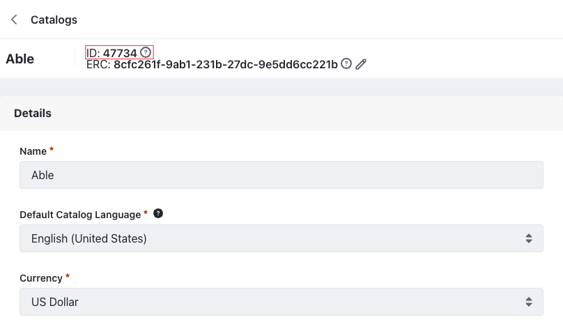
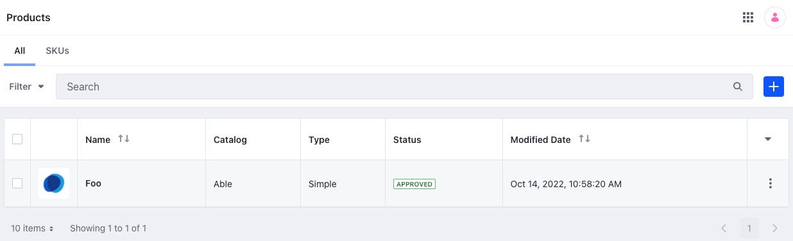

# Product API Basics

You can manage products from the Applications menu, but you can also use Liferay’s REST APIs. Call these services to create and manage products.

## Adding a Product

```{include} /_snippets/run-liferay-dxp.md
```

Then follow these steps:

1. Download and unzip [Product API Basics](./liferay-z8v2.zip).

   ```bash
   curl https://resources.learn.liferay.com/commerce/latest/en/product-management/developer-guide/liferay-z8v2.zip -O
   ```

   ```bash
   unzip liferay-z8v2.zip
   ```

1. A product is scoped to a catalog and the catalog ID is one of the required parameters. To get this, open the *Global Menu* (), and go to *Commerce* &rarr; *Catalogs*. Select the catalog where you'll add products and note down the ID present next to its name.

   

1. Use the cURL script to add a new product to the catalog. On the command line, navigate to the `curl` folder. Execute the `Product_POST_ToCatalog.sh` script with your catalog ID as a parameter.

   ```bash
   ./Product_POST_ToCatalog.sh 1234
   ```

   The JSON response shows a new product has been added:

   ```bash
   "actions" : {
    "get" : {
      "method" : "GET",
      "href" : "http://localhost:8080/o/headless-commerce-admin-catalog/v1.0/products/47738"
    },
    "update" : {
      "method" : "PATCH",
      "href" : "http://localhost:8080/o/headless-commerce-admin-catalog/v1.0/products/47738"
    },
    "delete" : {
      "method" : "DELETE",
      "href" : "http://localhost:8080/o/headless-commerce-admin-catalog/v1.0/products/47738"
    }
   },
   "active" : true,
   "catalogId" : 47734,
   "categories" : [ ],
   "createDate" : "2022-10-14T09:58:20Z",
   "customFields" : [ ],
   "description" : {
      "en_US" : ""
   },
   "displayDate" : "2022-10-14T09:58:00Z",
   "expando" : { },
   "externalReferenceCode" : "5ad0eabb-6c69-6eaf-75aa-ec4000408c66",
   "id" : 47738,
   "metaDescription" : {
      "en_US" : ""
   },
   "metaKeyword" : {
      "en_US" : ""
   },
   "metaTitle" : {
      "en_US" : ""
   },
   "modifiedDate" : "2022-10-14T09:58:20Z",
   "name" : {
      "en_US" : "Foo"
   },
   "productAccountGroupFilter" : false,
   "productChannelFilter" : false,
   "productId" : 47739,
   "productStatus" : 0,
   "productType" : "simple",
   "productTypeI18n" : "Simple",
   "shortDescription" : {
      "en_US" : ""
   },
   "skuFormatted" : "",
   "tags" : [ ],
   "thumbnail" : "/o/commerce-media/default/?groupId=47735",
   "urls" : {
      "en_US" : "foo"
   },
   "version" : 1,
   "workflowStatusInfo" : {
      "code" : 0,
      "label" : "approved",
      "label_i18n" : "Approved"
   }
   ```

1. Verify this by opening the *Global Menu* (), and navigating to *Commerce* &rarr; *Products*. See that a new product has been added.

   

1. You can also call the The REST service using the Java client. Navigate out of the `curl` folder and into the `java` folder. Compile the source files:

   ```bash
   javac -classpath .:* *.java
   ```

1. Run the `Product_POST_ToCatalog` class. Replace the `catalogId` value with your Catalog's ID:

   ```bash
   java -classpath .:* -DcatalogId=1234 Product_POST_ToCatalog
   ```

## Examine the cURL Command

The `Product_POST_ToCatalog.sh` script calls the REST service with a cURL command.

```{literalinclude} ./product-api-basics/resources/liferay-z8v2.zip/curl/Product_POST_ToCatalog.sh
    :language: bash
```

Here are the command's arguments:

| Arguments                                                                                                       | Description                                         |
| :-------------------------------------------------------------------------------------------------------------- | :-------------------------------------------------- |
| `-H "Content-Type: application/json"`                                                                           | Indicates that the request body format is JSON.     |
| `-X POST`                                                                                                       | The HTTP method to invoke at the specified endpoint |
| `"http://localhost:8080/o/headless-commerce-admin-catalog/v1.0/products"`                                       | The REST service endpoint                           |
| `-d "{\"active\": true, \"catalogId\": \"${1}\", \"name\": {\"en_US\": \"Foo\"}, \"productType\": \"simple\"}"` | The data to post                 |
| `-u "test@liferay.com:learn"`                                                                                   | Basic authentication credentials                    |

!!! note
   Basic authentication is used here for demonstration purposes. For production, you should authorize users via [OAuth2](https://learn.liferay.com/dxp/latest/en/headless-delivery/using-oauth2.html). See [Using OAuth2 to Authorize Users](https://learn.liferay.com/dxp/latest/en/headless-delivery/using-oauth2/using-oauth2-to-authorize-users.html) for a sample React application that utilizes OAuth2.

The other cURL commands use similar JSON arguments.

## Examine the Java Class

The `Product_POST_ToCatalog.java` class adds a product by calling the product related service.

```{literalinclude} ./product-api-basics/resources/liferay-z8v2.zip/java/Product_POST_ToCatalog.java
   :dedent: 1
   :language: java
   :lines: 11-33
```

This class invokes the REST service using only three lines of code:

| Line (abbreviated)                                                       | Description                                                                        |
| :----------------------------------------------------------------------- | :--------------------------------------------------------------------------------- |
| `ProductResource.Builder builder = ...`                                  | Gets a `Builder` for generating a `ProductResource` service instance.              |
| `ProductResource productResource = builder.authentication(...).build();` | Specifies basic authentication and generates a `ProductResource` service instance. |
| `productResource.postProduct(...);`                                      | Calls the `productResource.postProduct` method and passes the data to post.        |

Note that the project includes the `com.liferay.headless.commerce.admin.catalog.client.jar` file as a dependency. You can find client JAR dependency information for all REST applications in the API explorer in your installation at `/o/api`.

!!! note
   The `main` method's comment demonstrates running the class.

The other example Java classes are similar to this one, but call different `ProductResource` methods.

!!! important
   See [ProductResource](https://github.com/liferay/liferay-portal/blob/[$LIFERAY_LEARN_PORTAL_GIT_TAG$]/modules/apps/commerce/headless/headless-commerce/headless-commerce-admin-catalog-client/src/main/java/com/liferay/headless/commerce/admin/catalog/client/resource/v1_0/ProductResource.java) for service details.

Below are examples of calling other `Product` REST services using cURL and Java.

## Get Products from Instance

You can list all products from your Liferay instance by executing the following cURL or Java command.

### Products_GET_FromInstance.sh

Command:

```bash
./Products_GET_FromInstance.sh
```

Code:

```{literalinclude} ./product-api-basics/resources/liferay-z8v2.zip/curl/Products_GET_FromInstance.sh
   :language: bash
```

### Products_GET_FromInstance.java

Command:

```bash
java -classpath .:* Products_GET_FromInstance
```

Code:

```{literalinclude} ./product-api-basics/resources/liferay-z8v2.zip/java/Products_GET_FromInstance.java
   :dedent: 1
   :language: java
   :lines: 11-22
```

The `Product` objects of your Liferay instance are listed in JSON.

This API also accepts parameters to filter, paginate, search, and sort the products. See the [`getProductsPage`](https://github.com/liferay/liferay-portal/blob/master/modules/apps/commerce/headless/headless-commerce/headless-commerce-admin-catalog-client/src/main/java/com/liferay/headless/commerce/admin/catalog/client/resource/v1_0/ProductResource.java#L43-L46) method for more information. You can use the following Product fields in your queries to filter, search, and sort the results.

- categoryIds
- channelId
- statusCode
- customFields
- createDate
- modifiedDate
- catalogId
- name
- productType

| Filter Query                       | Description                              |
| :--------------------------------- | :--------------------------------------- |
| productType eq 'simple'            | Product type equals simple               |
| contains(name, 'Bar')              | Product name contains Bar                |
| customFields/sampleSize eq '100.0' | Custom field named sampleSize equals 100 |

| Sort Query                | Description                                                                            |
| :------------------------ | :------------------------------------------------------------------------------------- |
| createDate:desc           | Sort by createDate in the descending order                                             |
| name:asc                  | Sort by name in the ascending order                                                    |
| createDate:desc,name:desc | Sort by createDate in the descending order first, then by name in the descending order |

Read [API Query Parameters](https://learn.liferay.com/dxp/latest/en/headless-delivery/consuming-apis/api-query-parameters.html) for more information.

## Get a Product

Get a specific product with the following cURL or Java command. Replace `1234` with the product's ID.

!!! tip
   Use ``Products_GET_FromInstance.[java|sh]`` to get a list of all products, and note the `productId` of the product you want specifically.

### Product_GET_ById.sh

Command:

```bash
./Product_GET_ById.sh 1234
```

Code:

```{literalinclude} ./product-api-basics/resources/liferay-z8v2.zip/curl/Product_GET_ById.sh
   :language: bash
```

### Product_GET_ById.java

Command:

```bash
java -classpath .:* -DproductId=1234 Product_GET_ById
```

Code:

```{literalinclude} ./product-api-basics/resources/liferay-z8v2.zip/java/Product_GET_ById.java
   :dedent: 1
   :language: java
   :lines: 8-18
```

The `Product` fields are listed in JSON.

## Patch a Product

Update an existing product with the following cURL and Java commands. Replace `1234` with your product's ID.

### Product_PATCH_ById.sh

Command:

```bash
./Product_PATCH_ById.sh 1234
```

Code:

```{literalinclude} ./product-api-basics/resources/liferay-z8v2.zip/curl/Product_PATCH_ById.sh
   :language: bash
```

### Product_PATCH_ById.java

Command:

```bash
java -classpath .:* -DproductId=1234 Product_PATCH_ById
```

Code:

```{literalinclude} ./product-api-basics/resources/liferay-z8v2.zip/java/Product_PATCH_ById.java
   :dedent: 1
   :language: java
   :lines: 11-29
```

## Delete a Product

Delete an existing product with the following cURL and Java commands. Replace `1234` with your product's ID.

### Product_DELETE_ById.sh

Command:

```bash
./Product_DELETE_ById.sh 1234
```

Code:

```{literalinclude} ./product-api-basics/resources/liferay-z8v2.zip/curl/Product_DELETE_ById.sh
   :language: bash
```

### Product_DELETE_ById.java

Command

```bash
java -classpath .:* -DproductId=1234 Product_DELETE_ById
```

Code:

```{literalinclude} ./product-api-basics/resources/liferay-z8v2.zip/java/Product_DELETE_ById.java
   :dedent: 1
   :language: java
   :lines: 8-17
```

The [API Explorer](https://learn.liferay.com/dxp/latest/en/headless-delivery/consuming-apis/consuming-rest-services.html) lists all of the `Product` services and schemas and has an interface to try out each service.

## Related Topics

-[Consuming REST Services](https://learn.liferay.com/dxp/latest/en/headless-delivery/consuming-apis/consuming-rest-services)