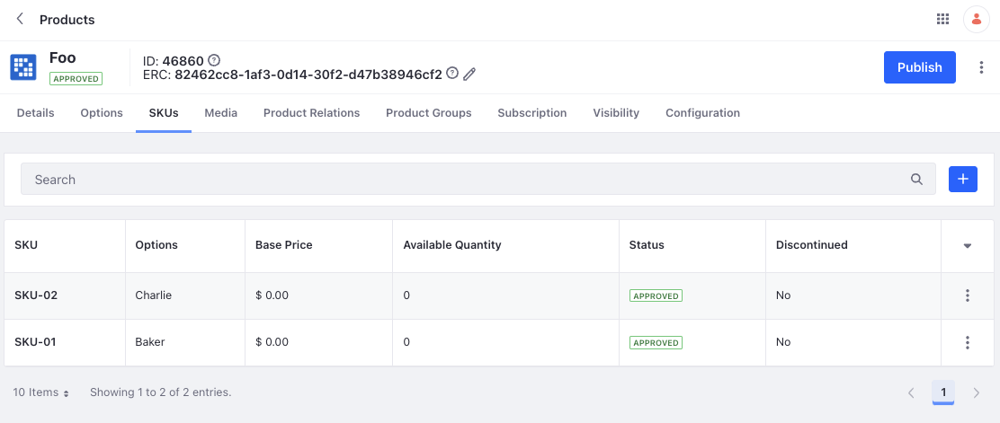

# Product API - Creating a Product with Multiple SKUs

You can create products with multiple active SKUs using the product API or from the Products application. To create such a product, you must first have an option template created using the [Option API](./option-api-basics.md) or through the Options application, and have values present for the option. You can add values from the Options application or use the [Option Value API](./option-value-api-basics.md).

```{note}
You can also create an option template from the Options tab on a product. The values added here, however, are specific to the product and doesn't get added to the option template found under Global Menu () &rarr; Commerce &rarr; Options.
```

## Adding a Product with Multiple SKUs

```{include} /_snippets/run-liferay-dxp.md
```

Then follow these steps:

1. Download and unzip [Product API - Adding a Product with Multiple SKUs](./liferay-q8t5.zip).

   ```bash
   curl https://resources.learn.liferay.com/commmerce/latest/en/product-management/developer-guide/liferay-q8t5.zip -O
   ```

   ```bash
   unzip liferay-q8t5.zip
   ```

1. A product is scoped to a catalog, and the catalog ID is one of the required parameters. To have multiple active SKUs, the product must also have options. You can create an option template to reuse it with multiple products. To link an option template to a product, the option ID is required. 

   To get the catalog ID, open the *Global Menu* (), and go to *Commerce* &rarr; *Catalogs*. Select the catalog where you'll add products and note the ID that's next to its name. 

   To get the option ID, open the *Global Menu* (), and go to *Commerce* &rarr; *Options*. Select the option you want to link to the product and note the ID that's next to its name. 

   ```{important}
   This example assumes you have an option template created with the name `Able` containing two values, `Baker` and `Charlie`. 
   ```

1. Use the cURL script to add a new product with multiple SKUs to the catalog. On the command line, navigate to the `curl` folder. Execute the `Product_POST_ToCatalog.sh` script with your catalog ID and option ID as parameters.

   ```bash
   ./Product_POST_ToCatalog.sh 1234 5678
   ```

   The JSON response shows a new product with multiple SKUs has been added:

   ```bash
   {
      "actions" : {
         "get" : {
            "method" : "GET",
            "href" : "http://localhost:8080/o/headless-commerce-admin-catalog/v1.0/products/46860"
         },
         "update" : {
            "method" : "PATCH",
            "href" : "http://localhost:8080/o/headless-commerce-admin-catalog/v1.0/products/46860"
         },
         "delete" : {
            "method" : "DELETE",
            "href" : "http://localhost:8080/o/headless-commerce-admin-catalog/v1.0/products/46860"
         }
      },
      "active" : true,
      "catalogId" : 1234,
      "categories" : [ ],
      "createDate" : "2023-06-09T11:32:27Z",
      "customFields" : [ ],
      "description" : {
         "en_US" : ""
      },
      "displayDate" : "2023-06-09T11:32:00Z",
      "expando" : { },
      "externalReferenceCode" : "82462cc8-1af3-0d14-30f2-d47b38946cf2",
      "id" : 46860,
      "metaDescription" : {
         "en_US" : ""
      },
      "metaKeyword" : {
         "en_US" : ""
      },
      "metaTitle" : {
         "en_US" : ""
      },
      "modifiedDate" : "2023-06-09T11:32:27Z",
      "name" : {
         "en_US" : "Foo"
      },
      "productAccountGroupFilter" : false,
      "productChannelFilter" : false,
      "productId" : 46861,
      "productStatus" : 0,
      "productType" : "simple",
      "productTypeI18n" : "Simple",
      "shortDescription" : {
         "en_US" : ""
      },
      "skuFormatted" : "(Multiple SKUs)",
      "tags" : [ ],
      "thumbnail" : "/o/commerce-media/default/?groupId=43744",
      "urls" : {
         "en_US" : "foo"
      },
      "version" : 1,
      "workflowStatusInfo" : {
         "code" : 0,
         "label" : "approved",
         "label_i18n" : "Approved"
      }
   }
   ```

   Note the `skuFormatted` field shows `(Multiple SKUs)` confirming the creation of more than one SKU.

1. Verify this by opening the *Global Menu* (), and navigating to *Commerce* &rarr; *Products*. Click the *Options* tab to see the linked product option. Click the *SKUs* tab to see two new SKUs with the Approved status.

   

1. You can also call the REST service using the Java client. Navigate out of the `curl` folder and into the `java` folder. Compile the source files:

   ```bash
   javac -classpath .:* *.java
   ```

1. Run the `Product_POST_ToCatalog` class. Replace the `catalogId` and `optionId` with the appropriate values. 

   ```bash
   java -classpath .:* -DcatalogId=1234 -DoptionId=5678 Product_POST_ToCatalog
   ```

## Examine the cURL Command

The `Product_POST_ToCatalog.sh` script calls the REST service with a cURL command.

```{literalinclude} ./product-api-creating-a-product-with-multiple-skus/resources/liferay-q8t5.zip/curl/Product_POST_ToCatalog.sh
    :language: bash
```

Here are the command's arguments:

| Arguments                                                                                                                                                                                                                                                                                                                                                                                                                                                                                                                                                                  | Description                                         |
| :------------------------------------------------------------------------------------------------------------------------------------------------------------------------------------------------------------------------------------------------------------------------------------------------------------------------------------------------------------------------------------------------------------------------------------------------------------------------------------------------------------------------------------------------------------------------- | :-------------------------------------------------- |
| `-H "Content-Type: application/json"`                                                                                                                                                                                                                                                                                                                                                                                                                                                                                                                                      | Indicates that the request body format is JSON.     |
| `-X POST`                                                                                                                                                                                                                                                                                                                                                                                                                                                                                                                                                                  | The HTTP method to invoke at the specified endpoint |
| `"http://localhost:8080/o/headless-commerce-admin-catalog/v1.0/products"`                                                                                                                                                                                                                                                                                                                                                                                                                                                                                                  | The REST service endpoint                           |
| `-d "{\"active\": true, \"catalogId\": \"${1}\", \"name\": {\"en_US\": \"Foo\"}, \"productOptions\": [{\"fieldType\": \"select\", \"key\": \"able\", \"name\": {\"en_US\": \"Able\"}, \"optionId\": \"${2}\", \"required\": true, \"skuContributor\": true}], \"productType\": \"simple\", \"skus\": [{\"published\": true, \"purchasable\": true, \"sku\": \"SKU-01\", \"skuOptions\": [{\"key\": \"able\", \"value\": \"Baker\"}]}, {\"published\": true, \"purchasable\": true, \"sku\": \"SKU-02\", \"skuOptions\": [{\"key\": \"able\", \"value\": \"Charlie\"}]}]}"` | The data to post                                    |
| `-u "test@liferay.com:learn"`                                                                                                                                                                                                                                                                                                                                                                                                                                                                                                                                              | Basic authentication credentials                    |

```{note}
Basic authentication is used here for demonstration purposes. For production, you should authorize users via [OAuth2](https://learn.liferay.com/dxp/latest/en/headless-delivery/using-oauth2.html). See [Using OAuth2 to Authorize Users](https://learn.liferay.com/dxp/latest/en/headless-delivery/using-oauth2/using-oauth2-to-authorize-users.html) for a sample React application that utilizes OAuth2.
```

## Examine the Java Class

The `Product_POST_ToCatalog.java` class adds a product with multiple SKUs by calling the product-related service.

```{literalinclude} ./product-api-creating-a-product-with-multiple-skus/resources/liferay-q8t5.zip/java/Product_POST_ToCatalog.java
   :dedent: 1
   :language: java
   :lines: 14-85
```

This class invokes the REST service using only three lines of code:

| Line (abbreviated)                                                       | Description                                                                        |
| :----------------------------------------------------------------------- | :--------------------------------------------------------------------------------- |
| `ProductResource.Builder builder = ...`                                  | Gets a `Builder` for generating a `ProductResource` service instance.              |
| `ProductResource productResource = builder.authentication(...).build();` | Specifies basic authentication and generates a `ProductResource` service instance. |
| `productResource.postProduct(...);`                                      | Calls the `productResource.postProduct` method and passes the data to post.        |

Note that the project includes the `com.liferay.headless.commerce.admin.catalog.client.jar` file as a dependency. You can find client JAR dependency information for all REST applications in the API explorer in your installation at `/o/api`.

```{note}
The `main` method's comment demonstrates running the class.
```

## Reviewing the Payload

This is the example payload used to create one product with two active SKUs. 

```json
{
   "active": true,
   "catalogId": 1234,
   "name": {
     "en_US": "Foo"
   },
   "productOptions":[
      {
         "fieldType": "select",
         "key": "able",
         "name": {
            "en_US": "Able"
         },
         "optionId": 5678,
         "required": true,
         "skuContributor": true
      }
   ],
   "productType": "simple",
   "skus": [
      {
         "published": true,
         "purchasable": true,
         "sku": "SKU-01",
         "skuOptions":[{
            "key": "able",
            "value": "Baker"
         }]
      },
      {
         "published": true,
         "purchasable": true,
         "sku": "SKU-02",
         "skuOptions":[{
            "key": "able",
            "value": "Charlie"
         }]
      }
   ]
}
```

There are a total of 6 fields in the JSON. 

| Field            | Description                                                                                                                                                                                                                                                                                                            |
|:-----------------|:-----------------------------------------------------------------------------------------------------------------------------------------------------------------------------------------------------------------------------------------------------------------------------------------------------------------------|
| `active`         | Set it to true or false to change the product's visibility.                                                                                                                                                                                                                                                            |
| `catalogId`      | ID of the product's catalog.                                                                                                                                                                                                                                                                                           |
| `name`           | The name of the product.                                                                                                                                                                                                                                                                                               |
| `productOptions` | An array of product options. See [ProductOption](https://github.com/liferay/liferay-portal/blob/[$LIFERAY_LEARN_PORTAL_GIT_TAG$]/modules/apps/commerce/headless/headless-commerce/headless-commerce-admin-catalog-client/src/main/java/com/liferay/headless/commerce/admin/catalog/client/dto/v1_0/ProductOption.java) |
| `productType`    | The type of the product (simple, grouped, virtual or diagram).                                                                                                                                                                                                                                                         |
| `skus`           | An array of product SKUs. See [Sku](https://github.com/liferay/liferay-portal/blob/[$LIFERAY_LEARN_PORTAL_GIT_TAG$]/modules/apps/commerce/headless/headless-commerce/headless-commerce-admin-catalog-client/src/main/java/com/liferay/headless/commerce/admin/catalog/client/dto/v1_0/Sku.java)                        |

The `productOptions` field contains information about the option that is linked to the product. 

| Field            | Description                                                                                                                            |
|:-----------------|:---------------------------------------------------------------------------------------------------------------------------------------|
| `fieldType`      | The option field's type. Can be one of `"text"`, `"select"`, `"radio"`, `"checkbox_multiple"`, `"date"`, `"numeric"`, or `"checkbox"`. |
| `key`            | The option's key.                                                                                                                      |
| `name`           | The option's name.                                                                                                                     |
| `optionId`       | The option's ID.                                                                                                                       |
| `required`       | When true, you must select an option before checking out.                                                                              |
| `skuContributor` | When true, each option is linked to a SKU. This is mandatory for products with multiple SKUs.                                          |

The `skus` field contains information about the SKUs of a product. 

| Field         | Description                                                                                                                                                                                                                                                                                                                                                                                                        |
| :------------ | :----------------------------------------------------------------------------------------------------------------------------------------------------------------------------------------------------------------------------------------------------------------------------------------------------------------------------------------------------------------------------------------------------------------- |
| `published`   | When true, the SKU is visible in the storefront.                                                                                                                                                                                                                                                                                                                                                                   |
| `purchasable` | When true, the SKU is purchasable.                                                                                                                                                                                                                                                                                                                                                                                 |
| `sku`         | The name of the SKU.                                                                                                                                                                                                                                                                                                                                                                                               |
| `skuOptions`  | An array of sku options. See [SkuOption](https://github.com/liferay/liferay-portal/blob/[$LIFERAY_LEARN_PORTAL_GIT_TAG$]/modules/apps/commerce/headless/headless-commerce/headless-commerce-admin-catalog-client/src/main/java/com/liferay/headless/commerce/admin/catalog/client/dto/v1_0/SkuOption.java). The `key` is the key of the option template and the `value` specifies one of the values of the option. |

```{note}
You can substitute the `key` and `value` inside `skuOptions` with `optionId` and `optionValueId`. 
```

## Related Topics

* [Product API Basics](./product-api-basics.md)
* [Option API Basics](./option-api-basics.md)
* [Option Value API Basics](./option-value-api-basics.md)
