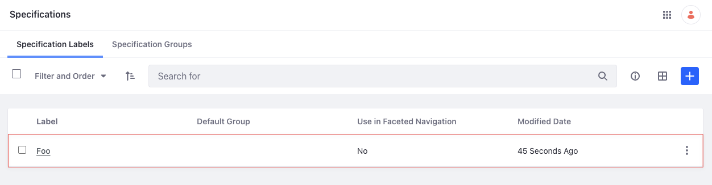

# Specification API Basics

You can manage product specifications from the Applications menu or with REST APIs. Call the [headless-commerce-admin-catalog](http://localhost:8080/o/api?endpoint=http://localhost:8080/o/headless-commerce-admin-catalog/v1.0/openapi.json) services to create and manage specifications.

## Adding a Specification

```{include} /_snippets/run-liferay-dxp.md
```

Once Liferay is running,

1. Download and unzip [Specification API Basics](./liferay-u9x9.zip).

   ```bash
   curl https://resources.learn.liferay.com/commmerce/latest/en/product-management/developer-guide/liferay-u9x9.zip -O
   ```

   ```bash
   unzip liferay-u9x9.zip
   ```

1. Specifications are scoped to an instance, and each specification must specify a unique `key` and a `title`.

   Use the cURL script to add a new specification. On the command line, navigate to the `curl` folder. Execute the `Specification_POST_ToInstance.sh` script.

   ```bash
   ./Specification_POST_ToInstance.sh
   ```

   The JSON response shows a new specification was added:

   ```bash
   {
      "description" : { },
      "facetable" : false,
      "id" : 45936,
      "key" : "foo",
      "title" : {
         "en_US" : "Foo"
      }
   }
   ```

1. To verify the specification addition, open the *Global Menu* () and navigate to *Commerce* &rarr; *Specifications*. The new specification appears under the Specification Labels tab.

   

   ```{note}
   Currently, the API cannot add a specification label to a specification group or create a specification group. You must instead use the Specifications UI. Open the *Global Menu* () and navigate to *Commerce* &rarr; *Specifications*. See [Specification Groups](../creating-and-managing-products/products/specifications.md#specification-groups) for more information.
   ```

1. Alternatively, call the REST service using the Java client. Navigate into the `java` folder and compile the source files:

   ```bash
   javac -classpath .:* *.java
   ```

1. Run the `Specification_POST_ToInstance` class.

   ```bash
   java -classpath .:* Specification_POST_ToInstance
   ```

## Examine the cURL Command

The `Specification_POST_ToInstance.sh` script calls the REST service with a cURL command.

```{literalinclude} ./specification-api-basics/resources/liferay-u9x9.zip/curl/Specification_POST_ToInstance.sh
    :language: bash
```

Here are the command's arguments:

| Arguments                                                                     | Description                                              |
| :---------------------------------------------------------------------------- | :------------------------------------------------------- |
| `-H "Content-Type: application/json"`                                           | Set the request body format to JSON.                     |
| `-X POST`                                                                       | Set the HTTP method to invoke at the specified endpoint. |
| `"http://localhost:8080/o/headless-commerce-admin-catalog/v1.0/specifications"` | Specify the REST service endpoint.                       |
| `-d "{\"key\": \"foo\", \"title\": {\"en_US\": \"Foo\"}}"`                      | Enter the data to post.                                  |
| `-u "test@liferay.com:learn"`                                                   | Enter basic authentication credentials.                  |

```{note}
Basic authentication is used here for demonstration purposes. For production, you should authorize users via [OAuth2](https://learn.liferay.com/en/w/dxp/headless-delivery/using-oauth2). See [Using OAuth2 to Authorize Users](https://learn.liferay.com/en/w/dxp/headless-delivery/using-oauth2/using-oauth2-to-authorize-users) for a sample React application using OAuth2.
```

The other cURL commands use similar JSON arguments.

## Examine the Java Class

The `Specification_POST_ToInstance.java` class adds a specification by calling the `SpecificationResource` service.

```{literalinclude} ./specifications-api-basics/resources/liferay-u9x9.zip/java/Specification_POST_ToInstance.java
   :dedent: 1
   :language: java
   :lines: 11-31
```

This class invokes the REST service using only three lines of code:

| Line (abbreviated)                                                                   | Description                                                                          |
| :----------------------------------------------------------------------------------- | :----------------------------------------------------------------------------------- |
| `SpecificationResource.Builder builder = ...`                                        | Get a `Builder` for generating a `SpecificationResource` service instance.           |
| `SpecificationResource specificationResource = builder.authentication(...).build();` | Use basic authentication and generate a `SpecificationResource` service instance.    |
| `specificationResource.postSpecification(...);`                                      | Call the `specificationResource.postSpecification` method and pass the data to post. |

The project includes the `com.liferay.headless.commerce.admin.catalog.client.jar` file as a dependency. You can find client JAR dependency information for all REST applications in the API Explorer in your installation at `/o/api` (e.g., <http://localhost:8080/o/api>).

```{note}
The `main` method's comment demonstrates running the class.
```

The remaining example Java classes call different `SpecificationResource` methods.

```{important}
See [SpecificationResource](https://github.com/liferay/liferay-portal/blob/[$LIFERAY_LEARN_PORTAL_GIT_TAG$]/modules/apps/commerce/headless/headless-commerce/headless-commerce-admin-catalog-client/src/main/java/com/liferay/headless/commerce/admin/catalog/client/resource/v1_0/SpecificationResource.java) for service details.
```

Below are examples of calling other `Specification` REST services using cURL and Java.

## Get Specifications from Instance

List all the specifications in your Liferay instance with a cURL or Java command.

### Specifications_GET_FromInstance.sh

Command:

```bash
./Specifications_GET_FromInstance.sh
```

Code:

```{literalinclude} ./specifications-api-basics/resources/liferay-u9x9.zip/curl/Specifications_GET_FromInstance.sh
   :language: bash
```

### Specifications_GET_FromInstance.java

Command:

```bash
java -classpath .:* Specifications_GET_FromInstance
```

Code:

```{literalinclude} ./specifications-api-basics/resources/liferay-u9x9.zip/java/Specifications_GET_FromInstance.java
   :dedent: 1
   :language: java
   :lines: 11-22
```

The instance's `Specification` objects are formatted in JSON.

### Filtering, Paginating, Searching, and Sorting Specifications

This API also accepts parameters to filter, paginate, search, and sort the specifications. See the [`getSpecificationsPage`](https://github.com/liferay/liferay-portal/blob/[$LIFERAY_LEARN_PORTAL_GIT_TAG$]/modules/apps/commerce/headless/headless-commerce/headless-commerce-admin-catalog-client/src/main/java/com/liferay/headless/commerce/admin/catalog/client/resource/v1_0/SpecificationResource.java#L43-#L46) method for more information. You can use the following `Specification` fields in your queries to filter, search, and sort the results:

* key
* title

| Filter Query     | Description                           |
| :--------------- | :------------------------------------ |
| `key eq 'foo'`   | The specification key must equal foo. |
| `title eq 'Bar'` | The specification title must be Bar.   |

| Sort Query  | Description                       |
| :---------- | :-------------------------------- |
| `key:desc`  | Sort by key in descending order.  |
| `title:asc` | Sort by title in ascending order. |

Read [API Query Parameters](https://learn.liferay.com/dxp/latest/en/headless-delivery/consuming-apis/api-query-parameters.html) for more information.

## Get a Specification

Get a specific specification with cURL or Java `get` commands. Replace `1234` with the specification's ID.

```{tip}
Use `Specifications_GET_FromInstance.[java|sh]` to get a list of all specifications, and note the `id` of the specification you want specifically.
```

### Specification_GET_ById.sh

Command:

```bash
./Specification_GET_ById.sh 1234
```

Code:

```{literalinclude} ./specifications-api-basics/resources/liferay-u9x9.zip/curl/Specification_GET_ById.sh
   :language: bash
```

### Specification_GET_ById.java

Command:

```bash
java -classpath .:* -DspecificationId=1234 Specification_GET_ById
```

Code:

```{literalinclude} ./specifications-api-basics/resources/liferay-u9x9.zip/java/Specification_GET_ById.java
   :dedent: 1
   :language: java
   :lines: 8-18
```

The `Specification` fields are listed in JSON.

## Patch a Specification

Update an existing specification with cURL and Java `patch` commands. Replace `1234` with your specification's ID.

### Specification_PATCH_ById.sh

Command:

```bash
./Specification_PATCH_ById.sh 1234
```

Code:

```{literalinclude} ./specifications-api-basics/resources/liferay-u9x9.zip/curl/Specification_PATCH_ById.sh
   :language: bash
```

### Specification_PATCH_ById.java

Command:

```bash
java -classpath .:* -DspecificationId=1234 Specification_PATCH_ById
```

Code:

```{literalinclude} ./specifications-api-basics/resources/liferay-u9x9.zip/java/Specification_PATCH_ById.java
   :dedent: 1
   :language: java
   :lines: 11-30
```

## Delete a Specification

Delete an existing specification with cURL and Java `delete` commands. Replace `1234` with your specification's ID.

### Specification_DELETE_ById.sh

Command:

```bash
./Specification_DELETE_ById.sh 1234
```

Code:

```{literalinclude} ./specifications-api-basics/resources/liferay-u9x9.zip/curl/Specification_DELETE_ById.sh
   :language: bash
```

### Specification_DELETE_ById.java

Command

```bash
java -classpath .:* -DspecificationId=1234 Specification_DELETE_ById
```

Code:

```{literalinclude} ./specifications-api-basics/resources/liferay-u9x9.zip/java/Specification_DELETE_ById.java
   :dedent: 1
   :language: java
   :lines: 8-17
```

The [API Explorer](https://learn.liferay.com/dxp/latest/en/headless-delivery/consuming-apis/consuming-rest-services.html) shows the `Specification` services and schemas and has an interface to test each service.
