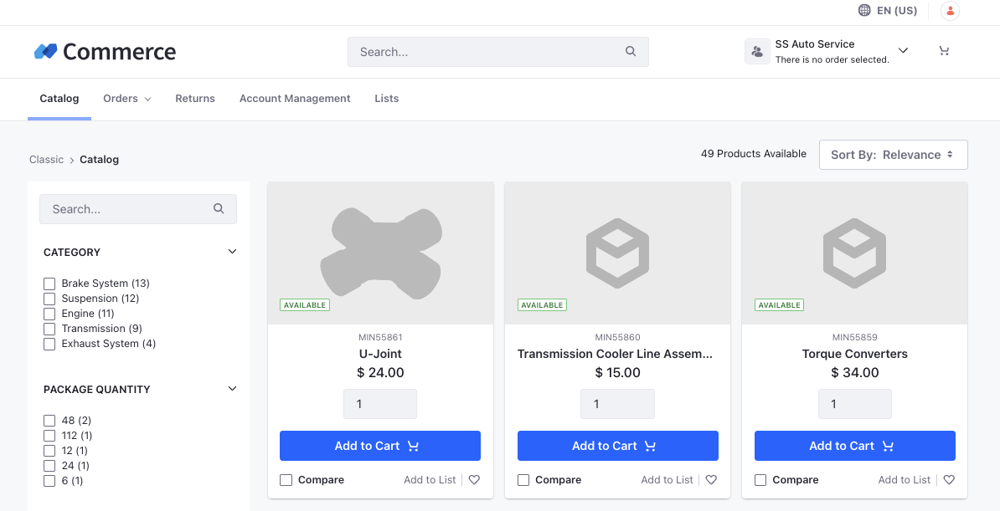

# Using the Commerce Classic Site Initializer

{bdg-secondary}`Liferay DXP 2024.Q4+/GA129+`
{bdg-link-primary}`[Beta Feature](https://learn.liferay.com/web/guest/w/dxp/system-administration/configuring-liferay/feature-flags#beta-feature-flags)`

A Site Initializer bundles together pages, content, and configurations to help you jump-start a new site with much of the site already built. You can reuse them across multiple Liferay instances to replicate the essential components of your sites quickly. The new Commerce Classic site initializer comes with the following pages out-of-the-box:

* [Catalog](../creating-store-content/commerce-storefront-pages/catalog.md)
* [Product Details](../creating-store-content/commerce-storefront-pages/product-details.md)
* [Checkout](../creating-store-content/commerce-storefront-pages/checkout.md)
* [Compare](../creating-store-content/commerce-storefront-pages/compare.md)
* [Pending Orders](../creating-store-content/commerce-storefront-pages/pending-orders.md)
* [Placed Orders](../creating-store-content/commerce-storefront-pages/placed-orders.md)
* [Search](../creating-store-content/commerce-storefront-pages/search.md)
* Returns 
* [Account Management](../creating-store-content/commerce-storefront-pages/account-management.md)
* [Lists (for wishlists)](../creating-store-content/commerce-storefront-pages/lists.md)

!!! note
    You can edit the look and feel, layout, and contents of each of these pages to adapt them to your requirements.

!!! important
    This feature is currently behind a [beta feature flag](https://learn.liferay.com/web/guest/w/dxp/system-administration/configuring-liferay/feature-flags#beta-feature-flags) (LPD-20379).

## Adding the Commerce Classic Site

1. Open the *Global Menu* () and navigate to *Control Panel* &rarr; *Sites*.

1. Click *New* and choose *Commerce Classic*.

1. Enter a name and click *Add*.

This adds the new site. To access it, open the *Global Menu* () and choose *Classic* from the Sites section on the right side.

