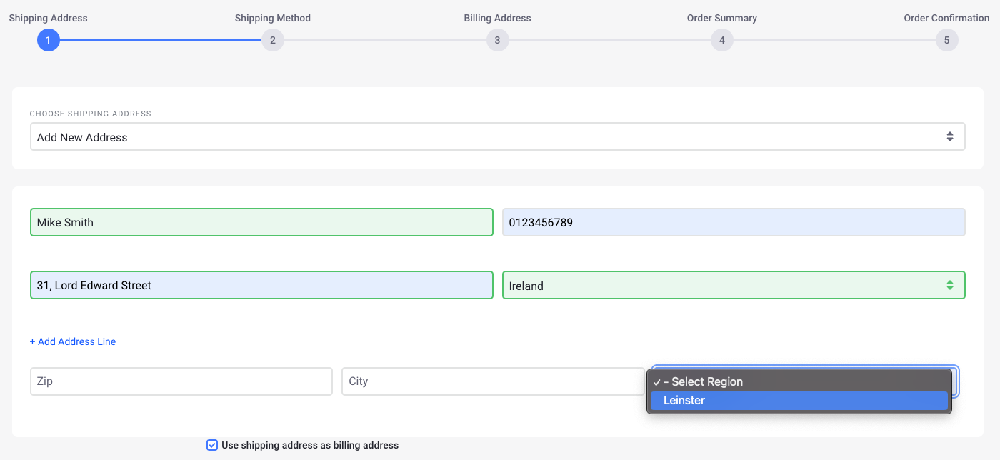

# Adding Regions

You can add states, provinces, or other administrative regions to countries in Liferay.

1. Open the *Global Menu* () and navigate to *Control Panel* &rarr; *Commerce* &rarr; *Countries*.

1. Click on a country (Ireland in this example).

1. Click *Regions*.

1. Click the *Add* () button to add a region.

1. Enter the following:

   * **Name**: *Leinster*
   * **Code**: *IE-L*
   * **Priority**: 6.0

1. Switch the toggle to *Active*.

   

1. Click *Save*.

Leinster has been added to the list of regions in Ireland. When you choose Ireland from the *Country* dropdown, Leinster appears in the *Region* dropdown on the Shipping Address Page. Repeat these steps to add all the regions for a country.

## Additional Information

**Note 1:** The values in the *Code* field must follow the [ISO-3166-2](https://www.iso.org/obp/ui/#search/code/) standard's format.

**Note 2:** You can use the priority field to manually rank regions if needed.
