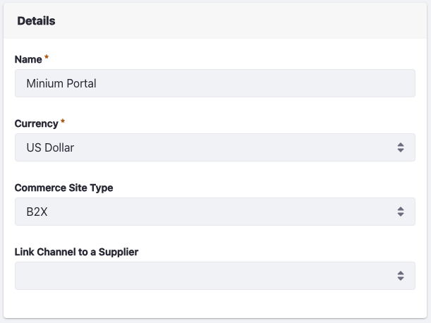
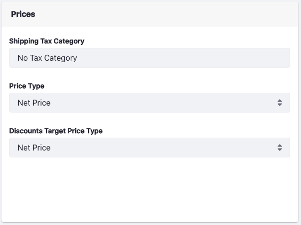
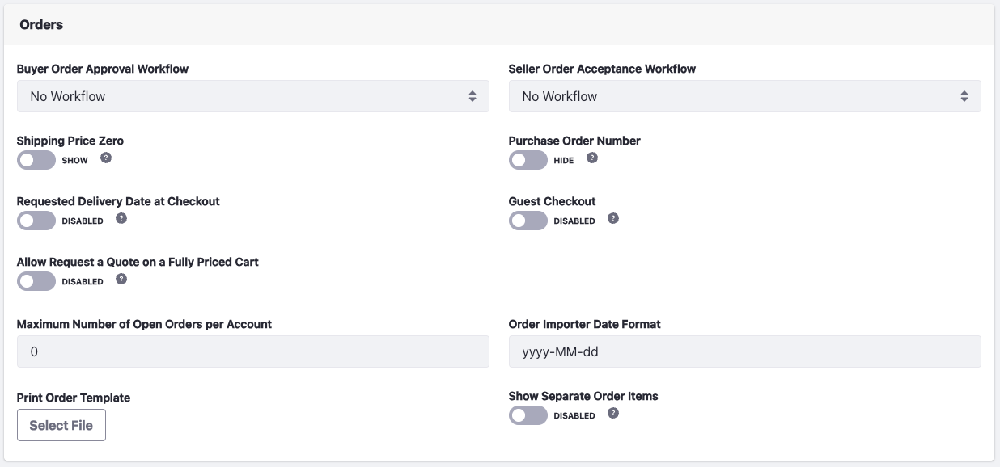
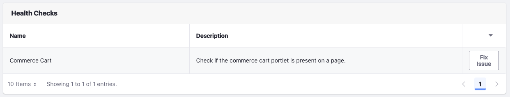
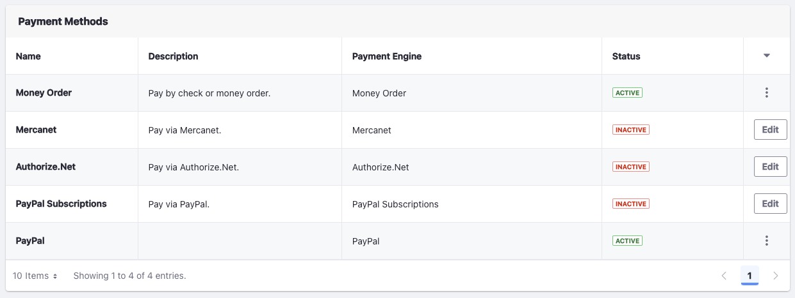
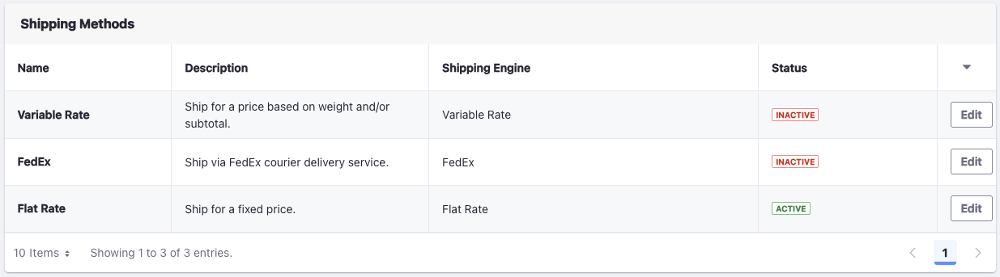
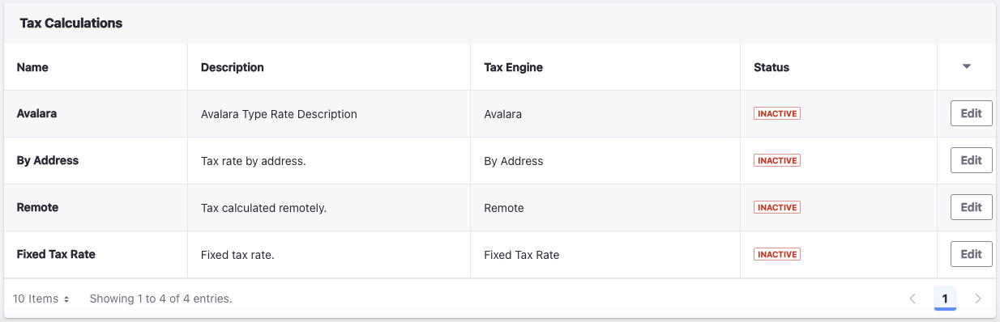
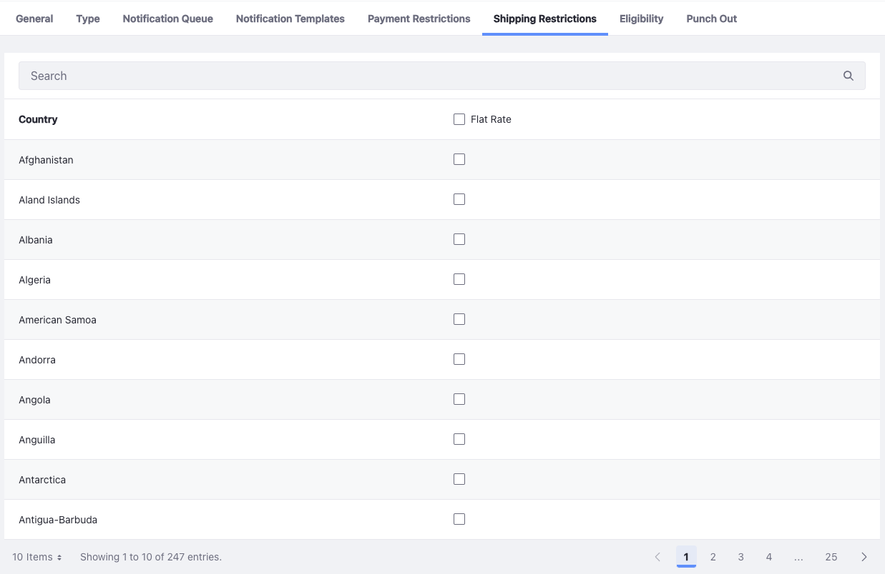
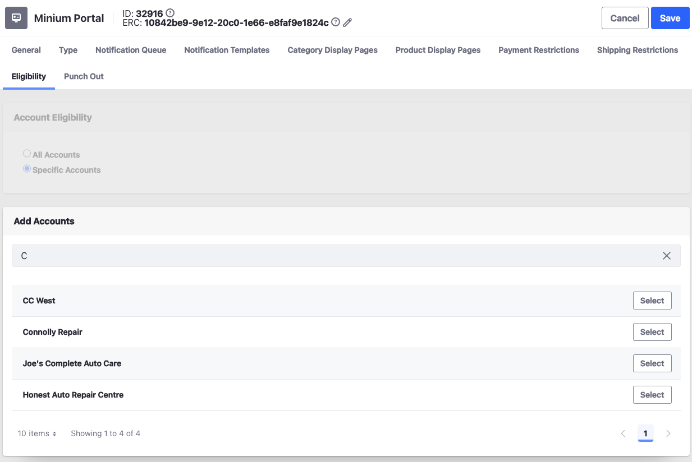

# Channels Reference Guide

The Channels application contains various options to manage and configure your channel. To create a channel, see [Managing Channels](./managing-channels.md).

## General

The _General_ tab consists of important channel settings like currency, order workflows, payments, shipping, and taxes.

### Details

You can view the channel's name, currency, site type, and {bdg-secondary}`Liferay DXP 7.4 U84+/GA84+` supplier account dropdown here. 

### Prices

You can set the [shipping tax category](../../pricing/configuring-taxes/creating-tax-categories.md), price type (net or gross), and the discounts target price type here.

_Price Type_ - Choose between net price or gross price. Net price includes tax during calculation, gross price doesn't.

_Discounts Target Price Type_ - Choose net price to apply discounts to the net price and gross price to apply discounts to the gross price. 

### Orders

The orders section contains several settings to customize the ordering experience for end users.

* Buyer Order Approval Workflow/Seller Order Acceptance Workflow - Enable this to have workflows for [buyers and sellers](../../order-management/order-workflows/introduction-to-order-workflows.md).
* Shipping Price Zero - Enable it to display shipping price as zero in the shipping method selection screen during checkout. 
* Purchase Order Number - Enable it to display the purchase order number field in pending and placed orders widgets. 
* Requested Delivery Date at Checkout - Enable it to allow buyers to enter the requested delivery date during checkout.
* Guest Checkout - Enable it to allow guests to checkout using an email address.
* {bdg-secondary}`Liferay DXP 7.4 U84+/GA84+` Allow Request a Quote on a Fully Priced Cart - Enable it to allow buyers to request a quote on a cart that has no products [priced on application](../../order-management/orders/price-on-application.md).
* Maximum Number of Open Orders per Account - Set the maximum number of open orders per account
* Order Importer Date Format - Set the date format to use while importing orders. See [Order Importer](../../order-management/order-importer.md) for more information.
* Print Order Template - Upload a file to use as template for 
* Show Separate Order Items - Enable it to display each item added to the cart on a separate line instead of updating the quantity for the same item. 

### Health Checks

Use health checks to quickly fix common setup issues with your stores such as missing widgets. This section shows up only if there's an issue. 

### Payment Methods

Use this section to configure [payment methods](../../store-management/configuring-payment-methods/managing-payment-methods.md) for your channel. See [custom payment engine](../../developer-guide/sales/implementing-a-new-payment-method.md) if you want to use a custom payment method.

### Shipping Methods

Use this section to configure the channel's shipment methods. See [flat rate](../../store-management/configuring-shipping-methods/using-the-flat-rate-shipping-method.md), [variable rate](../../store-management/configuring-shipping-methods/using-the-variable-rate-shipping-method.md), and [FedEx](../../store-management/configuring-shipping-methods/using-the-fedex-shipping-method.md) for more information on configuring these shipping methods.

### Tax Calculations

Use this section to configure the tax calculation method for your channel. To learn more about setting a tax rate, see [Setting Rates for Tax Calculations](../../pricing/configuring-taxes/setting-rates-for-tax-calculations.md).

## Type

Under this section, you can connect your channel to a Liferay site. If you're using your channel for a supplier, you can use it without connecting to a site.

## Notification Queue

You can configure Liferay to send email notifications triggered by a variety of events. When an event triggers a notification (for example, when placing an order), a notification entry gets added to the channel's _Notification Queue_. By default, the Liferay instance checks the queue every 15 minutes and deletes any unsent notifications after 43200 minutes (30 days).

See the [Configuring the Commerce Notification Queue](../../store-management/sending-emails/configuring-the-commerce-notification-queue.md) for more information.

!!! note
    The preferred way to send notifications is by using Liferay Objects. See the [Notification](https://learn.liferay.com/web/guest/w/dxp/building-applications/objects/creating-and-managing-objects/actions/understanding-action-types#notification) type to learn more about creating [object actions](https://learn.liferay.com/web/guest/w/dxp/building-applications/objects/creating-and-managing-objects/actions) to send notifications for orders. 

## Notification Templates

Use notification templates to customize email notifications and define the triggering events.

To learn more about sending emails notifications, see [Sending emails](../sending-emails.md).

To learn more about creating and using notification templates, see [Using Notification Templates](../../store-management/sending-emails/using-notification-templates.md).

## Category Display Pages

The category display pages tab displays the list of all category display pages created for your site. Using a [category display page](../../creating-store-content/creating-category-display-pages.md), you can us a specific page to display all products tagged in a given category. To work with category display pages, you should first create [product categories](../../product-management/creating-and-managing-products/products/organizing-your-catalog-with-product-categories.md) and associate them with the required products.

See [Creating Pages](https://learn.liferay.com/dxp/latest/en/site-building/creating-pages.html) to learn more about creating pages. See [Tags and Categories](https://learn.liferay.com/dxp/latest/en/content-authoring-and-management/tags-and-categories.html) to learn more about creating tags and categories.

## Product Display Pages

Product display pages operate similarly to category display pages. Use this to create a page to highlight a specific product instead of the default page. On the _Product Display Pages_ tab, you can view the list of all product display pages created on the site. See [Creating Product Display Pages](../../creating-store-content/creating-product-display-pages.md) for more information.

## Payment Restrictions

Choose countries restricted for your payment method here. If there's no billing address listed, the shipping address is used. To do so, you must activate at least one [payment method](../../store-management/configuring-payment-methods/managing-payment-methods.md). Check the boxes for each country to restrict accounts from that country from using the chosen payment method.

## Shipping Restrictions

Choose countries restricted for your shipment method here.

## Eligibility

{bdg-secondary}`Liferay DXP 2024.Q1+/Portal 7.4 GA112+`

By default, a channel is eligible to all accounts. You can control channel eligibility in the Eligibility tab. 

1. Select _Specific Accounts_.
1. Search for an account and click _Select_.
1. Click _Save_.

!!! note

    You cannot link guest accounts to a channel. Users from an account linked to an eligible channel cannot access other ineligible channels. If they are also linked to an account that is eligible for another channel, they must log in using the credentials for that account to access that channel. 

## Punch Out

Enable this to set a punch out URL for your external procurement system. See [PunchOut2Go](../../add-ons-and-connectors/punchout2go.md) for more information.

## Commerce 2.1 and Below

This article provides an overview to the channels management interface. To create a channel, see [Managing Channels](./managing-channels.md).

### General

The _General_ tab consists of important channel settings like currency, order workflows, payments, shipping, and taxes.

#### Details

You can view the channel's name, currency, and site type here. 

#### Orders

The orders section contains several settings to customize the ordering experience for end users.

* Buyer Order Approval Workflow/Seller Order Acceptance Workflow - Enable this to have workflows for [buyers and sellers](../../order-management/order-workflows/introduction-to-order-workflows.md).
* Purchase Order Number - Enable it to display the purchase order number field in pending and placed orders widgets. 
* Guest Checkout - Enable it to allow guests to checkout using an email address.

#### Prices

You can set the [shipping tax category](../../pricing/configuring-taxes/creating-tax-categories.md), price type (net or gross), and the discounts target price type here.

_Price Type_ - Choose between net price or gross price. Net price includes tax during calculation, gross price doesn't.

_Discounts Target Price Type_ - Choose net price to apply discounts to the net price and gross price to apply discounts to the gross price. 

#### Health Checks

Use health checks to quickly fix common setup issues with your stores such as missing widgets. This section shows up only if there's an issue. 

#### Payment Methods

Use this section to configure [payment methods](../../store-management/configuring-payment-methods/managing-payment-methods.md) for your channel. See [custom payment engine](../../developer-guide/sales/implementing-a-new-payment-method.md) if you want to use a custom payment method.

#### Shipping Methods

Use this section to configure the channel's shipment methods. See [flat rate](../../store-management/configuring-shipping-methods/using-the-flat-rate-shipping-method.md), [variable rate](../../store-management/configuring-shipping-methods/using-the-variable-rate-shipping-method.md), and [FedEx](../../store-management/configuring-shipping-methods/using-the-fedex-shipping-method.md) for more information on configuring these shipping methods.

#### Tax Calculations

Use this section to configure the tax calculation method for your channel. To learn more about setting a tax rate, see [Setting Rates for Tax Calculations](../../pricing/configuring-taxes/setting-rates-for-tax-calculations.md).

### Type

Under this section, you can connect your channel to a Liferay site.

### Notification Queue

You can configure Liferay to send email notifications triggered by a variety of events. When an event triggers a notification (for example, when placing an order), a notification entry gets added to the channel's _Notification Queue_. By default, the Liferay instance checks the queue every 15 minutes and deletes any unsent notifications after 43200 minutes (30 days).

See the [Configuring the Commerce Notification Queue](../../store-management/sending-emails/configuring-the-commerce-notification-queue.md) for more information.

### Notification Templates

Use notification templates to customize email notifications and define the triggering events.

To learn more about sending emails notifications, see [Sending emails](../sending-emails.md).

To learn more about creating and using notification templates, see [Using Notification Templates](../../store-management/sending-emails/using-notification-templates.md).

### Category Display Pages

The category display pages tab displays the list of all category display pages created for your site. Using a [category display page](../../creating-store-content/creating-category-display-pages.md), you can us a specific page to display all products tagged in a given category. To work with category display pages, you should first create [product categories](../../product-management/creating-and-managing-products/products/organizing-your-catalog-with-product-categories.md) and associate them with the required products.

See [Creating Pages](https://learn.liferay.com/dxp/latest/en/site-building/creating-pages.html) to learn more about creating pages. See [Tags and Categories](https://learn.liferay.com/dxp/latest/en/content-authoring-and-management/tags-and-categories.html) to learn more about creating tags and categories.

### Product Display Pages

Product display pages operate similarly to category display pages. Use this to create a page to highlight a specific product instead of the default page. On the _Product Display Pages_ tab, you can view the list of all product display pages created on the site. See [Creating Product Display Pages](../../creating-store-content/creating-product-display-pages.md) for more information.

### Payment Restrictions

Choose countries restricted for your payment method here. If there's no billing address listed, the shipping address is used. To do so, you must activate at least one [payment method](../../store-management/configuring-payment-methods/managing-payment-methods.md). Check the boxes for each country to restrict accounts from that country from using the chosen payment method.

### Shipping Restrictions

Choose countries restricted for your shipment method here.

## Related Topics

* [Configuring Product Visibility Using Channels](./configuring-product-visibility-using-channels.md)
* [Enabling or Disabling Order Workflows](../../order-management/order-workflows/enabling-or-disabling-order-workflows.md)
