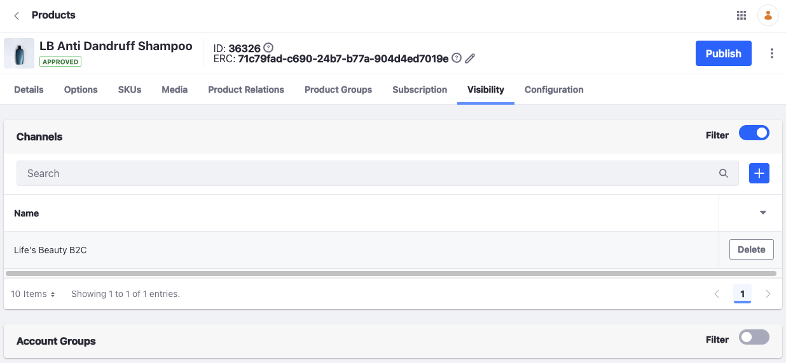

# Configuring Product Visibility Using Channels

When you create a product, it is visible across all channels, but you can limit visibility to specific channels.

Consider a multi-brand scenario where multiple brands share the same products. Here, each site has a different brand experience. 

## Filtering Products By Channel

These instructions assume you have products in your catalog, and two or more channels.

1. Open the _Global Menu_ () and navigate to _Commerce_ &rarr; _Products_.
1. Select a product.
1. Go to the _Visibility_ tab.

    

    You can filter a product by channels and account groups.

1. Activate the toggle for channels.
1. Click _Add_ ().
1. Check the desired channel and click _Add_.
1. Click _Publish_.

The channel is now associated with the product.

## Commerce 2.1 and Below

1. Navigate to the _Control Panel_ &rarr; _Commerce_ &rarr; _Products_.
1. Select a product.
1. Go to the _Visibility_ tab.

    

1. Click _Add_ ().
1. Click on the desired channel.
1. Click _Add_.

The channel is now associated with the product.

### Commerce 2.0 and Below

1. Navigate to _Control Panel_ &rarr; _Commerce_ &rarr; _Products_.
1. Select a product.
1. Click the _Configuration_ sub-tab.
1. Select _Channels_ from the sidebar.
1. Activate the _Enable filter channels_ toggle.
1. Check the boxes for each channel (in this case, the _NA Minium Store_) where the product should be visible.

    

1. Click _Save_.

The product only appears in the selected channels.

## Related Topics

* [Channels](../channels.md)
* [Managing Channels](./managing-channels.md)
