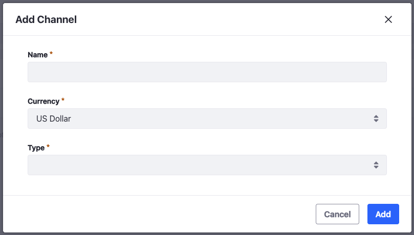
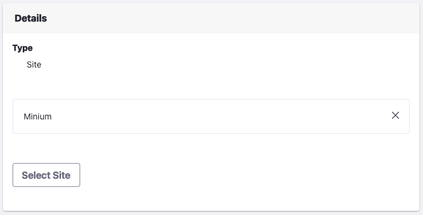

# Managing Channels

To display products and receive orders, a Liferay instance must have at least one channel. Accelerators like Minium already have a channel set up for you.

## Adding a New Channel

1. Open the _Global Menu_ () and navigate to _Commerce_ &rarr; _Channels_.
1. Click _Add_ ().
1. Enter a name and choose a currency for the channel.
1. Choose _Site_ from the _Type_ dropdown.

    

1. Click _Add_.

This creates a new channel. To start using it to sell products, you must link it to a Liferay site. If you want to use the channel for a supplier, you must link it to a [supplier account](../../order-management/suppliers/supplier-account.md).

## Linking a Channel to a Liferay Site

To use a channel to sell products, you must link it to a Liferay site.

1. Open the _Global Menu_ () and navigate to _Commerce_ &rarr; _Channels_.
1. Select the desired channel.
1. Go to _Type_.

    

1. Click _Select Site_.
1. Click _Choose_ next to the desired site.
1. Click _Save_.

You can link a different site to the channel later as long as the site is not linked to another channel. You can also configure products to appear only in this channel. See [Configuring Product Visibility Using Channels](./configuring-product-visibility-using-channels.md) for more information.

## Deleting a Channel

Channels can be deleted, including those created by an site accelerator. Note that when deleting a channel, this does not delete the DXP site. To delete a channel:

1. Open the _Global Menu_ () and navigate to _Commerce_ &rarr; _Channels_.
1. Navigate to the _Control Panel_ &rarr; _Commerce_ &rarr; _Channels_.
1. Click _Actions_() and select _Delete_.

The channel is now deleted.

## Commerce 2.1 and Below

### Adding a New Channel

To add a new Channel, follow these steps:

1. Navigate to the _Control Panel_ &rarr; _Commerce_ &rarr; _Channels_.
1. Click the () button.
1. Enter a name for the new channel.
1. Select a currency to associate with the channel.
1. In the _Type_ field, select _Site_.

    

1. Click _Add_.

You can link a different site to the channel later as long as the site is not linked to another channel. You can also configure products to appear only in this channel. 

### Commerce 2.0 and Below

#### Adding a New Channel

To add a new Channel, follow these steps:

1. Navigate to the _Control Panel_ &rarr; _Commerce_ &rarr; _Channels_.
1. Click the () button.
1. Enter a name for the new channel.
1. In the _Type_ field, select _Site_.
1. Select a site to associate with the channel.
1. Select a currency to associate with the channel.
1. Click _Save_.

    

You can link a different site to the channel later as long as the site is not linked to another channel. You can also configure products to appear only in this channel. 

## Related Topics

* [Channels](../channels.md)
* [Configuring Product Visibility Using Channels](./configuring-product-visibility-using-channels.md)
* [Channels Reference Guide](./channels-reference-guide.md)
