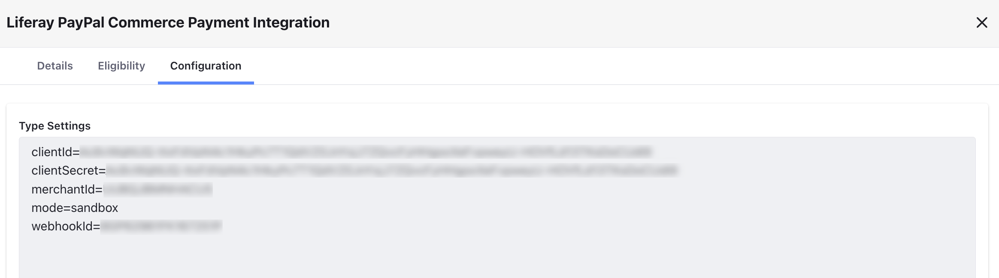
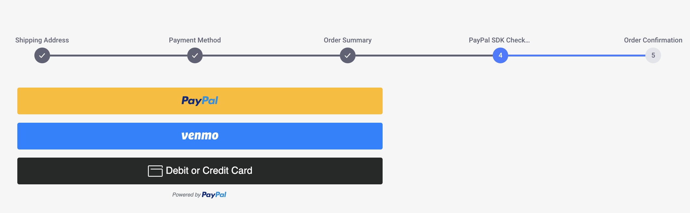

# Liferay Commerce Connector to PayPal SDK

{bdg-secondary}`Liferay DXP 2024.Q4+/Portal 7.4 GA129+`

Liferay now provides a client extension that integrates with the [PayPal JavaScript SDK](https://developer.paypal.com/sdk/js/reference/) to provide more payment options like Google Pay, Apple Pay, Venmo, Pay Later, etc. during checkout. This uses the payment integration client extension as a base.

Liferay also provides PayPal as a payment method out-of-the-box. This redirects the user to PayPal to complete payment whereas the new SDK processes the payment without the user having to navigate away from Liferay. See [Configuring Payment Methods](../configuring-payment-methods.md) to read more about the payment methods available out-of-the-box with Liferay.

!!! note
    Currently, the PayPal SDK client extension is only compatible with Liferay SaaS.

To use this client extension, you must have a merchant ID and also generate a PayPal client ID and client secret. Visit the [PayPal Developer Dashboard](https://developer.paypal.com/developer/applications/create) for more information.

## Install and Deploy the PayPal SDK Client Extension

1. Go to the [Liferay Marketplace](https://marketplace.liferay.com) and search for `Liferay Commerce Connector to PayPal SDK`.

1. Click *Get App*, select your account or create one, and accept the end user license agreement and terms of service.

1. Click *Continue*.

1. Select a project from the ones available to you.

1. Click *Get App*.

1. Note the order ID. You must use it to install the app from your Cloud dashboard.

1. Click *Go to Console*.

1. Go to Services, and click *New App*.

1. Enter the order ID from before and complete the installation.

1. Log in as an administrator and verify that two OAuth Application User Agents and two OAuth Application Headless Servers were added to Liferay. Open the *Global Menu* () and go to *Control Panel* &rarr; *OAuth2 Administration*.

1. Open the *Global Menu* () and navigate to *Commerce* &rarr; *Channels*.

1. Select the channel and scroll down to the Payment Methods section.

1. Click *Liferay PayPal Commerce Payment Integration*.

1. Use the *Active* toggle to activate the payment method and click *Save*. Two new tabs for Eligibility and Configuration appear.

   You can go to the Eligibility tab to select specific order types or payment terms to be eligible for the payment integration. By default, it is eligible for all order types and payment terms.

   The configuration tab contains an input field that accepts key-value pairs that you can find from your [PayPal Developer Dashboard](https://ca-test.adyen.com/).

   

   | Field          | Description                                                               |
   | :------------- | :------------------------------------------------------------------------ |
   | `clientId`     | The Client ID field from your PayPal dashboard.                           |
   | `clientSecret` | The Client Secret field from your PayPal dashboard.                       |
   | `merchantId`   | The Account ID field from your PayPal dashboard.                          |
   | `mode`         | Use `sandbox` or `live` depending on your configuration.                  |
   | `webhookId`    | The ID of the webhook created on your PayPal dashboard. This is optional. |

1. Click *Save*.

   Liferay Commerce Connector to PayPal SDK is now enabled for your store.

1. Open your site and use the account selector to create a new account.

1. Add a few items to your cart.

1. Open the mini cart and click *Submit*. This starts the checkout flow.

1. Choose the *Liferay PayPal Commerce Payment Integration* method in the Payment Method step. If you didn't have other active payment methods, this step appears directly. Use the desired payment option to complete payment.

!!! note
    The above flow uses PayPal's sandbox mode. PayPal provides numerous test card numbers to replicate different payment scenarios. See [Card Testing](https://developer.paypal.com/tools/sandbox/card-testing/) for more information.

1. Open the *Global Menu* () and go to *Commerce* &rarr; *Payments* to verify the payment’s completion.
