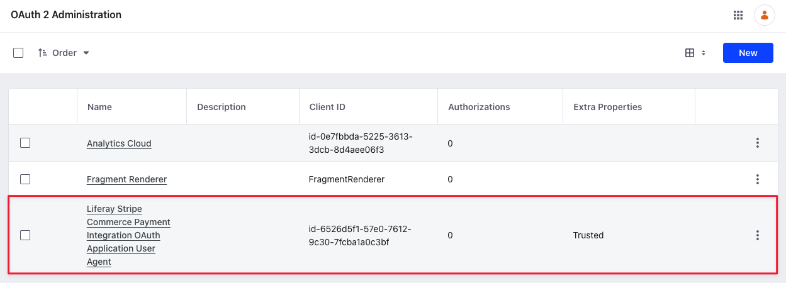
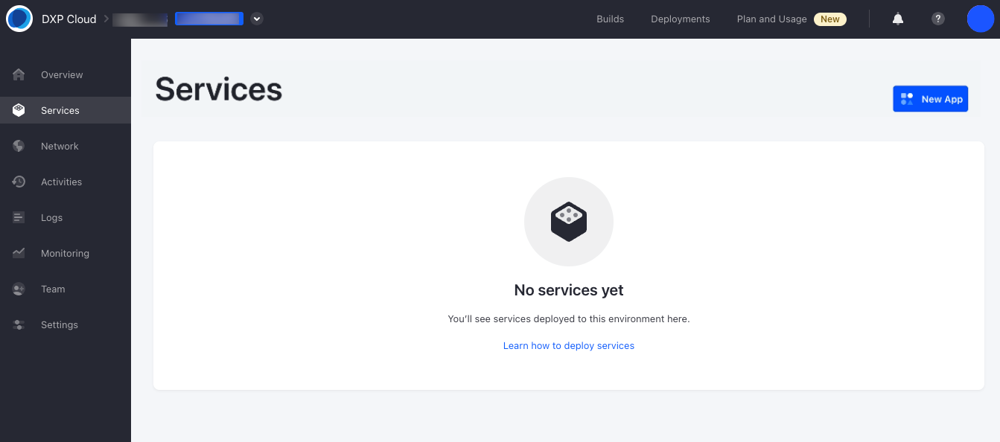
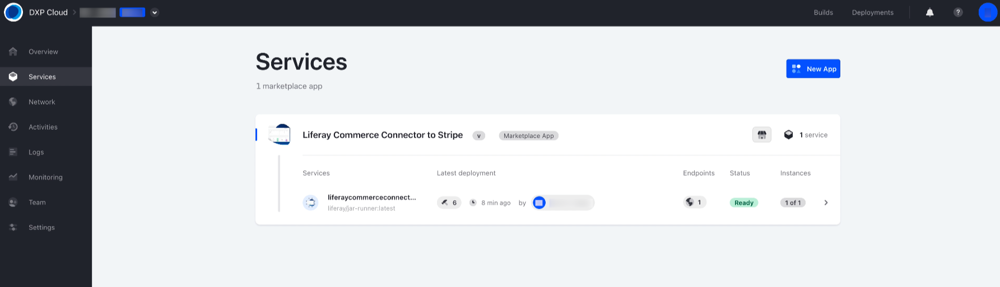
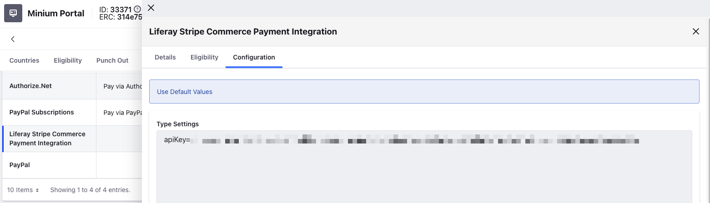
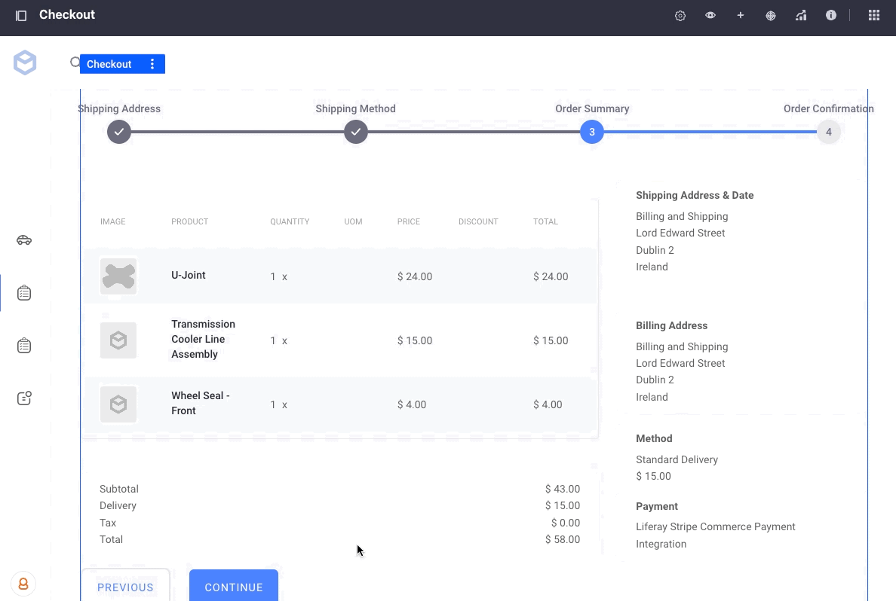

# Stripe

{bdg-secondary}`Liferay DXP 2024.Q2+/Portal 7.4 GA120+`

Liferay provides a client extension that integrates with [Stripe](https://stripe.com). It uses the payment integration client extension as a base. See [Configuring Payment Methods](../configuring-payment-methods.md) to read more about the payment methods available out-of-the-box with Liferay.

!!! note
    Currently, the Stripe client extension is only compatible with Liferay SaaS.

## Install and Deploy the Stripe Client Extension

1. Go to the [Liferay Marketplace](https://marketplace.liferay.com) and search for `Liferay Commerce Connector to Stripe`.

1. Click *Get App*, select your account or create one, and accept the end user license agreement and terms of service.

1. Click *Continue*.

1. Select a project from the ones available to you.

1. Click *Get App*.

1. Note the order ID. You must use it to install the app from your Cloud dashboard.

1. Click *Go to Console*.

   

1. Go to Services, and click *New App*.

   

1. Enter the order ID from before and complete the installation.

   

1. Log in as an administrator and verify that the OAuth Application User Agent was added to Liferay. Open the *Global Menu* () and go to *Control Panel* &rarr; *OAuth2 Administration*.

   

## Verifying the Addition of Stripe as a Payment Method

1. Open the *Global Menu* () and go to *Control Panel* &rarr; *Sites*.

1. Add a new Minium site.

1. Now, open the *Global Menu* () and go to *Commerce* &rarr; *Channels*.

1. Select *Minium Portal* and scroll down to the Payment Methods section. Verify the addition of Stripe as a new payment method here. It is inactive by default.

   

1. Select the new payment integration and activate it using the *Active* toggle.

1. Click *Save*. Two new tabs, *Eligibility* and *Configuration*, appear for the payment integration.

   The configuration tab contains an input field. You must enter an API key that you can obtain from your [Stripe Dashboard](https://dashboard.stripe.com/login).

   

   You can go to the Eligibility tab to select specific order types or payment terms to be eligible for the payment integration. By default, it is eligible for all order types and payment terms.

1. Click *Save*.

1. Open the site and use the account selector to create a new account.

1. Add a few items to your cart.

1. Open the mini cart and click *Submit*. This starts the checkout flow.

1. Continue checking out until you reach the order summary page. Click *Continue* to redirect to Stripe. Enter the necessary details and click *Pay*. After confirming payment, you're automatically redirected back to Liferay. Open the *Global Menu* () and go to *Commerce* &rarr; *Payments* to verify the payment’s completion.

!!! note
    The above flow uses Stripe's test mode. Stripe provides numerous test card numbers to replicate different payment scenarios. See [How to use test cards](https://docs.stripe.com/testing#use-test-cards) for more information.
