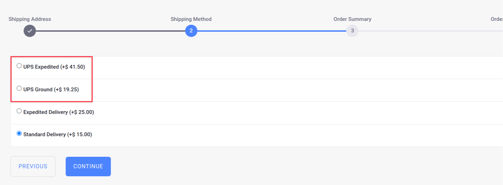

# Using the UPS Shipping Method

{bdg-secondary}`Liferay DXP 2024.Q3+/Portal 7.4 GA132+`

Liferay provides a client extension that integrates with [UPS](https://www.ups.com/). It uses the shipping engine client extension as a base. See [Configuring Shipping Methods](https://learn.liferay.com/w/commerce/store-management/configuring-shipping-methods) to read more about the shipping methods available out-of-the-box with Liferay.

!!! note
    Currently, the UPS client extension is only compatible with Liferay SaaS.

## Install and Deploy the UPS Client Extension

1. Go to the [Liferay Marketplace](https://marketplace.liferay.com/) and search for `Liferay Commerce Connector to UPS`.

1. Click *Get App*, select your account or create one, and accept the end user license agreement and terms of service.

1. Click *Continue*.

1. Select a project from the ones available to you.

1. Click *Get App*.

1. Note the order ID. You must use it to install the app from your Cloud dashboard.

1. Click *Go to Console*.

1. Go to Services, and click *New App*.

1. Enter the order ID from before and complete the installation.

1. Log in as an administrator and verify that the OAuth Application User Agent was added to Liferay. Open the *Global Menu* () and go to *Control Panel* &rarr; *OAuth2 Administration*. Verify the addition of a new entry called Liferay UPS Commerce Shipping Engine OAuth Application User Agent.

## Verifying the Addition of UPS as a Shipping Method

1. Open the *Global Menu* () and go to *Control Panel* &rarr; *Sites*.

1. Add a new Minium site.

1. Now, open the *Global Menu* () and go to *Commerce* → *Channels*.

1. Select *Minium Portal* and scroll down to the Shipping Methods section. Verify the addition of UPS as a new shipping method here. It is inactive by default.

1. Select the new shipping engine and activate it using the *Active* toggle.

1. Click *Save*. A new tab, *Configuration*, appears for the shipping method.

   The configuration tab contains an input field. You must the following few key-value pairs for the shipping method to work correctly.

   ```
   clientId=<CLIENT_ID>
   clientSecret=<CLIENT_SECRET>
   dimensionsUnitOfMeasurementCode=
   packageWeightUnitOfMeasurementCode=
   packagingTypeCode=
   ratingCodes=
   shipperAddressLine1=
   shipperAddressLine2=
   shipperAddressLine3=
   shipperCountryCode=
   shipperPostalCode=
   simpleRateCode=
   ```

   Replace `<CLIENT_ID>` and `<CLIENT_SECRET>` with the appropriate values from your UPS Developer Dashboard. For valid values of other fields, see below:

   * [dimensionsUnitOfMeasurementCode](https://developer.ups.com/api/reference?loc=en_US#operation/Rate!path=RateRequest/Shipment/Package/Dimensions/UnitOfMeasurement&t=request)
   * [packageWeightUnitOfMeasurementCode](https://developer.ups.com/api/reference?loc=en_US#operation/Rate!path=RateRequest/Shipment/Package/DimWeight/UnitOfMeasurement&t=request)
   * [packagingTypeCode](https://developer.ups.com/api/reference?loc=en_US#operation/Rate!path=RateRequest/Shipment/Package/PackagingType/Code&t=request)
   * [ratingCodes](https://developer.ups.com/api/reference?loc=en_US#operation/Rate!path=RateRequest/Shipment/Service/Code&t=request)
   * [simpleRateCode](https://developer.ups.com/api/reference?loc=en_US#operation/Rate!path=RateRequest/Shipment/Package/SimpleRate/Code&t=request)

1. Click *Save*.

1. Open the site and use the account selector to create a new account.

1. Add a few items to your cart.

1. Open the mini cart and click Submit. This starts the checkout flow.



Continue checking out until you reach the shipping method page. You can see the addition of UPS shipping options on this page. Select the method of your choice and continue checking out.

See [Getting Started with UPS APIs](https://developer.ups.com/get-started?loc=en_US) for more information on setting up your UPS Developer account.