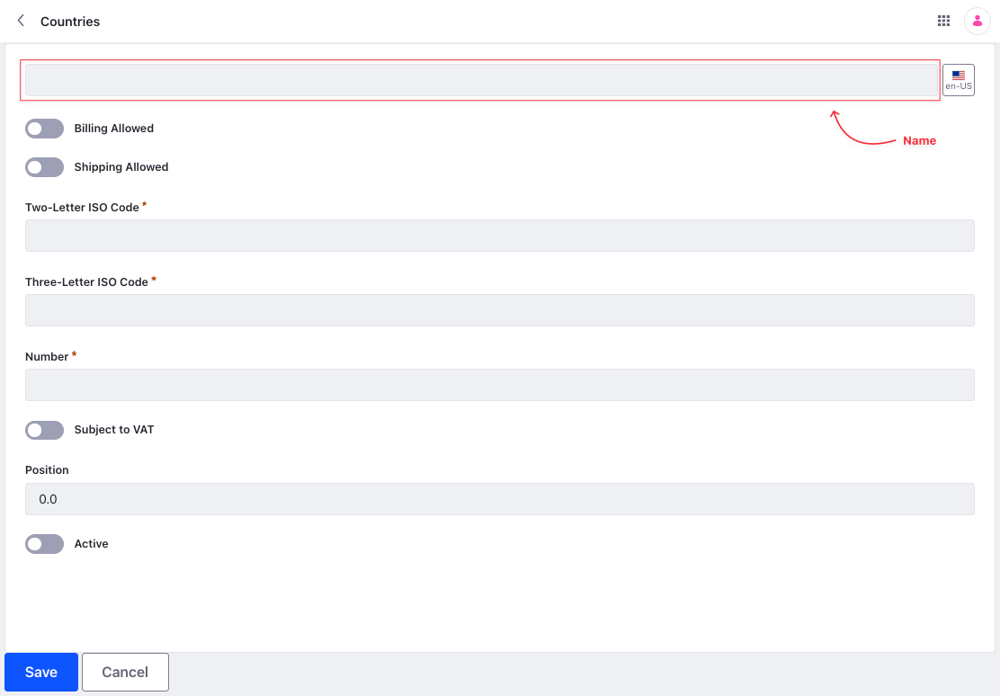
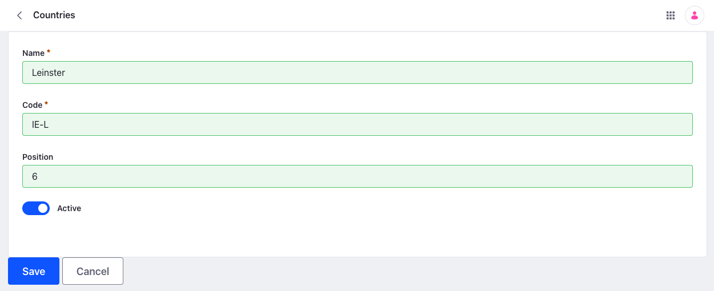
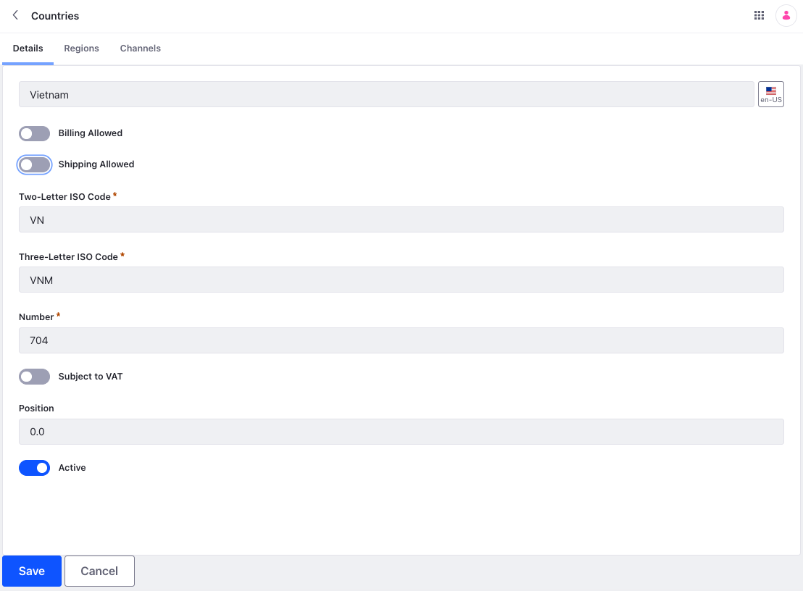

# Countries Configuration Reference

You can create a country in Liferay by opening the *Global Menu* () and navigating to *Control Panel* &rarr; *Commerce* &rarr; *Countries*. Click the *Add* () button to add a country.

| Field                 | Description                                                                                |
| :-------------------- | :----------------------------------------------------------------------------------------- |
| Name                  | Country name                                                                               |
| Billing Allowed       | Toggle to enable/disable the country in the *Country* dropdown of billing address          |
| Shipping Allowed      | Toggle to enable/disable the country in the *Country* dropdown of shipping address         |
| Two-Letter ISO Code   | Two letter ISO code as per [ISO-3166-2](https://www.iso.org/obp/ui/#search/code/) standard |
| Three-Letter ISO Code | Three letter ISO as per [ISO-3166-2](https://www.iso.org/obp/ui/#search/code/) standard    |
| Number                | Numeric code as per [ISO-3166-2](https://www.iso.org/obp/ui/#search/code/) standard        |
| Subject to VAT        | Toggle to determine if the country is subject to VAT                                       |
| Position              | Determines the sort order in the *Country* dropdown                                        |
| Active                | Toggle to enable/disable the country                                                       |

## Filtering Channels

You may want to restrict some countries in some channels. You can do this by selecting the required country and clicking on the *Channels* tab.

1. Activate the *Enable filter channels* toggle.

   

1. Use the checkbox to select the channels for which the country must be unavailable to select during checkout.

1. Click *Save*.

During checkout, you won't see the country in the *Country* dropdown.

## Deactivating a Country for Billing or Shipping

Some stores may need to deactivate a country for shipping or billing purposes.

1. Open the *Global Menu* () and navigate to *Control Panel* &rarr; *Commerce* &rarr; *Countries*.

1. Click the country to be deactivated (Vietnam in this example).

1. Switch the *Billing Allowed* toggle to *No*.

1. Switch the *Shipping Allowed* toggle to *No*.  

    

1. Click *Save*.

Note, billing and shipping have both been disabled. To completely remove a country as an option when entering a shipping address, switch the *Active* toggle to *No*.
