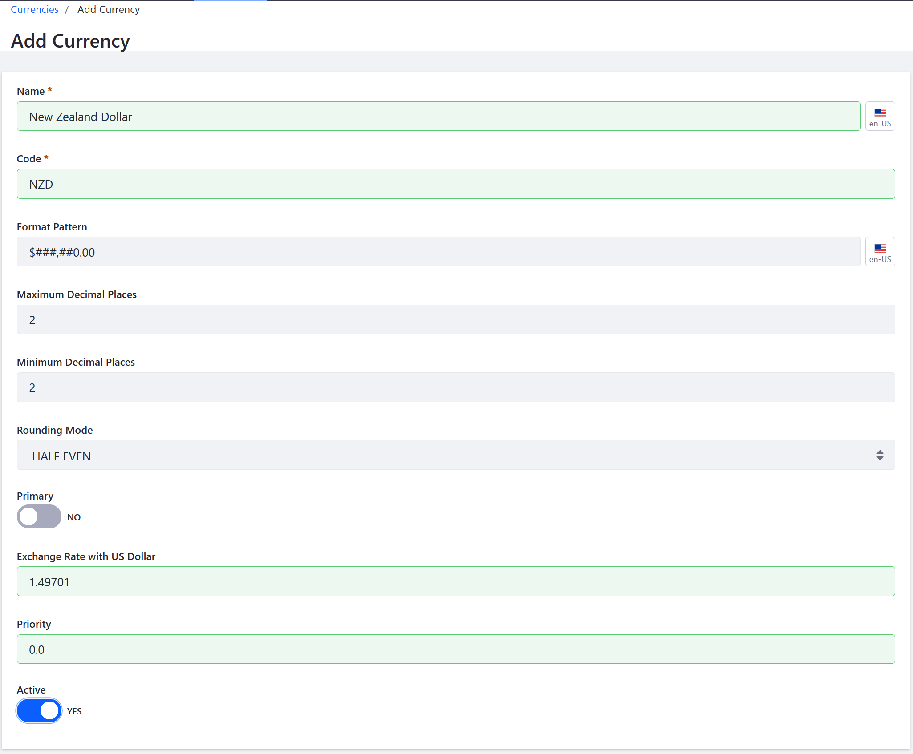

---
toc:
  - ./currencies/understanding-the-currency-hierarchy.md
  - ./currencies/managing-exchange-rates.md
  - ./currencies/currencies-reference.md
uuid: 18c03a6c-efa9-4179-ae0a-65f0322fa512
taxonomy-category-names:
- Commerce
- Storefronts
- Currencies
- Liferay Self-Hosted
- Liferay PaaS
- Liferay SaaS
---

# Currencies

Liferay comes with multiple currencies pre-configured for use. If a desired currency is not already included, you can add a new one. See the [Currencies Reference](./currencies/currencies-reference.md) on how to enter specific values in the correct format.

To add a new currency,

1. Open the _Global Menu_ () and navigate to _Commerce_ &rarr; _Currencies_.

1. Click _New_.

1. Enter the data below:

   * _Name:_ New Zealand Dollar
   * _Code:_ NZD (ISO code)
   * _Format Pattern:_ $###,##0.00
   * _Maximum Decimal places:_ 2
   * _Minimum Decimal places:_ 2
   * _Rounding Mode:_ HALF EVEN
   * _Exchange Rate:_ 1.49701
   * _Priority:_ 11

1. Leave the _Primary_ toggle to _NO_.

   

1. Switch the _Active_ toggle to _Yes_.

1. Click _Save_.

- _Format Pattern_ requires the currency’s sign, the number of digits to come between commas, and the places to display. For example, in the format `$###,##0.00` for US dollars, the places held by `0` are always displayed (as `0` if no other digit is present) while the places held by `#` are only displayed if occupied. A value of `0.01` in the above format would be displayed as $0.01.

- _Rounding Mode_ requires a type of [rounding mode](https://en.wikipedia.org/wiki/Rounding#Directed_rounding_to_an_integer) from the drop-down menu.

- Some payment methods require a specific primary currency to be configured for the store to function. [Mercanet](../store-management/configuring-payment-methods/mercanet.md) requires EUR as the primary currency.
