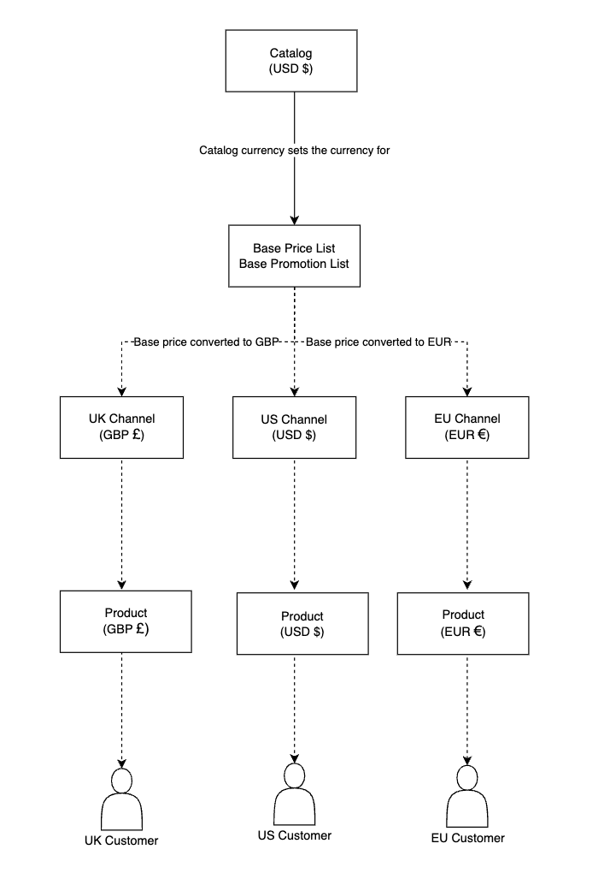

# Understanding the Currency Hierarchy

With Liferay, you can use different currencies across catalogs, price lists, and channels. Each currency has its own role in the currency hierarchy.

The [catalog's](../../product-management/catalogs/creating-a-new-catalog.md) currency sets the initial currency for the base price list that determines each product's base price. You can then use custom [price lists](../../pricing/creating-a-price-list.md) with alternate currencies to override the base price list for specific channels, accounts, and account groups.

When products are added to a [channel](../../store-management/channels/managing-channels.md), their prices are converted to the channel's currency using an [exchange rate provider](./managing-exchange-rates.md). The converted price is then stored in the channel and used for its display and order prices.

For example, consider a US-based business with three channels, one for US customers, one for EU customers, and another for UK customers. The catalog and base price list both use USD, while its channels use different currencies, USD, GBP, and EUR. When the products are available in these channels, Liferay's exchange rate provider automatically converts the base USD prices to the channel's currency.

In this example, the USD prices are converted to EUR and GBP and stored in the EU and UK channels. These stored prices are then used for the channel's connected site. This ensures that European customers and UK customers see the correct prices when browsing the EU or UK channel's site, while US customers accessing the US channel's site, see USD prices. When orders are created, each channel uses its stored prices in the appropriate currency.

!!! note
    You can view available currencies by opening the *Global Menu* () and navigating to *Commerce* &rarr; *Currencies* Here you can edit, prioritize, add/remove, and activate/deactivate currencies. See [Currencies Reference](./currencies-reference.md) and [Adding a New Currency](./adding-a-new-currency.md) for more information.

<!-- Update article once [COMMERCE-5171](https://issues.liferay.com/browse/COMMERCE-5171) is implemented. It removes Catalog Currency and uses the Base Price List currency alone as currency basis. -->

## Related Topics

* [Adding a New Currency](./adding-a-new-currency.md)
* [Managing Exchange Rates](./managing-exchange-rates.md)
* [Currencies Reference](./currencies-reference.md)
