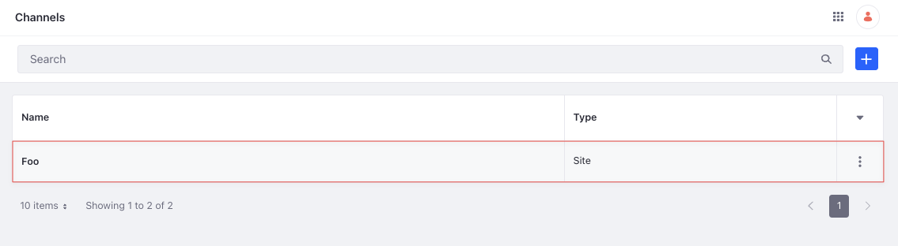

# Channel API Basics

You can manage channels from the Applications menu or with REST APIs. Call the [headless-commerce-admin-channel](http://localhost:8080/o/api?endpoint=http://localhost:8080/o/headless-commerce-admin-channel/v1.0/openapi.json) services to create and manage channels.

## Adding a Channel

```{include} /_snippets/run-liferay-dxp.md
```

Once Liferay is running,

1. Download and unzip [Channel API Basics](./liferay-a2t5.zip).

   ```bash
   curl https://resources.learn.liferay.com/commmerce/latest/en/store-management/developer-guide/liferay-a2t5.zip -O
   ```

   ```bash
   unzip liferay-a2t5.zip
   ```

1. Channels are scoped to an instance, and each channel must specify a `currencyCode`, `name`, and `type`. One type, `site`, is available out-of-the-box.

   Use the cURL script to add a new channel. On the command line, navigate to the `curl` folder. Execute the `Channel_POST_ToInstance.sh` script.

   ```bash
   ./Channel_POST_ToInstance.sh
   ```

   The JSON response shows a new channel was added:

   ```json
   {
      "currencyCode" : "USD",
      "externalReferenceCode" : "29f395e8-779c-e95e-36f6-844a1ebf00c4",
      "id" : 46901,
      "name" : "Foo",
      "siteGroupId" : 0,
      "type" : "site"
   }
   ```

1. To verify the channel addition, open the *Global Menu* () and navigate to *Commerce* &rarr; *Channels*. The new channel appears.

   

1. Alternatively, call the REST service using the Java client. Navigate into the `java` folder and compile the source files:

   ```bash
   javac -classpath .:* *.java
   ```

1. Run the `Channel_POST_ToInstance` class.

   ```bash
   java -classpath .:* Channel_POST_ToInstance
   ```

## Examine the cURL Command

The `Channel_POST_ToInstance.sh` script calls the REST service with a cURL command.

```{literalinclude} ./channel-api-basics/resources/liferay-a2t5.zip/curl/Channel_POST_ToInstance.sh
    :language: bash
```

Here are the command's arguments:

| Arguments                                                                 | Description                                              |
| :------------------------------------------------------------------------ | :------------------------------------------------------- |
| `-H "Content-Type: application/json"`                                     | Set the request body format to JSON.                     |
| `-X POST`                                                                 | Set the HTTP method to invoke at the specified endpoint. |
| `"http://localhost:8080/o/headless-commerce-admin-channel/v1.0/channels"` | Specify the REST service endpoint.                       |
| `-d "{\"currencyCode\": \"USD\", \"name\": \"Foo\", \"type\": \"site\"}"` | Enter the data to post.                                  |
| `-u "test@liferay.com:learn"`                                             | Enter basic authentication credentials.                  |

```{note}
Basic authentication is used here for demonstration purposes. For production, you should authorize users via [OAuth2](https://learn.liferay.com/en/w/dxp/headless-delivery/using-oauth2). See [Using OAuth2 to Authorize Users](https://learn.liferay.com/en/w/dxp/headless-delivery/using-oauth2/using-oauth2-to-authorize-users) for a sample React application using OAuth2.
```

The other cURL commands use similar JSON arguments.

## Examine the Java Class

The `Channel_POST_ToInstance.java` class adds a channel by calling the `ChannelResource` service.

```{literalinclude} ./channel-api-basics/resources/liferay-a2t5.zip/java/Channel_POST_ToInstance.java
   :dedent: 1
   :language: java
   :lines: 9-25
```

This class invokes the REST service using only three lines of code:

| Line (abbreviated)                                                       | Description                                                                 |
| :----------------------------------------------------------------------- | :-------------------------------------------------------------------------- |
| `ChannelResource.Builder builder = ...`                                  | Get a `Builder` for generating a `ChannelResource` service instance.        |
| `ChannelResource channelResource = builder.authentication(...).build();` | Use basic authentication and generate a `ChannelResource` service instance. |
| `channelResource.postChannel(...);`                                      | Call the `channelResource.postChannel` method and pass the data to post.    |

The project includes the `com.liferay.headless.commerce.admin.channel.client.jar` file as a dependency. You can find client JAR dependency information for all REST applications in the API Explorer in your installation at `/o/api` (e.g., <http://localhost:8080/o/api>).

```{note}
The `main` method's comment demonstrates running the class.
```

The remaining example Java classes call different `ChannelResource` methods.

```{important}
See [ChannelResource](https://github.com/liferay/liferay-portal/blob/[$LIFERAY_LEARN_PORTAL_GIT_TAG$]/modules/apps/commerce/headless/headless-commerce/headless-commerce-admin-channel-client/src/main/java/com/liferay/headless/commerce/admin/channel/client/resource/v1_0/ChannelResource.java) for service details.
```

Below are examples of calling other `Channel` REST services using cURL and Java.

## Get Channels from Instance

List all the channels in your Liferay instance with a cURL or Java command.

### Channels_GET_FromInstance.sh

Command:

```bash
./Channels_GET_FromInstance.sh
```

Code:

```{literalinclude} ./channel-api-basics/resources/liferay-a2t5.zip/curl/Channels_GET_FromInstance.sh
   :language: bash
```

### Channels_GET_FromInstance.java

Command:

```bash
java -classpath .:* Channels_GET_FromInstance
```

Code:

```{literalinclude} ./channel-api-basics/resources/liferay-a2t5.zip/java/Channels_GET_FromInstance.java
   :dedent: 1
   :language: java
   :lines: 9-19
```

The instance's `Channel` objects are formatted in JSON.

### Filtering, Paginating, Searching, and Sorting Channels

This API also accepts parameters to filter, paginate, search, and sort the channels. See the [`getChannelsPage`](https://github.com/liferay/liferay-portal/blob/[$LIFERAY_LEARN_PORTAL_GIT_TAG$]/modules/apps/commerce/headless/headless-commerce/headless-commerce-admin-channel-client/src/main/java/com/liferay/headless/commerce/admin/channel/client/resource/v1_0/ChannelResource.java#L43-#L46) method for more information. You can use the following `Channel` fields in your queries to filter, search, and sort the results:

* name
* siteGroupId

| Filter Query             | Description                               |
| :----------------------- | :---------------------------------------- |
| `siteGroupId eq '12345'` | The channel siteGroupId must equal 12345. |
| `name eq 'Foo'`          | The channel name must equal Foo.           |

| Sort Query        | Description                             |
| :---------------- | :-------------------------------------- |
| `name:desc`       | Sort by name in descending order.       |
| `siteGroupId:asc` | Sort by siteGroupId in ascending order. |

Read [API Query Parameters](https://learn.liferay.com/dxp/latest/en/headless-delivery/consuming-apis/api-query-parameters.html) for more information.

## Get a Channel

Get a specific channel with cURL or Java `get` commands. Replace `1234` with the channel's ID.

```{tip}
Use `Channels_GET_FromInstance.[java|sh]` to get a list of all channels, and note the `id` of the channel you want specifically.
```

### Channel_GET_ById.sh

Command:

```bash
./Channel_GET_ById.sh 1234
```

Code:

```{literalinclude} ./channel-api-basics/resources/liferay-a2t5.zip/curl/Channel_GET_ById.sh
   :language: bash
```

### Channel_GET_ById.java

Command:

```bash
java -classpath .:* -DchannelId=1234 Channel_GET_ById
```

Code:

```{literalinclude} ./channel-api-basics/resources/liferay-a2t5.zip/java/Channel_GET_ById.java
   :dedent: 1
   :language: java
   :lines: 8-18
```

The `Channel` fields are listed in JSON.

## Patch a Channel

Update an existing channel with cURL and Java `patch` commands. Replace `1234` with your channel's ID.

### Channel_PATCH_ById.sh

Command:

```bash
./Channel_PATCH_ById.sh 1234
```

Code:

```{literalinclude} ./channel-api-basics/resources/liferay-a2t5.zip/curl/Channel_PATCH_ById.sh
   :language: bash
```

### Channel_PATCH_ById.java

Command:

```bash
java -classpath .:* -DchannelId=1234 Channel_PATCH_ById
```

Code:

```{literalinclude} ./channel-api-basics/resources/liferay-a2t5.zip/java/Channel_PATCH_ById.java
   :dedent: 1
   :language: java
   :lines: 9-23
```

## Delete a Channel

Delete an existing channel with cURL and Java `delete` commands. Replace `1234` with your channel's ID.

### Channel_DELETE_ById.sh

Command:

```bash
./Channel_DELETE_ById.sh 1234
```

Code:

```{literalinclude} ./channel-api-basics/resources/liferay-a2t5.zip/curl/Channel_DELETE_ById.sh
   :language: bash
```

### Channel_DELETE_ById.java

Command

```bash
java -classpath .:* -DchannelId=1234 Channel_DELETE_ById
```

Code:

```{literalinclude} ./channel-api-basics/resources/liferay-a2t5.zip/java/Channel_DELETE_ById.java
   :dedent: 1
   :language: java
   :lines: 8-17
```

The [API Explorer](https://learn.liferay.com/dxp/latest/en/headless-delivery/consuming-apis/consuming-rest-services.html) shows the `Channel` services and schemas and has an interface to test each service.
