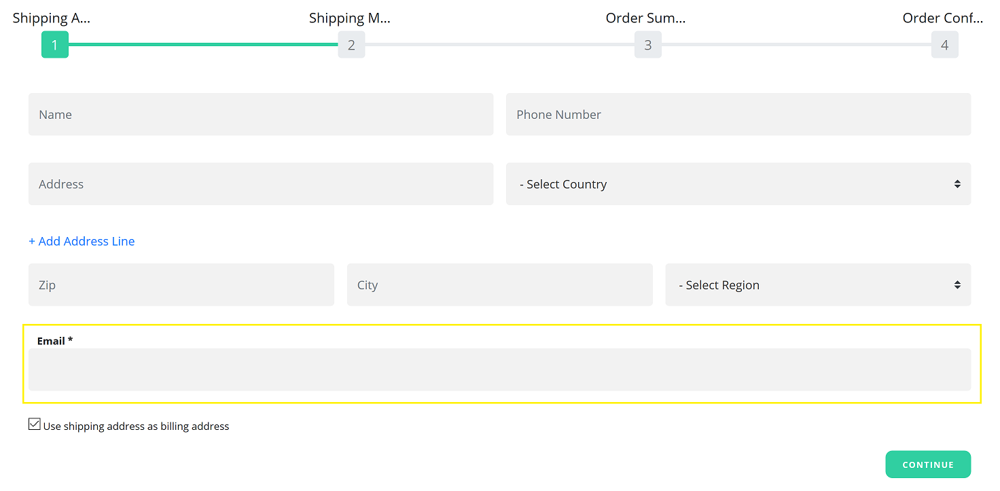
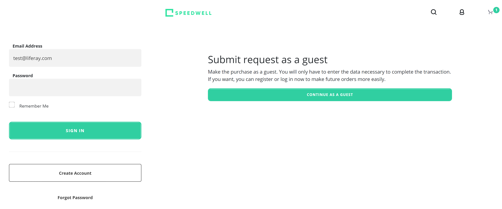
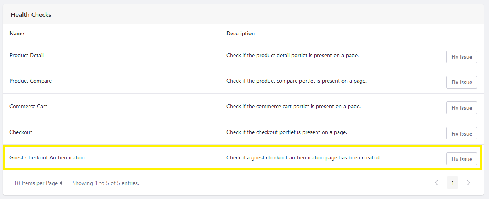

# Enabling Guest Checkout

You can enable guest checkout on a per-[channel](./channels.md) basis. 

1. Open the _Global Menu_ () and navigate to _Commerce_ &rarr; _Channels_.

1. Select the channel linked to your site.

1. Under Orders, enable _Guest Checkout_ toggle.

1. Click _Save_.

Guest customers can now add items to the cart and proceed to checkout without logging in. After clicking _Submit_, they can enter an email address during the checkout process.

## Adding the Continuing as Guest Option

For customers to continue their checkout process as guest users, you can create a separate authentication page where they have several checkout options.

- Customers can sign in if they have an account. They can view all their account information, including past orders.
- Customers can create a new account if they are new to your site.
- Customers can continue as guests, entering only the data necessary to complete the transaction. They can register later or log in to order faster.

To generate this authentication page,

1. Open the _Global Menu_ () and navigate to _Commerce_ &rarr; _Channels_.

1. Select the channel linked to your site.

1. On the General tab's Health Checks section, click _Fix Issue_ next to Guest Checkout Authentication. This creates a new authentication page with an option to sign in or continue as a guest.

   

1. Click _Save_.

If this authentication page doesn't exist, guests are redirected to the page with the _Checkout_ widget.

## Commerce 2.1 and Below

To enable Guest Checkout,

1. Navigate to the _Control Panel_ &rarr; _Commerce_ &rarr; _Channels_.

1. Click on the desired channel.

1. On the _General_ tab's _Orders_ section, slide the _Guest Checkout_ toggle to Enabled.

1. Click _Save_.

Guest customers can now add items to the cart and proceed to checkout without logging in. After clicking _Submit_, there's an option to enter their email address during the checkout process.

## Related Topics

* [Guest Checkout Overview](./guest-checkout-overview.md)
* [Channels](../../store-management/channels.md)
* [Managing Channels](../../store-management/channels/managing-channels.md)
* [Channels Reference Guide](../../store-management/channels/channels-reference-guide.md)
