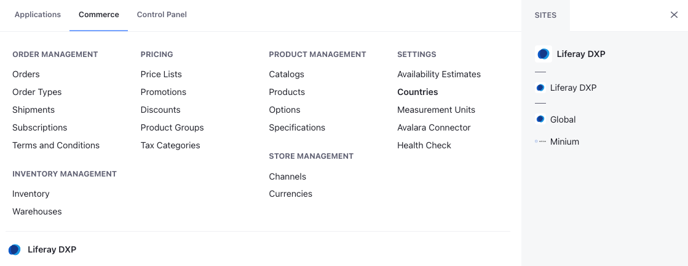

# Liferay Commerce Configuration Overview

You can find options to configure Commerce from the Global Menu.

Open the *Global Menu* () and go to the *Commerce* tab. This tab includes the following applications.

## Order Management

* [Orders](../order-management/orders/orders-menu-reference-guide.md)
* [Order Types](../order-management/order-types.md)
* [Shipments](../order-management/shipments/introduction-to-shipments.md)
* [Subscriptions](../order-management/subscriptions/managing-subscriptions.md)
* [Terms and Conditions](../order-management/terms-and-conditions.md)

## Inventory Management

* [Inventory](../inventory-management.md)
* [Warehouses](../inventory-management/warehouse-reference-guide.md)

## Pricing

* [Price Lists](../pricing/creating-a-price-list.md)
* [Promotions](../pricing/promoting-products/introduction-to-promotions.md)
* [Discounts](../pricing/promoting-products/introduction-to-discounts.md)
* [Product Groups](../pricing/promoting-products/introduction-to-product-groups.md)
* [Tax Categories](../pricing/configuring-taxes.md)

## Product Management

* [Catalogs](../product-management/catalogs/creating-a-new-catalog.md)
* [Products](../product-management/creating-and-managing-products/products/products-overview.md)
* [Options](../product-management/creating-and-managing-products/products/using-product-options.md)
* [Specifications](../product-management/creating-and-managing-products/products/specifications.md)

## Store Management

* [Channels](./channels/managing-channels.md)
* [Currencies](./currencies/adding-a-new-currency.md)

## Settings

* [Availability Estimates](../inventory-management/availability-estimates.md)
* [Countries](./countries-configuration-reference.md)
* [Measurement Units](./configuring-shipping-methods/measurement-units.md)

## Liferay Commerce 2.1 and Below

Liferay Commerce 2.1 configurations are divided into several locations in the Liferay *Product Menu*. The Commerce *Control Panel* drop down contains configurations and settings that apply *globally* to the Liferay Commerce installation. The Commerce *Site Menu* drop down contains configurations and settings that are scoped to a specific store site.

### Commerce Control Panel

Navigate to *Control Panel* &rarr; *Commerce*. Making changes to any of the following configurations applies across all sites.

* [Channels](./channels/managing-channels.md)
* [Price Lists](../pricing/creating-a-price-list.md)
* [Orders](../order-management/orders/orders-menu-reference-guide.md)

The Commerce Global Settings menu contains the following tabs:

* [Availability Estimates](../inventory-management/availability-estimates.md)
* [Countries](./countries-configuration-reference.md)
* [Currencies](./currencies/adding-a-new-currency.md)
* Default Images
* [Measurement Units](./configuring-shipping-methods/measurement-units.md)
* Health Check
* [Warehouses](../inventory-management/warehouse-reference-guide.md)

### Commerce Site Settings

{bdg-secondary}`Commerce 2.0 and below`

The following configurations are scoped to the selected store site. Changes here are not applied to other stores hosted on the same Liferay Commerce instance.

Navigate to the *Control Panel* &rarr; *Store Site* &rarr; *Commerce*.

The following site settings are found here:

* [Notifications](./sending-emails/using-notification-templates.md)
* [Introduction to Order Workflows](../order-management/order-workflows/introduction-to-order-workflows.md)
* [Payment Methods](./configuring-payment-methods.md)
* [Product Display Pages](../creating-store-content/creating-product-display-pages.md)
* [Shipping Methods](./configuring-shipping-methods/shipping-method-reference.md)
* [Site Types](../starting-a-store/sites-and-site-types.md)
