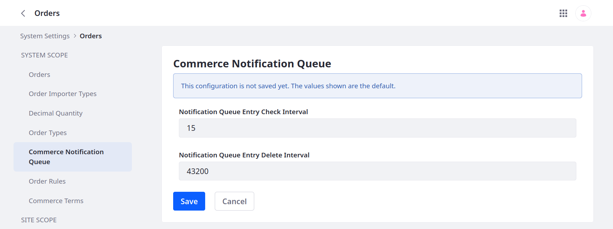

# Configuring the Commerce Notification Queue

When channel events trigger notifications, Commerce logs them in the channel's Notification Queue tab with the `Unsent` status. By default, Liferay checks for queued notifications every 15 minutes and sends them if they have the `Unsent` status. However, if a notification has the `Unsent` status after 43200 minutes (30 days), Liferay deletes it.

You can change the interval for sending and removing queued notifications.

1. Open the *Global Menu* () and navigate to *Control Panel* &rarr; *System Settings*.

1. Click *Orders* and then select *Commerce Notification Queue*.

1. Enter new values for the *Notification Queue Entry Check Interval* and *Notification Queue Entry Delete Interval* fields. Values are set in minutes (e.g., 15 = 15 mins).

   

1. Click *Save*.

!!! warning
    If you require this feature to be disabled, [blacklist](https://learn.liferay.com/web/guest/w/dxp/system-administration/installing-and-managing-apps/managing-apps/blacklisting-osgi-components.md) the component. Do not enter zero or a negative number for the interval.

## Related Topics

* [Using Notification Templates](./using-notification-templates.md)
