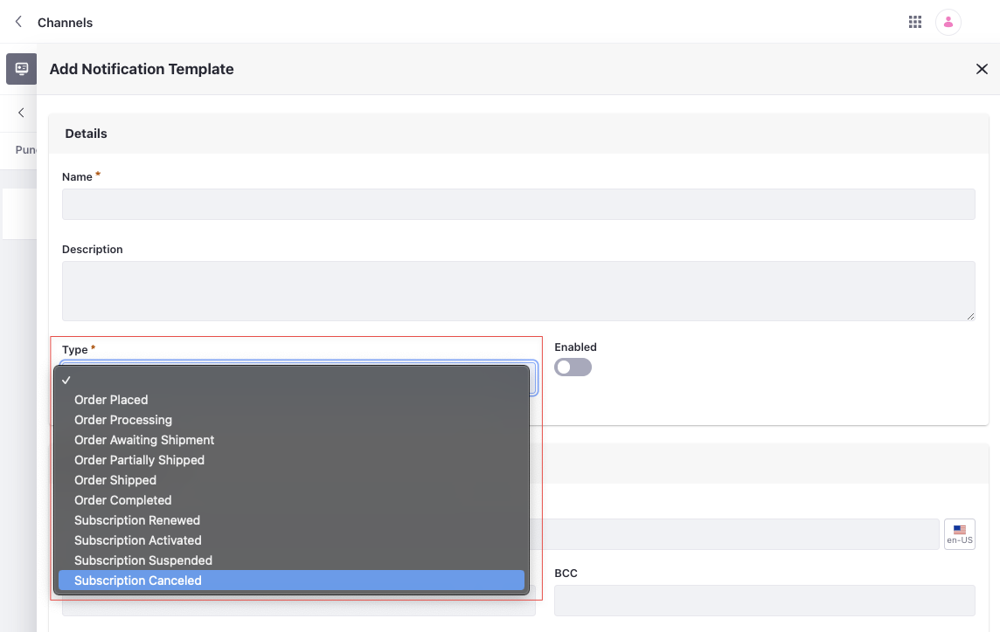
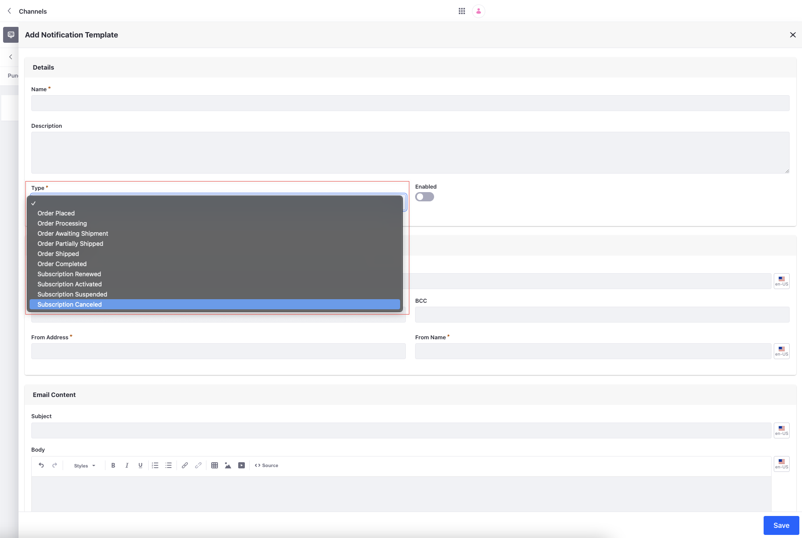
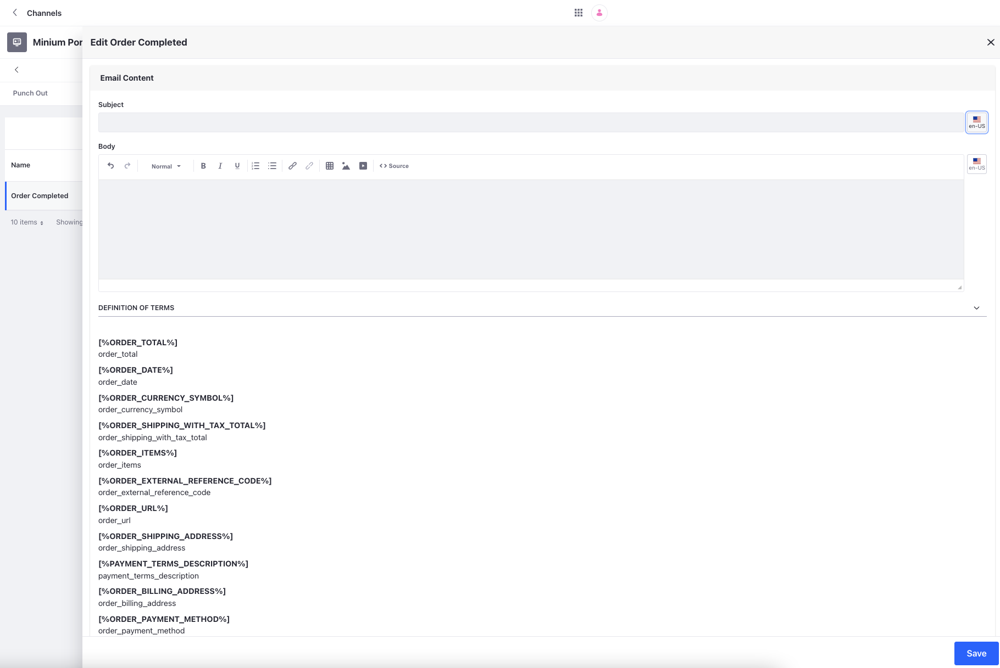

# Notification Template Variables Reference Guide

When creating notification templates, you can use variables to populate email fields dynamically with data from the triggering event.

## Notification Template Variables (Object Action)

For notification templates assigned as an object action to the Commerce Order object, you can use the following variables.

| Variable                                         | Description                                                                                 |
| :----------------------------------------------- | :------------------------------------------------------------------------------------------ |
| [%COMMERCEORDER_ACCOUNTID%]                      | Account ID                                                                                  |
| [%COMMERCEORDER_CHANNELID%]                      | Channel ID                                                                                  |
| [%COMMERCEORDER_CREATEDATE%]                     | Date when the order was created                                                             |
| [%COMMERCEORDER_AUTHOR_EMAIL_ADDRESS%]           | Email address of the user who created the order                                             |
| [%COMMERCEORDER_AUTHOR_SUFFIX%]                  | Suffix of the user who created the order                                                    |
| [%COMMERCEORDER_AUTHOR_PREFIX%]                  | Prefix of the user who created the order                                                    |
| [%COMMERCEORDER_AUTHOR_FIRST_NAME%]              | First name of the user who created the order                                                |
| [%COMMERCEORDER_AUTHOR_LAST_NAME%]               | Last name of the user who created the order                                                 |
| [%COMMERCEORDER_AUTHOR_MIDDLE_NAME%]             | Middle name of the user who created the order                                               |
| [%COMMERCEORDER_AUTHOR_ID%]                      | ID of the user who created the order                                                        |
| [%COMMERCEORDER_CURRENCYCODE%]                   | Currency code of the order (Example: USD, EUR)                                              |
| [%COMMERCEORDER_EXTERNALREFERENCECODE%]          | Order’s external reference code                                                             |
| [%COMMERCEORDER_ID%]                             | Order ID                                                                                    |
| [%COMMERCEORDER_MODIFIEDDATE%]                   | Modified Date                                                                               |
| [%COMMERCEORDER_ORDERDATE%]                      | Date when the order was placed                                                              |
| [%COMMERCEORDER_ORDERSTATUS%]                    | Order's status                                                                              |
| [%COMMERCEORDER_ORDERTYPEEXTERNALREFERENCECODE%] | External reference code of the order type.                                                  |
| [%COMMERCEORDER_ORDERTYPEID%]                    | Order type ID                                                                               |
| [%COMMERCEORDER_SHIPPINGAMOUNT%]                 | Order’s total shipping cost excluding tax                                                   |
| [%COMMERCEORDER_SHIPPINGAMOUNTFORMATTED%]        | Formatted shipping cost                                                                     |
| [%COMMERCEORDER_STATUS%]                         | Order's workflow status                                                                     |
| [%COMMERCEORDER_TAXAMOUNT%]                      | Total tax for the order                                                                     |
| [%COMMERCEORDER_TAXAMOUNTFORMATTED%]             | Formatted tax amount                                                                        |
| [%COMMERCEORDER_TOTAL%]                          | Order’s total excluding tax                                                                 |
| [%COMMERCEORDER_TOTALFORMATTED%]                 | Formatted total amount                                                                      |
| [%COMMERCEORDER_BILLING_ADDRESS_PHONE_NUMBER%]   | Billing address phone number                                                                |
| [%COMMERCEORDER_BILLING_ADDRESS_ZIP%]            | Billing address zip                                                                         |
| [%COMMERCEORDER_BILLING_ADDRESS_REGION%]         | Billing address region                                                                      |
| [%COMMERCEORDER_BILLING_ADDRESS_CITY%]           | Billing address city                                                                        |
| [%COMMERCEORDER_BILLING_ADDRESS_COUNTRY%]        | Billing address country                                                                     |
| [%COMMERCEORDER_BILLING_ADDRESS_STREET2%]        | Billing address street 2                                                                    |
| [%COMMERCEORDER_BILLING_ADDRESS_STREET1%]        | Billing address street 1                                                                    |
| [%COMMERCEORDER_BILLING_ADDRESS_NAME%]           | Billing address name                                                                        |
| [%COMMERCEORDER_BILLING_ADDRESS_STREET3%]        | Billing address street 3                                                                    |
| [%SALES_AGENT%]                                  | Sales Agent associated with the account                                                     |

The following variables are only available in Liferay DXP 2024.Q3+/Portal 7.4 GA132+.

| Variable                                        | Description                         |
| :---------------------------------------------- | :---------------------------------- |
| [%COMMERCEORDER_ACCOUNT_NAME%]                  | Account name                        |
| [%COMMERCEORDER_SHIPPING_ADDRESS_PHONE_NUMBER%] | Shipping address phone number       |
| [%COMMERCEORDER_SHIPPING_ADDRESS_COUNTRY%]      | Shipping address country            |
| [%COMMERCEORDER_SHIPPING_ADDRESS_CITY%]         | Shipping address city               |
| [%COMMERCEORDER_SHIPPING_ADDRESS_ZIP%]          | Shipping address zip                |
| [%COMMERCEORDER_SHIPPING_ADDRESS_STREET3%]      | Shipping address street 3           |
| [%COMMERCEORDER_SHIPPING_ADDRESS_NAME%]         | Shipping address name               |
| [%COMMERCEORDER_SHIPPING_ADDRESS_STREET2%]      | Shipping address street 2           |
| [%COMMERCEORDER_SHIPPING_ADDRESS_REGION%]       | Shipping address region             |
| [%COMMERCEORDER_SHIPPING_ADDRESS_STREET1%]      | Shipping address street 1           |
| [%COMMERCEORDER_ORDER_ITEMS%]                   | A table listing all the order items |

!!! important
    These new variables are behind a release feature flag. Read [Release Feature Flags](https://learn.liferay.com/web/guest/w/dxp/system-administration/configuring-liferay/feature-flags#release-feature-flags) for more information.

## Notification Template Variables (Channel)

For notification templates created under a channel, select a notification template *Type* to view its variables. This determines which channel events trigger the notification.

After selecting a type, you can view its variables and their descriptions by expanding *Definition of Terms* in the *Email Settings* and *Email Content* sections. Examples include the customer's name, order ID, shipping and billing addresses, list of order items, and more.

### Email Settings

| Variable                       | Description                                                                                                                                      |
| :----------------------------- | :----------------------------------------------------------------------------------------------------------------------------------------------- |
| [%ACCOUNT_ROLE_ORDER_MANAGER%] | Order manager(s) for the account that placed the order                                                                                           |
| [%ORDER_CREATOR%]              | User who created the order                                                                                                                      |
| [%ACCOUNT_ROLE_ADMINISTRATOR%] | Account administrator(s) for the account that placed the order                                                                                   |
| [%USER_GROUP_NAME%]            | Name of a user group. Replace `NAME` with the user group name (e.g., for user group Sales Consultants, enter `[%USER_GROUP_Sales Consultants%]`) |

### Order Based Notification Template Types

Channels have six types of notification templates for order events:

1. Order Placed

1. Order Processing

1. Order Awaiting Shipment

1. Order Partially Shipped

1. Order Shipped

1. Order Completed

| Variable                          | Description                                    |
| :-------------------------------- | :--------------------------------------------- |
| [%ORDER_ITEMS%]                   | A table listing all items in the order         |
| [%ORDER_SHIPPING_ADDRESS%]        | Order's shipping address                       |
| [%ORDER_BILLING_ADDRESS%]         | Order's billing address                        |
| [%ORDER_ID%]                      | Order ID                                       |
| [%ORDER_TOTAL%]                   | Order's total excluding tax                    |
| [%ORDER_DATE%]                    | Date when the order was placed                 |
| [%ORDER_CURRENCY_SYMBOL%]         | Currency symbol of the order (Example: $, £)   |
| [%ORDER_SHIPPING_WITH_TAX_TOTAL%] | Order's total shipping cost including tax      |
| [%ORDER_EXTERNAL_REFERENCE_CODE%] | Order's external reference code                |
| [%ORDER_URL%]                     | Order's URL                                    |
| [%PAYMENT_TERMS_DESCRIPTION%]     | Payment terms attached to the order            |
| [%ORDER_PAYMENT_METHOD%]          | Order's payment method                         |
| [%ORDER_TAX_TOTAL%]               | Total tax for the order                        |
| [%ORDER_WITH_TAX_TOTAL%]          | Total amount for the order including tax       |
| [%ORDER_CREATOR_USER_FIRST_NAME%] | First name of the user who created the order  |
| [%ORDER_SHIPPING_OPTION%]         | Order's shipping option                        |
| [%ORDER_CREATOR_USER_LAST_NAME%]  | Last name of the user who created the order   |
| [%DELIVERY_TERMS_DESCRIPTION%]    | Delivery terms attached to the order           |
| [%ORDER_CREATOR%]                 | User who created the order                    |
| [%ORDER_CURRENCY_CODE%]           | Currency code of the order (Example: USD, GBP) |
| [%ORDER_CREATOR_USER_TITLE%]      | Title of the user who created the order       |
| [%ORDER_SHIPPING_TOTAL%]          | Order's total shipping cost excluding tax      |

### Subscription Based Notification Template Types

Channels have four types of notification templates for subscription events:

1. Subscription Renewed

1. Subscription Activated

1. Subscription Suspended

1. Subscription Canceled

| Variable          | Description                 |
| :---------------- | :-------------------------- |
| [%PRODUCT_NAME%]  | Product Name                |
| [%ORDER_CREATOR%] | User who created the order |
| [%ORDER_ID%]      | Order ID                    |

## Related Topics

* [Using Notification Templates](./using-notification-templates.md)
