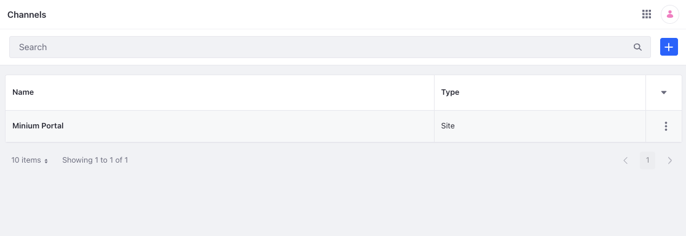
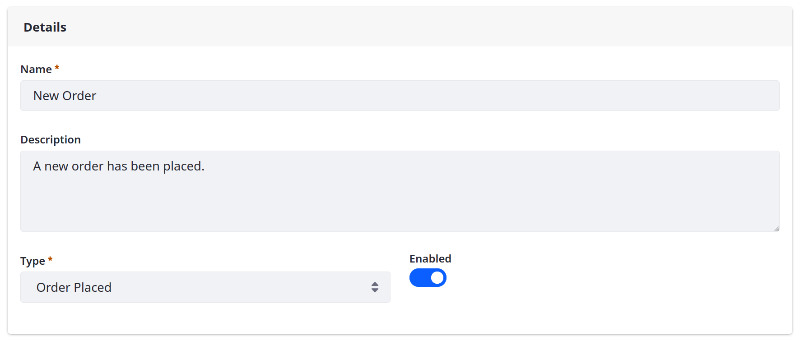
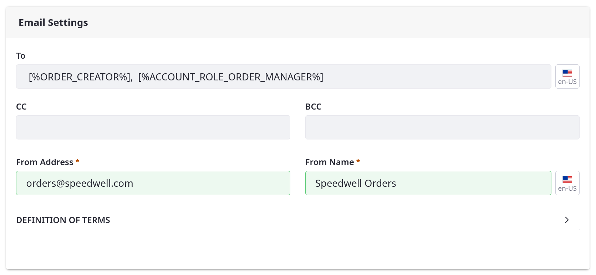
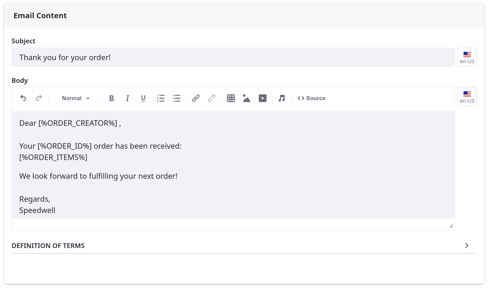

# Using Notification Templates

Email notifications are sent automatically to users based on events in the store. To send them, you must first create a *Notification Template*. Notification templates define the sender, trigger, and content of an email notification.

!!! note
    To use notifications in Commerce, first configure mail settings for your Liferay system. See [Configuring Mail](https://learn.liferay.com/w/dxp/installation-and-upgrades/setting-up-liferay/configuring-mail) for more information.

## Event Triggers

Every notification template has a type that determines the channel event that triggers the notification. Commerce includes the following event triggers for notification templates.

| Notification Type       | Event                                                               |
| :---------------------- | :------------------------------------------------------------------ |
| Order Placed            | An order is placed in the channel.                                  |
| Order Processing        | The order is in process.                                            |
| Order Awaiting Shipment | The order is ready for shipping.                                    |
| Order Partially Shipped | Order items are shipped separately.                                 |
| Order Shipped           | The order has shipped.                                              |
| Order Completed         | The order has been delivered and marked as complete.                |
| Subscription Renewed    | A subscription is renewed.                                          |
| Subscription Activated  | A subscription is activated.                                        |
| Subscription Suspended  | A subscription is suspended, pending review or action by the store. |
| Subscription Canceled   | A subscription is cancelled.                                        |

## Creating a Notification Template

1. Open the *Global Menu* () and navigate to *Control Panel* &rarr; *Commerce* &rarr; *Channels*.

1. Select a *channel* and go to the *Notification Templates* tab.

   

1. Click *Add* ().

1. Enter a *name* and *description* for the template.

1. Select an event type to determine which channel events trigger the notification. Each template can only have one trigger.

1. Toggle the switch to enable the template.

   

1. Under Email Settings, enter the *sender* and *recipients* for the notification.

   You can use template variables to populate these fields automatically using data from the triggering event. See [Notification Template Variables Reference Guide](./notification-template-variables-reference-guide.md) for more information. If required, you can also specify the actual email addresses to send the notification to.

   

1. In the Email Content section, enter a *subject* and *body* for the email.

   You can use template variables to populate these fields automatically using data from the triggering event. See [Notification Template Variables Reference Guide](./notification-template-variables-reference-guide.md) for more information.

   

1. Click *Save*.

While enabled, the notification template automatically sends emails when triggered. The Notification Queue tab displays all triggered notifications with its sender, recipients, event type, status, and priority.

## Viewing Email Notifications of an Order

Email notifications related to an order are tracked. To view them, open the *Global Menu* () and navigate to *Control Panel* &rarr; *Commerce* &rarr; *Orders*. Select an order and click the *Emails* tab. See [Order Information](../../order-management/orders/order-information.md) to learn more.

## Commerce 2.0 and Below

To create email notifications in Commerce 2.0 and below:

1. Navigate to *Site Administration* &rarr; *Commerce* &rarr; *Settings*.

    

1. Click the *Notifications* tab.

1. Click the *Notification Templates* sub-tab.

1. Click *Add* () to create a new Notification Template and enter the following information.

   * **Name**: New Orders
   * **Description**: New orders template
   * **Account Groups**: (leave blank or designate an **optional** account group)
   * **From Address**: Your store's email address (for example: *orders@yourstore.com*)
   * **From Name**: Name of the store or a customer service representative
   * **Type**: Order Placed
   * **Enabled**: Switch the toggle to *YES*
   * **Subject**: Email subject (for example: *Your order has been received.*)
   * **Body**: You can use variables such as `[%ORDER_CREATOR%]` and `[%ORDER_ID%]` to represent a customer's name and order ID respectively. See the [Notification Template Variables Reference Guide](./notification-template-variables-reference-guide.md) to learn more.

   

1. Click *Save*.

The notification template now sends an automated email upon receiving an order. When you create a template, a new notification is added to the notification queue whenever an order is placed. To view this, you can check the *Notifications Queue* sub-tab after placing an order. By default, the Liferay instance checks the queue every 15 minutes to send any unsent notifications. To learn how to change the interval, see [Configuring the Commerce Notification Queue](./configuring-the-commerce-notification-queue.md).

## Related Topics

* [Notification Template Variables Reference Guide](./notification-template-variables-reference-guide.md)
* [Configuring the Commerce Notification Queue](./configuring-the-commerce-notification-queue.md)
