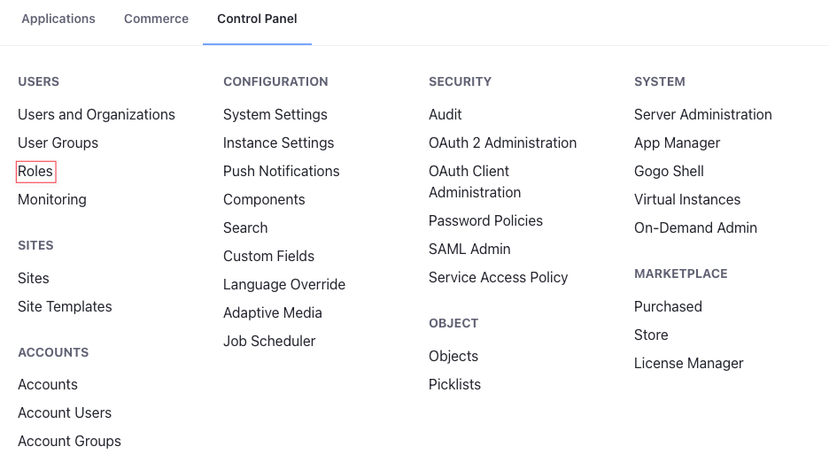
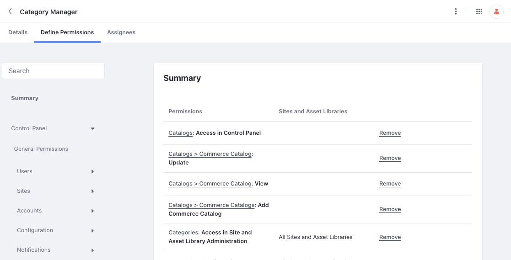

# Commerce Roles Reference

Liferay includes four roles [out-of-the-box](#out-of-the-box-roles) for Commerce: account administrator, account member, buyer, and order manager. You can modify these roles or create additional account roles to better suit your use case. Some [common custom roles](#custom-roles) include catalog manager, inventory manager, shipment manager, instance order manager, and discount manager.

```{note}
The sales agent role is available out-of-the-box for Liferay 7.3.x and earlier Commerce versions. It is available in Liferay DXP 7.4 and above through the Minium and Speedwell accelerators only. 
```

## Viewing Permissions

Follow these steps to view and manage permissions associated with a Commerce role:

1. Open the *Global Menu* () and navigate to *Control Panel* &rarr; *Users* &rarr; *Roles*.

   

1. Click the Account Roles tab and select a role:

   * Account Administrator
   * Account Member
   * Buyer
   * Order Manager

   ```{note}
   In Liferay 7.3 and earlier versions, the account administrator is a site role, and the account member role is not a default role. 
   ```

1. Click the *Define Permissions* tab.

   From here, you can view a summary of all application and resource permissions assigned to the role.

   You can also remove or add permissions.

   

## Out-of-the-Box Roles

The following roles are available out-of-the-box with your DXP instance. They are included with default DXP roles, and you can modify them if needed. See [Defining Role Permissions](https://learn.liferay.com/w/dxp/users-and-permissions/roles-and-permissions/defining-role-permissions) for more information.

### Account Administrator

> Account Role

Account administrators are account super users. They can approve or reject orders when there is a [buyer order approval](../../order-management/order-workflows/enabling-or-disabling-order-workflows.md#enabling-workflow) workflow enabled and oversee the order managers and buyers of their account. They can modify their account, invite or add users to it, and assign roles to other account members. Account administrators cannot create or delete accounts. This permission is reserved for instance administrators.

The accounts permissions define how account administrators can modify accounts in a B2B setting, while the open carts permissions define how administrators can modify orders regardless of the store type.

| Permissions                                                          | Description                                                                                                |
| :------------------------------------------------------------------- | :--------------------------------------------------------------------------------------------------------- |
| Accounts > Account: Add Account Entry                                | Ability to add account entries                                                                             |
| Accounts > Account Entry: Manage Users                               | Ability to manage account users                                                                            |
| Accounts > Account Entry: Update                                     | Ability to modify account entries                                                                          |
| Accounts > Account Entry: View                                       | Ability to view an account                                                                                 |
| Accounts > Account Entry: View Users                                 | Ability to view account users                                                                              |
| Accounts > Commerce Account: Manage Addresses                        | Ability to add a new billing, a shipping, or a combined address to an account                              |
| Accounts > Commerce Account: Manage Members                          | Ability to invite users and organizations to an account; also ability to edit their details                |
| Accounts > Commerce Account: Update                                  | Ability to modify an account                                                                               |
| Accounts > Commerce Account: View                                    | Ability to view an account                                                                                 |
| Accounts > Commerce Account: View Addresses                          | Ability to view all addresses associated with an account                                                   |
| Accounts > Commerce Account: View Members                            | Ability to view all members in an account                                                                  |
| Open Carts > Commerce Order: Add Order                               | Ability to add an order to a buyer's account                                                               |
| Open Carts > Commerce Order: Approve Open Orders                     | Ability to approve orders when workflow is enabled                                                         |
| Open Carts > Commerce Order: Check Out Open Orders                   | Ability to complete the checkout process for orders                                                        |
| Open Carts > Commerce Order: Delete Orders                           | Ability to delete orders                                                                                   |
| Open Carts > Commerce Order: Manage Orders                           | Ability to change order details, such as mailing and billing addresses; ability to add a note to the order |
| Open Carts > Commerce Order: View Open Orders                        | Ability to view all open orders                                                                            |
| Open Carts > Commerce Order: View Orders                             | Ability to view orders regardless of status                                                                |
| Open Carts > Commerce Orders: Manage Commerce Order Payment Methods  | Ability to manage payment methods of an order                                                              |
| Open Carts > Commerce Orders: Manage Commerce Order Shipping Options | Ability to manage shipping options of an order                                                             |
| Open Carts > Commerce Orders: Manage Order Delivery Terms            | Ability to manage the delivery terms of an order                                                           |
| Open Carts > Commerce Orders: Manage Order Payment Terms             | Ability to manage the payment terms of an order                                                            |
| Open Carts > Commerce Orders: View Billing Address                   | Ability to view the billing address of an order                                                            |
| Accounts > Account Entry: View Account Roles                         | Ability to view account roles                                                                              |
| Accounts > Account Entry: View Addresses                             | Ability to view addresses of the account                                                                   |
| Accounts > Account Entry: Manage Addresses                           | Ability to manage addresses of the account                                                                 |
| Accounts > Account Entry: View Organizations                         | Ability to view organizations in the account                                                               |

### Account Member

> Account Role (included in Liferay 7.4+)

This role is automatically assigned to all users of an account and grants basic view permissions.

| Permission                     | Description                |
| :----------------------------- | :------------------------- |
| Accounts > Account Entry: View | Ability to view an Account |

### Account Supplier

{bdg-secondary}`Liferay DXP 7.4 U84+/GA84+`

> Account Role

This is a new account role introduced in Liferay to associate with supplier accounts. The role doesn't have any permissions associated with it, but upon assignment, a user is assigned the regular role of supplier. This role scopes the access of the regular role to the correct channels and catalogs associated with the supplier account. If you directly use the regular role, it grants the supplier access to all catalogs and channels. See [Supplier](#supplier) role below. 

### Buyer

> Account Role

Buyers can make purchases on behalf of the account they are handling. When there's a buyer order approval workflow, they must submit the order to the order manager who decides whether to approve it or not. A buyer can also view and check out orders from another buyer of the same account.

The accounts permissions define the buyer's ability to view and manage addresses, while the open carts permissions define the buyer’s ability to view, create, and check out orders, and also manage other order attributes.

| Permissions                                                          | Description                                         |
| :------------------------------------------------------------------- | :-------------------------------------------------- |
| Open Carts > Commerce Order: Add Order                               | Ability to add an order to a buyer's account        |
| Open Carts > Commerce Order: Checkout Open Orders                    | Ability to complete the checkout process for orders |
| Open Carts > Commerce Order: View Open Orders                        | Ability to view open orders                         |
| Open Carts > Commerce Order: View Orders                             | Ability to view orders regardless of status         |
| Accounts > Account Entry: Manage Addresses                           | Ability to manage the addresses of an account       |
| Accounts > Account Entry: View Addresses                             | Ability to view the addresses of an account         |
| Open Carts > Commerce Orders: Manage Commerce Order Payment Methods  | Ability to manage the payment methods of an order   |
| Open Carts > Commerce Orders: Manage Commerce Order Shipping Options | Ability to manage the shipping options of an order  |
| Open Carts > Commerce Orders: Manage Order Delivery Terms            | Ability to manage the delivery terms of an order    |
| Open Carts > Commerce Orders: Manage Order Payment Terms             | Ability to manage the payment terms of an order     |
| Open Carts > Commerce Orders: View Billing Address                   | Ability to view the billing address of an order     |

### Order Manager

> Account Role

You can use this role to oversee all the purchases made in the account. If there's a buyer order approval workflow, the order manager gets a request from the buyer to approve a purchase. This role grants users all the permissions of buyers and allows them to also manage, delete, and approve orders in a specific site.

| Permissions                                                          | Description                                                                                                |
| :------------------------------------------------------------------- | :--------------------------------------------------------------------------------------------------------- |
| Open Carts > Commerce Order: Add Order                               | Ability to add an order to a buyer's account                                                               |
| Open Carts > Commerce Order: Approve Open Orders                     | Ability to approve orders when workflow is enabled                                                         |
| Open Carts > Commerce Order: Check Out Open Orders                   | Ability to complete the checkout process for orders                                                        |
| Open Carts > Commerce Order: Delete Orders                           | Ability to delete orders                                                                                   |
| Open Carts > Commerce Order: Manage Orders                           | Ability to change order details, such as mailing and billing addresses; ability to add a note to the order |
| Open Carts > Commerce Order: View Open Orders                        | Ability to view all open orders                                                                            |
| Open Carts > Commerce Order: View Orders                             | Ability to view orders regardless of status                                                                |
| Open Carts > Commerce Orders: Manage Commerce Order Payment Methods  | Ability to manage the payment methods of an order                                                          |
| Open Carts > Commerce Orders: Manage Commerce Order Shipping Options | Ability to manage an order’s shipping options                                                              |
| Open Carts > Commerce Orders: Manage Order Delivery Terms            | Ability to manage the delivery terms of an order                                                           |
| Open Carts > Commerce Orders: Manage Order Payment Terms             | Ability to manage the payment terms of an order                                                            |
| Open Carts > Commerce Orders: View Billing Address                   | Ability to view the billing address of an order                                                            |

### Supplier

{bdg-secondary}`Liferay DXP 7.4 U84+/GA84+`

> Regular Role

A supplier is associated with a channel and can manage products, catalogs, orders, price lists, promotions, warehouses, and inventory associated to that channel. See below for a full list of supplier permissions. 

| Permission                                                             | Description                                                      |
| :--------------------------------------------------------------------- | :--------------------------------------------------------------- |
| Catalogs: Access in Control Panel                                      | Ability to access the catalogs application in the Global Menu    |
| Catalogs > Commerce Catalogs: Add Commerce Catalog                     | Ability to add a catalog                                         |
| Channels: Access in Control Panel                                      | Ability to access the channels application in the Global Menu    |
| Channels > Commerce Channels: Add Notification Template                | Ability to add a notification template for a channel             |
| Channels > Commerce Channels: View Notification Queue Entries          | Ability to view notification queue entries for a channel         |
| Open Carts > Commerce Order Type: View                                 | Ability to view the order type of an order                       |
| Open Carts > Commerce Orders: Manage Commerce Order Payment Methods    | Ability to manage payment methods of an order                    |
| Open Carts > Commerce Orders: Manage Commerce Order Shipping Options   | Ability to manage shipping options of an order                   |
| Open Carts > Commerce Orders: Manage Order Delivery Terms              | Ability to manage delivery terms of an order                     |
| Open Carts > Commerce Orders: Manage Order Notes                       | Ability to change general order notes                            |
| Open Carts > Commerce Orders: Manage Order Payment Terms               | Ability to manage payment terms of an order                      |
| Open Carts > Commerce Orders: Manage Order Prices                      | Ability to change order prices                                   |
| Open Carts > Commerce Orders: Manage Order Restricted Notes            | Ability to change restricted order notes                         |
| Options > Commerce Products: Add Commerce Product Specification Option | Ability to add product specifications                            |
| Options > Commerce Products: Add Option                                | Ability to add options to products                               |
| Options > Commerce Products: Manage Attachments                        | Ability to manage product attachments                            |
| Options > Commerce Products: Manage Images                             | Ability to manage product images                                 |
| Options > Commerce Products: Manage Measurement Units                  | Ability to manage measurement units                              |
| Options > Commerce Products: View Attachments                          | Ability to view product attachments                              |
| Options > Commerce Products: View Images                               | Ability to view product images                                   |
| Orders: Access in Control Panel                                        | Ability to access the orders application in the Global Menu      |
| Portal: View Control Panel Menu                                        | Ability to access the Global Menu                                |
| Price Lists: Access in Control Panel                                   | Ability to access the price lists application in the Global Menu |
| Price Lists > Commerce Price Lists: Add Commerce Price List            | Ability to add a price list                                      |
| Product Groups > Commerce Pricing: Add Commerce Pricing Class          | Ability to add a pricing class for product groups                |
| Product Groups > Commerce Product Group: View                          | Ability to view product groups                                   |
| Products: Access in Control Panel                                      | Ability to access the products application in the Global Menu    |
| Promotions: Access in Control Panel                                    | Ability to access the promotions application in the Global Menu  |
| Shipments > Commerce Shipments: Manage Shipments                       | Ability to manage shipments                                      |
| Tax Categories > Commerce Taxes: View Tax Categories                   | Ability to view tax categories                                   |

## Roles created by Site Initializers - Minium and Speedwell

### Sales Agent

The sales agent is a regular role in Liferay, and assignees can manage any account assigned to the role without granting them administrative permissions. You can find it under the Regular Roles tab.

| Permissions                                                       | Description                                                                          |
| :---------------------------------------------------------------- | :----------------------------------------------------------------------------------- |
| Accounts > Account Entry: Manage Organizations                    | Ability to add or remove organizations                                               |
| Accounts > Account Entry: Manage Users                            | Ability to add or remove users                                                       |
| Open Carts > Commerce Order: Add Order                            | Ability to add an order to the account that the agent's organization is a member of. |
| Open Carts > Commerce Order: Check Out Open Orders                | Ability to complete the checkout process for orders                                  |
| Open Carts > Commerce Order: View Open Orders                     | Ability to view all open orders                                                      |
| Users and Organizations > Organization: Manage Available Accounts | Ability to manage accounts that the sales agent's organization is a member of.       |

### Discount Manager

> Regular Role

The discount manager role grants permissions to create, update, and delete discounts in Commerce. Since discounts can target different parts of an order and use different eligibility rules, there are a lot of possible permission configurations for a Discount Manager.

| Permissions                                                 | Description                                                      |
| :---------------------------------------------------------- | :--------------------------------------------------------------- |
| Catalogs > Commerce Catalog: View                           | Ability to view catalogs                                         |
| Portal: View Control Panel Menu                             | Ability to access the Global Menu                                |
| Price Lists: Access in Control Panel                        | Ability to access the Price Lists application in the Global Menu |
| Price Lists > Commerce Price List: Delete                   | Ability to delete price list entries                             |
| Price Lists > Commerce Price List: Update                   | Ability to modify price list entries                             |
| Price Lists > Commerce Price List: View                     | Ability to view price list entries                               |
| Price Lists > Commerce Price Lists: Add Commerce Price List | Ability to add price list entries                                |
| Promotions: Access in Control Panel                         | Ability to access to promotions in the Global Menu               |

### Category Manager

The category manager role grants permissions to create categories and vocabularies in Liferay. The category manager can also access and manage product catalogs.

> Regular Role

| Permissions                                                 | Description                                                               |
| :---------------------------------------------------------- | :------------------------------------------------------------------------ |
| Catalogs: Access in Control Panel                           | Ability to access the catalogs application in the Global Menu             |
| Catalogs > Commerce Catalog: Update                         | Ability to update product catalogs                                        |
| Catalogs > Commerce Catalog: View                           | Ability to view product catalogs                                          |
| Catalogs > Commerce Catalogs: Add Commerce Catalog          | Ability to add new product catalogs                                       |
| Categories: Access in Site and Asset Library administration | Ability to access categories in the site and asset library administration |
| Categories: View                                            | Ability to view categories                                                |
| Categories > Asset Categories: Add Category                 | Ability to add categories                                                 |
| Categories > Asset Categories: Add Vocabulary               | Ability to add vocabularies                                               |
| Portal: View Control Panel Menu                             | Ability to access the Global Menu                                         |
| Products: Access in Control Panel                           | Ability to access the Products application in the Global Menu             |

### Operations Manager

> Regular Role

The operations manager role grants permissions to manage accounts of an account group, inventory, shipments, and orders.

| Permissions                                                  | Description                                                                                                |
| :----------------------------------------------------------- | :--------------------------------------------------------------------------------------------------------- |
| Account Groups > Commerce Accounts: Manage All Accounts      | Ability to manage accounts of an account group                                                             |
| Inventory: Access in Control Panel                           | Ability to access inventory in the Global Menu                                                             |
| Open Carts > Commerce Orders: Manage Order Delivery Terms    | Ability to manage the delivery terms of an order                                                           |
| Open Carts > Commerce Orders: Manage Order Payment Terms     | Ability to manage the payment terms of an order                                                            |
| Open Carts > Commerce Orders: Manage Orders                  | Ability to change order details, such as mailing and billing addresses; ability to add a note to the order |
| Orders: Access in Control Panel                              | Ability to access orders in the Global Menu                                                                |
| Portal: View Control Panel Menu                              | Ability to access the Global Menu                                                                          |
| Shipments: Access in Control Panel                           | Ability to access shipments in the Global Menu                                                             |
| Shipments > Commerce Shipments: Manage Shipments             | Ability to access and modify shipments entities                                                            |
| Subscriptions: Access in Control Panel                       | Ability to access subscriptions in the Global Menu                                                         |
| Subscriptions > Commerce Subscriptions: Manage Subscriptions | Ability to access and modify subscriptions                                                                 |
| Warehouses > Commerce Inventories: Manage Inventory          | Ability to access and modify inventory linked to a warehouse                                               |

### Punch Out

> Site Role

| Permissions                                         | Description                                         |
| :-------------------------------------------------- | :-------------------------------------------------- |
| Open Carts > Commerce Orders: Check Out Open Orders | Ability to complete the checkout process for orders |
| Open Carts > Commerce Orders: View Open Orders      | Ability to view all open orders                     |

## Custom Roles

The following list includes common custom roles you may want to create for your own Commerce instance. These roles can be created in the same way as other DXP roles. See [Creating and Managing Roles](https://learn.liferay.com/w/dxp/users-and-permissions/roles-and-permissions/creating-and-managing-roles) and [Defining Role Permissions](https://learn.liferay.com/w/dxp/users-and-permissions/roles-and-permissions/defining-role-permissions) for more information

### Catalog Manager

> Regular Role

The catalog manager role grants permissions to access, create, edit, and manage products within a specific catalog. This role is useful in multiple catalog scenarios, where different vendors or company teams manage different products in separate catalogs. Catalog managers cannot manage inventory. For this responsibility, see [Inventory Manager](#inventory-manager)

| Permissions                                         | Description                                                   |
| :-------------------------------------------------- | :------------------------------------------------------------ |
| Catalogs: Access in Control Panel                   | Ability to access the catalogs application in the Global Menu |
| Catalogs: View                                      | Ability to view the catalogs application                      |
| Currencies > Commerce Currencies: Manage Currencies | Ability to manage currencies                                  |
| Portal: View Control Panel Menu                     | Ability to access the Global Menu                             |
| Products: Access in Control Panel                   | Ability to access the products application in the Global Menu |
| Products: View                                      | Ability to view the products application                      |

In addition to the above permissions, you must also assign View and Update permissions for the individual catalogs you want the role to manage.

To do this, open the *Global Menu* (), click on the *Commerce* tab, and go to *Product Management* &rarr; *Catalog*. Then, click on the *Actions* button () for the desired Catalog, and select *Permissions*. Use the check boxes to assign the role *View* and *Update* permissions.

```{note}
If you want your catalog manager to manage products in a catalog but not modify the catalog itself, remove the `Catalogs: Access in Control Panel` and `Catalogs: View` permissions.
```

### Inventory Manager

> Regular Role

The Inventory Manager role allows users to view and manage inventory in all Warehouses. Users with the role can add incoming shipments, update inventory levels, transfer between Warehouses, and view the changelog.

| Permissions                                         | Description                                                           |
| :-------------------------------------------------- | :-------------------------------------------------------------------- |
| Inventory: Access in Control Panel                  | Ability to access the inventory application in the Control Panel      |
| Inventory: View                                     | Ability to view the inventory application                             |
| Warehouses > Commerce Inventories: Manage Inventory | Ability to access and modify inventory entities linked to a warehouse |
| Portal: View Control Panel Menu                     | Ability to access the Global Menu                                     |

### Instance Order Manager

> Regular Role

The Order Manager role grants users the necessary permissions for managing orders across multiple Channels and is not limited to a single Site.

| Permissions                                                | Description                                                                                                |
| :--------------------------------------------------------- | :--------------------------------------------------------------------------------------------------------- |
| Open Carts > Commerce Order: Add Order                     | Ability to add an Order to a buyer's account                                                               |
| Open Carts > Commerce Order: Approve Open Orders           | Ability to approve orders when workflow is enabled                                                         |
| Open Carts > Commerce Order: Check Out Open Orders         | Ability to complete the checkout process for orders                                                        |
| Open Carts > Commerce Order: Delete Orders                 | Ability to delete orders                                                                                   |
| Open Carts > Commerce Order: Manage Order Notes            | Ability to change general order notes                                                                      |
| Open Carts > Commerce Order: Manage Order Restricted Notes | Ability to change restricted order notes                                                                   |
| Open Carts > Commerce Order: Manage Orders                 | Ability to change order details, such as mailing and billing addresses; ability to add a note to the order |
| Open Carts > Commerce Order: View Open Orders              | Ability to view all open orders                                                                            |
| Open Carts > Commerce Order: View Orders                   | Ability to view orders regardless of status                                                                |
| Orders: Access in Control Panel                            | Ability to access the orders application in the Global Menu                                                |
| Orders: Permissions                                        | Ability to view and modify permissions for the orders application                                          |
| Orders: View                                               | Ability to view the orders application                                                                     |
| Account Groups > Commerce Accounts: Manage All Accounts    | Necessary to access the Account Groups application                                                         |
| Portal: View Control Panel Menu                            | Ability to access the Global Menu                                                                          |

### Shipments Manager

> Regular Role

The Shipment Manager role allows a user to process shipments. This includes the ability to add shipping details, shipping dates, add items to the shipment and update shipment status. In Commerce 3.0+ and Liferay 7.3+, users create shipments via the Orders application. If you only want the Shipment Manager to fill and process the shipment, then the following permissions are sufficient. Otherwise, you may want to add additional [Order Manager](#order-manager-regular-role) permissions.

| Permissions                                             | Description                                                           |
| :------------------------------------------------------ | :-------------------------------------------------------------------- |
| Open Carts > Commerce Order: View Orders                | Ability to view Orders regardless of status                           |
| Account Groups > Commerce Accounts: Manage All Accounts | Necessary to access the Account Groups application                    |
| Warehouses > Commerce Inventories: Manage Inventory     | Ability to access and modify Inventory entities linked to a Warehouse |
| Manage Shipments                                        | Ability to access and modify Shipment entities                        |
| Portal: View Control Panel Menu                         | Ability to access the Global Menu                                     |
| Shipments: Access in Control Panel                      | Ability to access the Shipments application in the Global Menu        |
| Shipments: View                                         | Ability to view the Shipments application                             |
| Shipments > Commerce Warehouse: View                    | Ability to view Warehouse entities                                    |

## Liferay 7.3 and Earlier

### Sales Agent

> Regular Role

The sales agent is a regular role in Liferay and assignees are able to manage any account assigned to the role without granting administrative permissions. You can find it under the *Regular Roles* tab.


| Permissions               | Description                                                    |
| :------------------------ | :------------------------------------------------------------- |
| Manage Organizations      | Ability to add or remove organizations                         |
| Manage Available Accounts | Ability to manage accounts that the sales agent is a member of |

## Related Topics

* [Understanding Roles and Permissions](https://learn.liferay.com/w/dxp/users-and-permissions/roles-and-permissions/understanding-roles-and-permissions)
* [Order Management Permissions Reference](./order-management-permissions.md)
* [Inventory Management Permissions Reference](./inventory-management-permissions.md)
* [Pricing Permissions Reference](./pricing-permissions.md)
* [Product Management Permissions Reference](./product-management-permissions.md)
* [Store Management Permissions Reference](./store-management-permissions.md)
* [Settings Permissions Reference](./settings-permissions.md)
