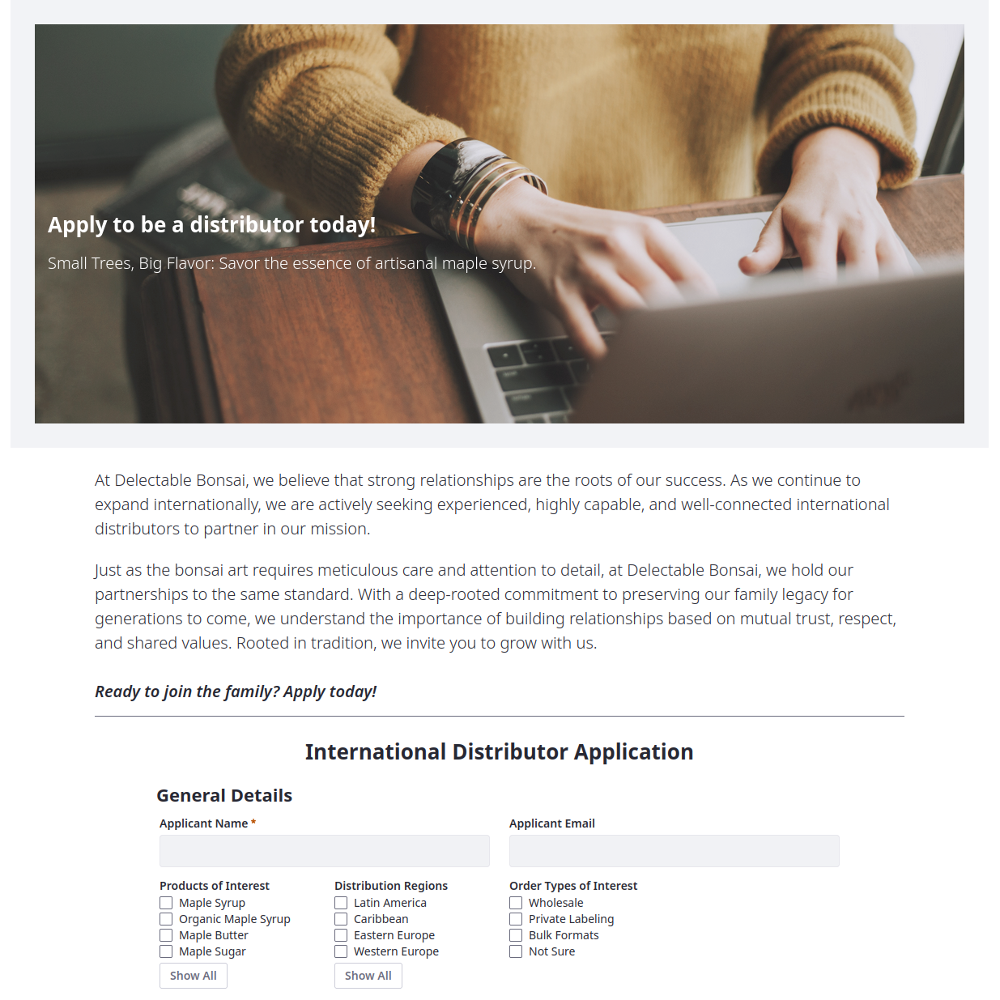

---
toc:
  - ./application-development/modeling-data-structures.md
  - ./application-development/implementing-business-logic.md
  - ./application-development/designing-user-interfaces.md
uuid: 38f72d34-99ad-4e11-b28e-bf41850ee7c7
---
# Application Development

Sometimes Liferay's out-of-the-box features don't cover all the functionality you need. When this happens, you can develop your own applications that interface with Liferay and leverage its features.

Here, we'll continue the story of Delectable Bonsai, a fictional B2B producer of maple syrup products that supplies distributors across the globe. Due to recent growth, Delectable Bonsai needs a custom solution for receiving and approving distributor applications in a B2B context.

<!--TASK:
Due to recent growth, Delectable Bonsai needs two custom solutions to streamline business processes and better serve customers: 

1. A distributor application flow for receiving and approving distributors in a B2B context

1. A Ticketing System for customers to report issues and open requests
-->

This application is deployable on Liferay SaaS, PaaS, and self-hosted environments, and Delectable Bonsai's partners can use it to apply for and obtain new business accounts.

When finished, you'll have learned how to

* Use Liferay Objects to define and manage custom data structures that leverage Liferay's core frameworks, including headless APIs, permissions, and more.
* Use Liferay's page builder features to design experiences for creating and displaying object entries.
* Use microservice client extensions to provide backend functionality to your solutions.
<!--TASK: * Use frontend client extensions to build dynamic user experiences that integrate with object APIs. -->
<!--TASK: * Promote custom applications from UAT/DEV to PRD environments. -->

Start by [Modeling Data Structures](./application-development/modeling-data-structures.md)!

::::{grid} 2
:gutter: 3 3 3 3

:::{grid-item-card} Module One: Modeling Data Structures
:link: ./application-development/modeling-data-structures.md

Learn how to use Liferay Objects to define and manage custom data structures.
:::

:::{grid-item-card} Module Two: Implementing Business Logic
:link: ./application-development/implementing-business-logic.md

Learn how to add validations, notifications, and more to your applications in Liferay DXP.
:::

:::{grid-item-card} Module Three: Designing User Interfaces
:link: ./application-development/designing-user-interfaces.md

Learn how to design application interfaces in Liferay DXP.
:::
::::

<!--TASK:
:::{grid-item-card} Module Four: Building a Ticketing System
:link: ./application-development/building-a-ticketing-system.md

Learn how to use advanced features to develop a ticketing system.
:::
-->
