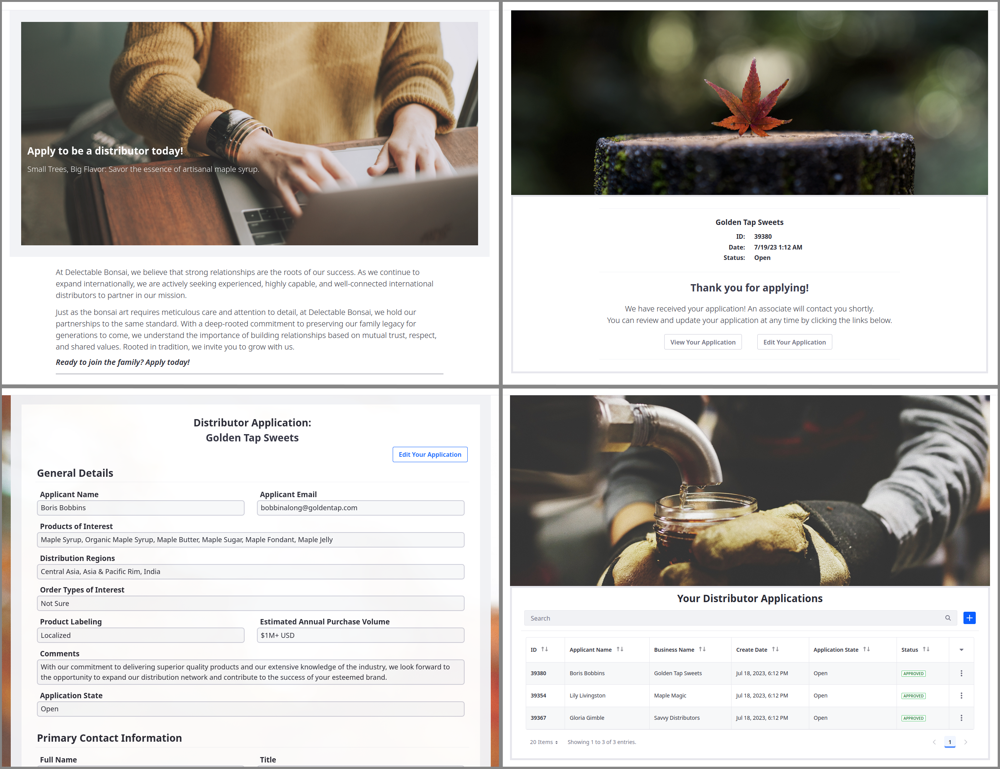

# Designing User Interfaces

Liferay gives you the tools for creating dynamic and responsive user interfaces for your custom applications. With Liferay's page builder features, you can use fragments and widgets in site pages to design forms, display object data, and more. In this way, you can create a seamless site experience for your users.

Currently, Delectable Bonsai's application uses object layouts and views. While these are serviceable for administrative users, they have limited customization options. Since Delectable Bonsai wants to integrate the application with their site, object layouts and views do not satisfy their requirements.

In this module, you'll create these four pages for the Distributor Application object:

* An application submission page
* A success page for successful submissions
* An overview page for managing and editing applications
* A display page for viewing each application's details

The first step is adding pages to the Delectable Bonsai site.

Ready?

[Let's Go!](./designing-user-interfaces/adding-pages-for-distributor-application.md)
