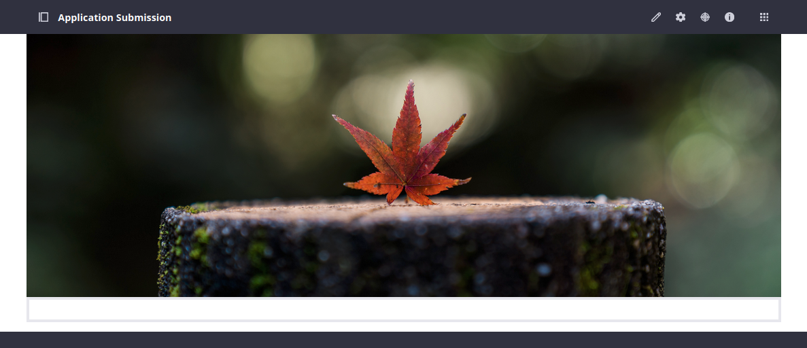
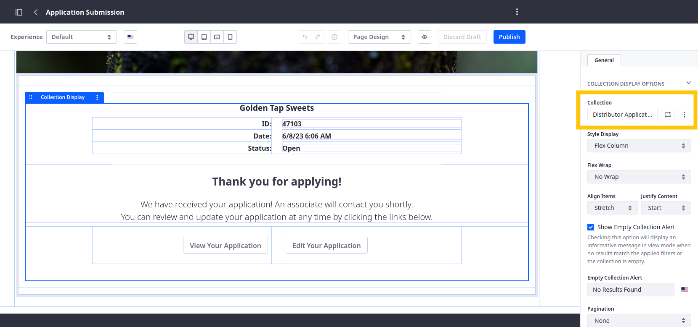

# Adding Details to the Success Page

1. Navigate to the Application Submission page and click *Edit* ().

   

1. Drag and drop the *Application Submission Page* fragment into the empty container at the bottom of the page

   

   This ... collection display fragment that's mapped to the Distributor Application object's. This collection display fragment contains sub-fragments mapped to Distributor Application fields.

   

1. Click *Publish*.

<!-- Links to two pages. The display page and overview page for Distributor Applications. -->

Next: [Adding the Distributor Application Widget to the Overview Page](./adding-the-distributor-application-widget-to-the-overview-page.md)
