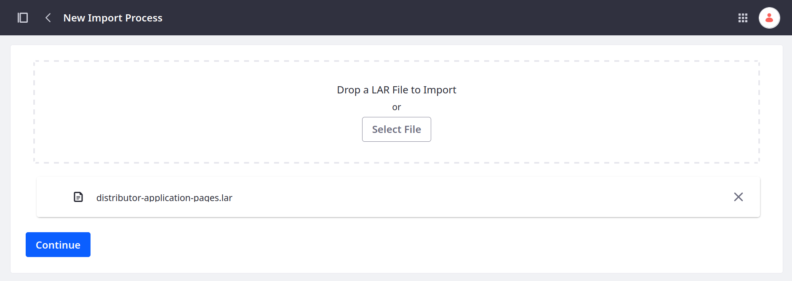
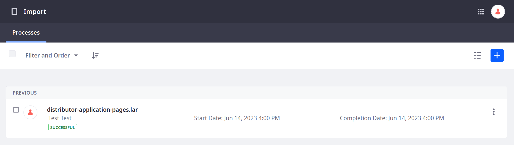
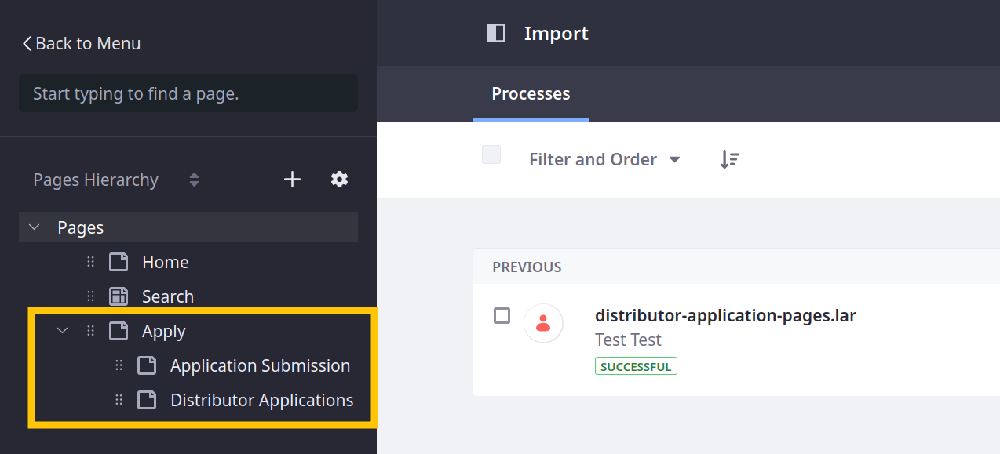

# Adding Pages for Distributor Application

Pages are the primary building blocks <!--w/c--> of Liferay sites. Delectable Bonsai's design team has created and exported three placeholder pages for use with the Distributor Application object. Here you'll import these pages as a LAR file: <!--TASK: If you've completed the [Site Design]() course, then you've already added these pages to your site. Otherwise, you can download and import them as a LAR file. -->

1. Download the LAR file for this exercise:

   ```bash
   curl https://learn.liferay.com/courses/latest/en/application-development/designing-user-interfaces/adding-pages-for-distributor-application/distributor-application-pages.lar -O
   ```

1. Open the *Site Menu* (), expand *Publishing*, and click *Import*.

1. Click *Add* (), select the `distributor-application-pages.lar` file, and click *Continue*.

   

1. Keep the default import configuration and click *Import*.

1. Confirm the import finishes successfully.

   

1. Verify these pages appear in your site:

   * Apply
   * Application Submission
   * Distributor Applications

   

These pages provide the framework for building the Distributor Application UI.

Currently, they're empty. Instead of starting from scratch, you'll import the provided fragment compositions to add the fragments or widgets necessary for creating, viewing, and managing applications. 

Next: [Importing Fragments for the Distributor Application Pages](./importing-fragments-for-the-distributor-application-pages.md)
