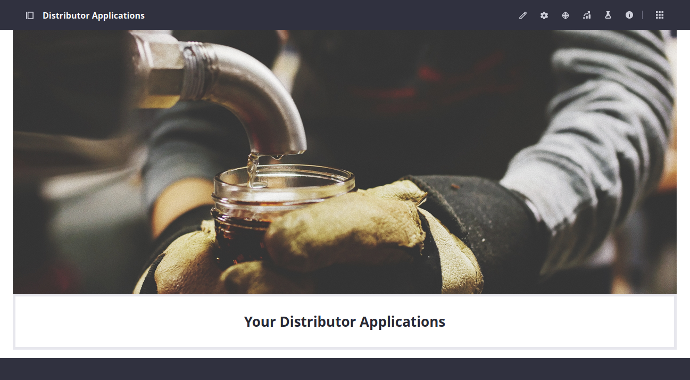
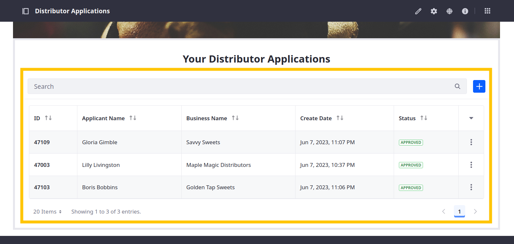
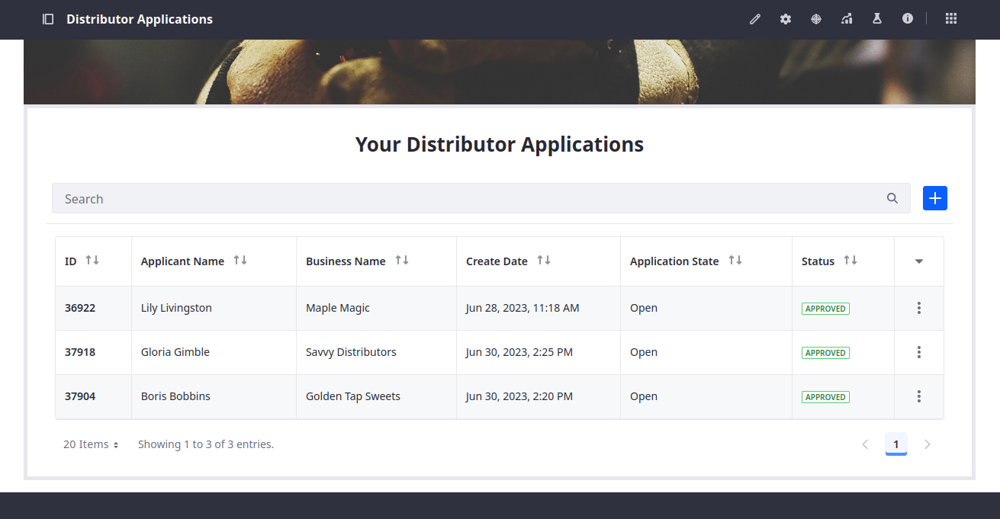

# Adding the Distributor Application Widget to the Overview Page

Delectable Bonsai wants to provide prospective distributors with a UI for viewing and editing their applications. While they could achieve this by granting them access to the Distributor Application object in the control panel, they want to reserve the global menu for administrators and limit applicants to the Delectable Bonsai Site. To do this, you'll add the Distributor Application's widget to the overview page.

1. Navigate to the Distributor Applications page and click *Edit* ().

   

1. In the Fragments and Widgets side panel, go to the *Widgets* tab and expand *Object*.

1. Drag and drop the *Distributor Applications* fragment into the empty Object Widget container.

   

   This provides users access to the Distributor Applications object in the site page. With the widget, prospective distributors can view, edit, and manage their applications.

   

   Additionally, administrators can use this page to manage all applications they have permission to access.

   

   The widget uses the object's default view and layout for rendering object data.

1. Click *Publish*.

Congratulations! You've completed setting up the Distributor Application object. Prospective distributors can now submit, edit, and manage applications in the Delectable Bonsai site.

Now that the Distributor Application is complete, let's walk through our onboarding flow.

Next: [Using the Distributor Application](./using-the-distributor-application.md)

<!--TASK:
Now that the Distributor Application is complete, Delectable Bonsai wants to incorporate a ticketing system for customers to report issues and open requests.

Module Four: [Building a Ticketing System](../building-a-ticketing-system.md) -->
