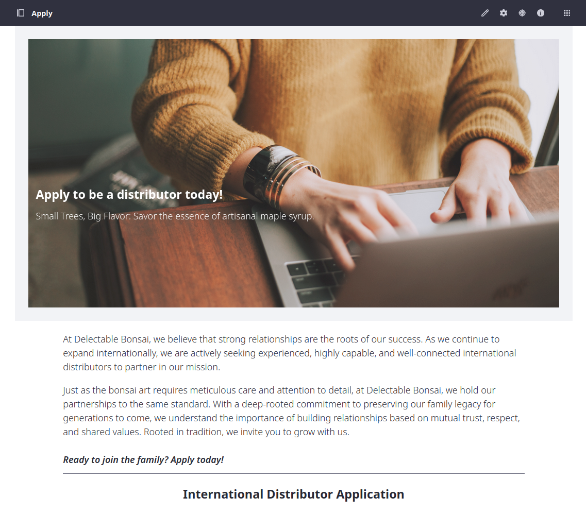
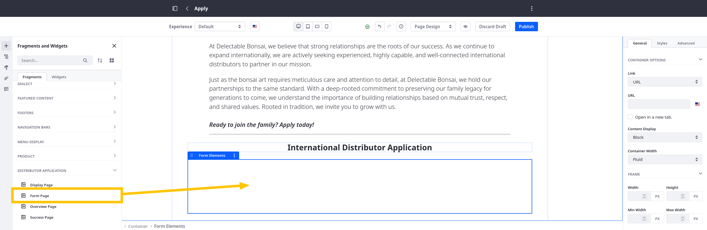
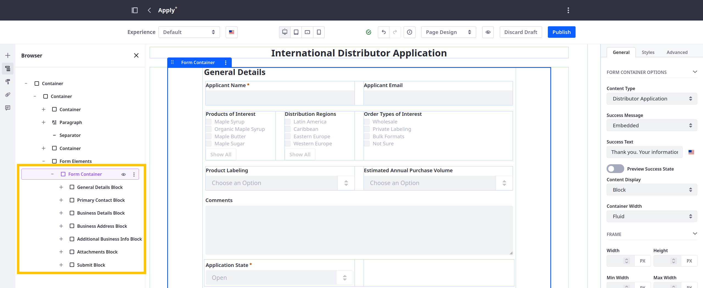
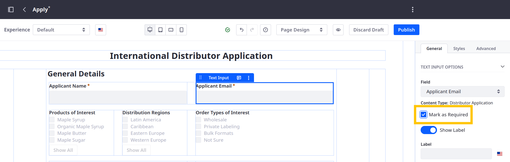
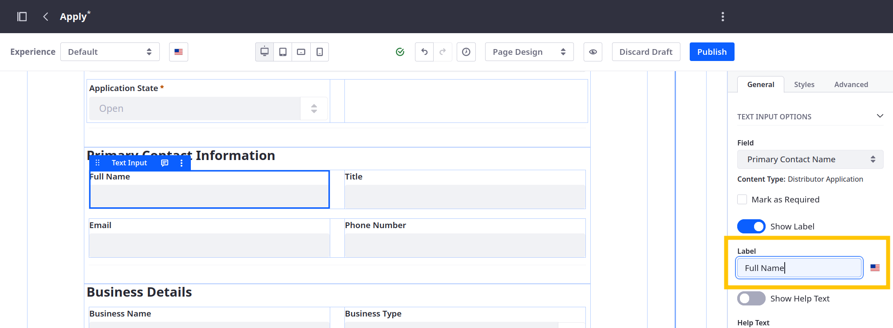
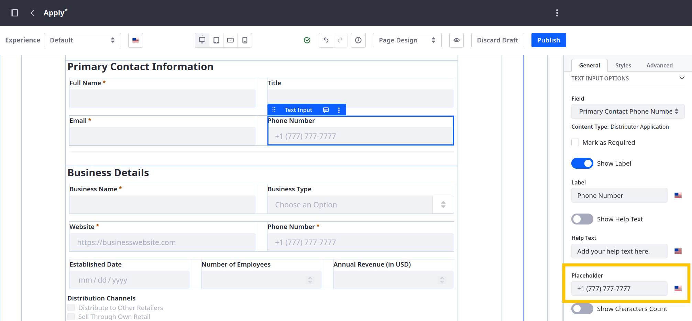
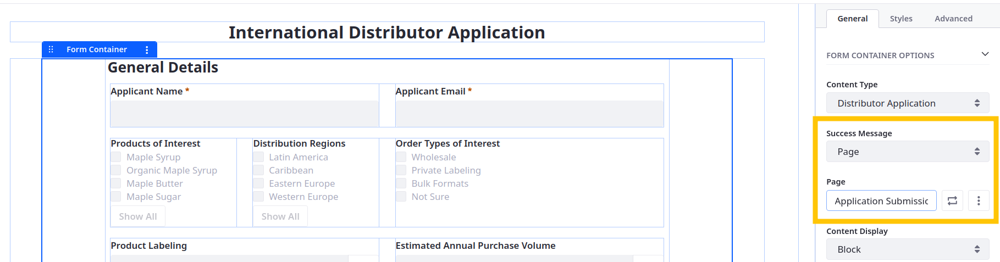

# Adding the Form to the Apply Page

By default, each object definition uses a layout for entry creation. Besides layouts, Liferay provides form fragments that you can map to custom objects for creating entries. Using form fragments, Delectable Bonsai can replace their object layout and integrate the form into their site pages.

Add the provided form fragment composition to the Apply page and configure its elements:

1. Navigate to the Apply page and click *Edit* ().

   

1. Drag and drop the *Form Page* fragment into the empty Fragment Elements container at the bottom of the page.

   

   This includes a form container that's mapped to the Distributor Application object and its fields. The form organizes form elements into these groups:

   * General Details
   * Primary Contact Information
   * Business Details
   * Business Address
   * Additional Business Information
   * Attachments
   * Submit

   

1. Select these fields and mark them as required:

   * Applicant Email
   * Primary Contact Name
   * Primary Contact Email
   * Business Name
   * Business Website
   * Business Phone Number

   

1. Select these fields and enter a display label for them:

   | Field                            | Label                   |
   |:---------------------------------|:------------------------|
   | Primary Contact Name             | Full Name               |
   | Primary Contact Title            | Title                   |
   | Primary Contact Email            | Email                   |
   | Primary Contact Phone Number     | Phone Number            |

   The provided fragments include display labels for the business, bank, and reference fields.

   

1. Set placeholder text for these fields:

   | Field                        | Placeholder                         |
   |:-----------------------------|:------------------------------------|
   | Primary Contact Phone Number | `e.g., +1 (777) 777-7777`           |
   | Business Website             | `e.g., https://businesswebsite.com` |
   | Business Phone Number        | `e.g., +1 (777) 777-7777`           |

   

1. Select the Form Container fragment, set the Success Message to *Page*, and select *Application Submission*.

   

1. Click *Publish*.

Great! Now that you've added the form and configured its elements, Delectable Bonsai's prospective distributors can use the form to submit applications. Next, design the success page for application submissions.

Next: [Adding Details to the Success Page](./adding-details-to-the-success-page.md)
