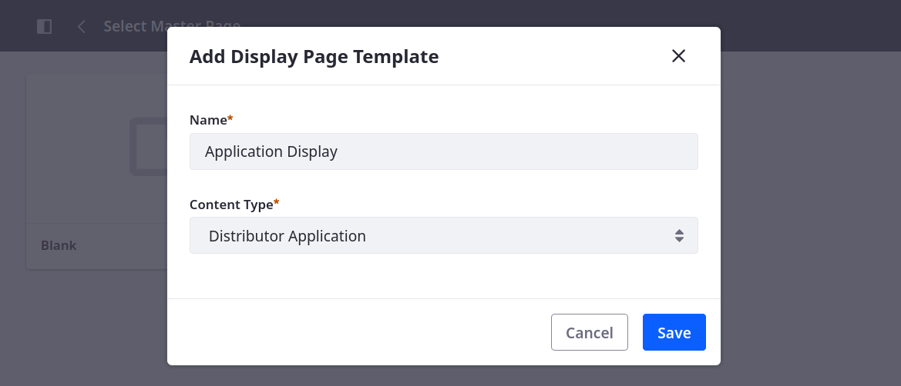
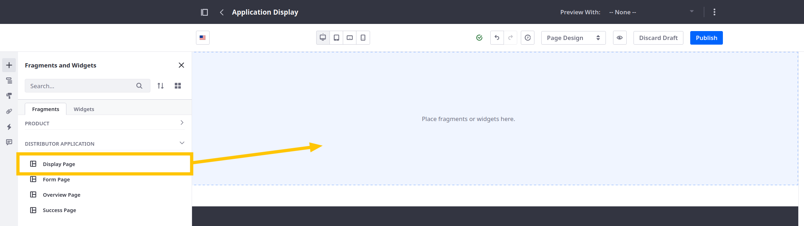
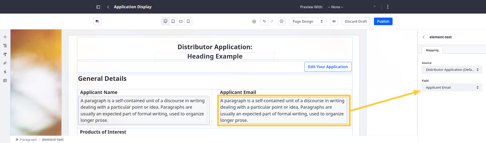
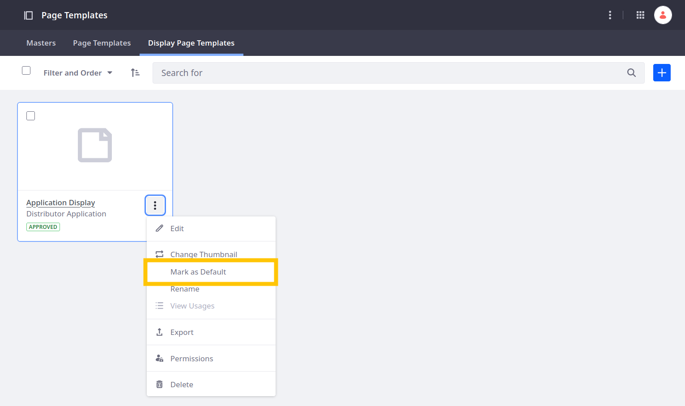
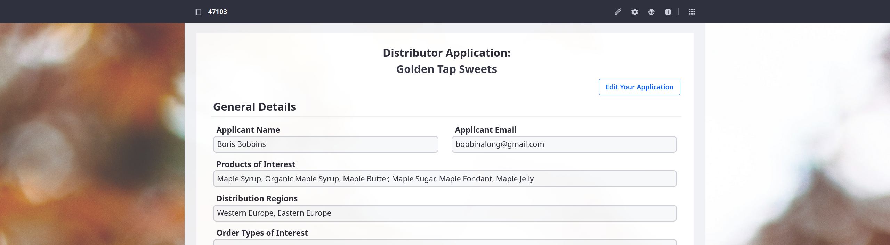

# Creating a Display Page for Distributor Applications

Published objects are integrated with the Info framework, so you can select them as the content type for display page templates. When selected, the object is set as the template's mapping source, so you can map fragment fields to object fields to create flexible page displays for individual object entries.

When users submit an application, Liferay gives assigns it a friendly URL for viewing the application's display page. To use this URL to view an application's data, you must create a default display page template for the Distributor Application object. Here you'll create this template and design it using a provided fragment composition.

<!-- Refine intro. -->

1. Open the *Site Menu* (), expand *Design*, and click *Page Templates*.

1. Go to the *Display Page Template* tab and click *Add* ().

1. Select the *Blank* master template.

1. Enter these details and click *Save*.

   | Field        | Value                   |
   |:-------------|:------------------------|
   | Name         | Application Display     |
   | Content Type | Distributor Application |

   

   By selecting the Distributor Application content type, you can map page fragments to Distributor Application fields and populate the page with the current application's values.

1. Drag and drop the *Display Page* fragment into the empty template.

<!-- Duh. Please disregard the other comments on this. I can see now from the screenshot that all these fragments are in a Distributor Application category. Sorry about that; carry on! -Rich -->

   

   This composition includes numerous fragments that are mapped to Distributor Application fields.

   

1. Click *Publish*.

1. Click the *Actions* button () for the display page template and select *Mark as Default*.

   This ensures Liferay uses the template for distributor applications.

   

Great! Now when users navigate to an application's friendly URL, the display page template is populated with its data.

Like the success page, the display page includes an Edit Your Application button for accessing the application overview page, where they can view and edit applications after submission. Now you can finish setting up this page.

Next: [Adding the Distributor Application Widget to the Overview Page](./adding-the-distributor-application-widget-to-the-overview-page.md)
